# COE428

> This will cover various topics for the course COE428: Algorithms and Data Structures, using the textbook, *Introduction to  Algorithms*, by T. Cormen, C. Leiserson, R. Rive, and lectures notes provided by the professor, Dr. Reza Samavi.

> Other resources used:
> 
> - [Abdul Bari - Algorithms](https://www.youtube.com/playlist?list=PLDN4rrl48XKpZkf03iYFl-O29szjTrs_O)

<div align="center">
  
  
</div>

Last Updated: 2022-04-16

# Introduction to Algorithms

## Algorithm Analysis 
An algorithm is a sequence of computational step that transform the  input into the output. You will typically see them displayed as pseudocode shown below:

<!-- ::: algorithm
::: algorithmic
$key = A[j]$ $i = j - 1$ $A[i+1] = A[i]$ $i = i - 1$ $A[i+1] = key$
:::
::: -->

It is very convenient to classify algorithms based on the relative amount of time or relative amount of space they require and specify as a function of the input size. Thus, we have the notions of:
- Time Complexity: Running time of the program as a function of the size of input.
- Space Complexity: Amount of computer memory required during the program execution, as a function of the input size.
- Running Time The time complexity of an algorithm can be measured  by characterizing running time as a function, $\color{ocre2}T(n)$, of the input size, $\color{ocre2}n$. We count the
number of primitive operations that are executed:

-   Assigning a value to a variable

-   Calling a method

-   Performing an arithmetic operation

-   Comparing two values

-   Indexing into an array

-   Returning from a method

::: algorithm
::: algorithmic
$temp = a$;

$a = b$;

$b = temp$;
:::
:::

For this example, we say the running time is $\color{ocre2}T(n) = 3$,
since there's three primitive operations executed by an algorithm. When
it comes to loops, it becomes a bit more complex.

::: algorithm
::: algorithmic
$x = s[0]$ $x = s[i]$
:::
:::

We define the size of the input array to be $\color{ocre2}n$:

1.  In line 1, its indexing an array, $\color{ocre2}s[0]$, then
    assigning it to $\color{ocre2}x$

2.  In line 2, inside the for loop:

    -   It first assigns $\color{ocre2}i = 1$

    -   On each iteration, it makes a comparison, $\color{ocre2}<$, for
        $\color{ocre2}n$ times

3.  In line 3, the if statement repeats for :

    -   Its indexing an array, $\color{ocre2}s[i]$, then makes a
        comparison, $\color{ocre2}>$

    -   In line 4, there's two possibilities that could occur:

        -   If true, then its indexing an array, $\color{ocre2}s[i]$,
            then assigning it to $\color{ocre2}x$

        -   If false, then it won't execute

    -   At the end, $\color{ocre2}i++$, is incremented, then assigned
        back to $\color{ocre2}i$

4.  The last line returns $\color{ocre2}x$

The number of primitive operations executed by algorithm can be
characterized in two ways:

-   Best-Case Analysis:
    $\color{ocre2}T(n) = 2 + 1 + n + (n-1)(2 + 0 + 2) + 1 = 5n$

-   Worst-Case Analysis:
    $\color{ocre2}T(n) = 2 + 1 + n + (n-1)(2 + 2 + 2) + 1 = 7n - 2$

\... to which it is bounded by two linear functions,
$\color{ocre2}5n \leq T(n) \leq 7n - 2$

-4ex -1ex -.4ex 1ex .2ex Classes of Functions Let's first go over some
common functions that characterize the running time of an algorithm:

-   Constant function: $\color{ocre2}f(n)  = c$

-   Linear function: $\color{ocre2}f(n) = n$

-   n-log-n function: $\color{ocre2}f(n) = n\log{n}$

-   Quadratic function: $\color{ocre2}f(n) = n^2$

-   Cubic function: $\color{ocre2}f(n) = n^3$

-   Exponents: $\color{ocre2}f(n) = b^n$

-   Logarithms: $\color{ocre2}f(n) = \log_2{n}$

A review from MTH is the summation formula, which will be useful when
analyzing the time complexity of algorithms:

-   Arithmetic series:
    $\displaystyle\color{ocre2}\sum_{k = 0}^{n} k = 1 + 2 + \cdots + n = \frac{n(n+1)}{2}$

-   Geometric series:
    $\displaystyle\color{ocre2}\sum_{k = 0}^{n} x^k = 1 + x + x^2 + \cdots + x^n = \frac{1-x^{n+1}}{1-x}$

\... and the following terms which you might recall from coding:

-   $\color{ocre2}\lfloor x \rfloor$ or `floor(x)` is largest integer
    less than to equal to $x$.

-   $\color{ocre2}\lceil x \rceil$ or`ceiling(x)` is least integer
    greater than to equal to $x$.

-3ex -0.1ex -.4ex 0.5ex .2ex Growth Rate of Running Time When choosing
between algorithms, we care most about asymptotic performance; how the
algorithm increases with the input size.

::: center
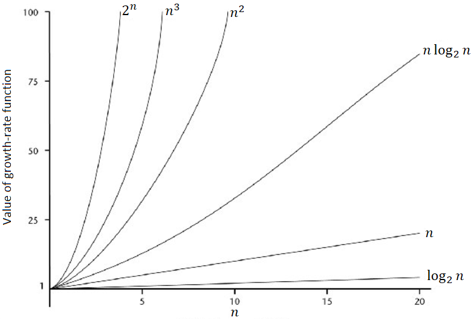{width="60%"}
:::

If you notice, as the input size increases, certain class of functions
grows much more rapidly than others.

::: center
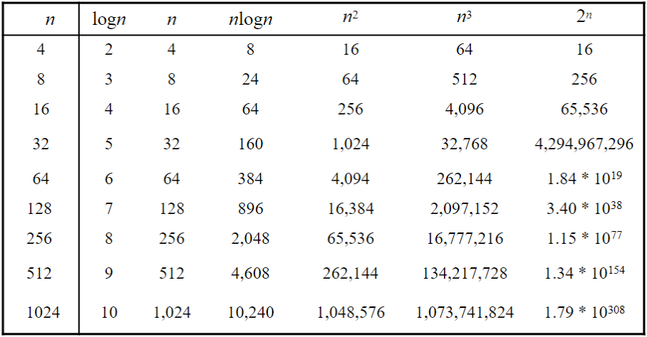{width="75%"}
:::

If we let the value of the growth-rate function represent the units of
time, an algorithm with the function $\color{ocre2}f(n) = \log_2{n}$
would be much more efficient than an algorithm with the function
$\color{ocre2}f(n) = 2^n$.

In general, the order-of-growth can be classified to be:
$$\color{ocre2}1 < \log{n} < \sqrt{n} < n < n\log{n} < n^2 < n^3 < \cdots < 2^n < 3^n < \cdots < n! < n^n$$

# Analyzing and Designing Algorithms

In this lecture, we will go over three different types of sorting
algorithm: insertion sort, merge sort, and selection sort.

The purpose of sorting algorithms is to solve the following problem:

Input:

:   A sequence of $\color{ocre2}n$ numbers
    $\color{ocre2}\langle a_1, a_2, \dots, a_n \rangle$

Output:

:   A permutation (reordering)
    $\color{ocre2}\langle a'_1, a'_2, \dots, a'_n \rangle$ of the input
    sequence such that
    $\color{ocre2}a'_1 \leq a'_2 \leq \dots \leq a'_n$.

::: dBox
::: definitionT
**Definition 2.1** (Key). *The sequence are typically stored in array.
We also refer to the number as keys.*
:::
:::

-4ex -1ex -.4ex 1ex .2ex Insertion Sort Insertion sort is a sorting
algorithm that places an unsorted element at its suitable place in each
iteration.

::: algorithm
[Insertion-Sort$(A,n) \to A[1 \dots\ n]$]{.smallcaps}

::: algorithmic
$key = A[j]$ $i = j - 1$ $A[i+1] = A[i]$ $i = i - 1$ $A[i+1] = key$
:::
:::

1.  Iterate from [`A[1]`]{style="background-color: light-gray"} to
    [`A[n]`]{style="background-color: light-gray"} over the array.

2.  Compare the current element
    [`key = A[j]`]{style="background-color: light-gray"} to its
    predecessor.

3.  If the element is smaller than its predecessor, compare it to the
    elements before. Move the greater elements one position up to make
    space for the swapped element.

::: list

Note that iterations starts at
[`A[1]`]{style="background-color: light-gray"}, not
[`A[0]`]{style="background-color: light-gray"}. For the sake of
convenience, we assume a fictitious record
[`A[0]`]{style="background-color: light-gray"} as the sentinel value
with key of $\color{ocre2}-\infty$.
:::

It maybe easier to visualize this using images to better understand the
psuedocode written. Suppose we start out with the following array with 6
elements.

::: center
{width="45%"}
:::

If we apply the insertion sort algorithm, the following array would be
sorted as shown below. Let's denote the
[`key`]{style="background-color: light-gray"} in green.

::: center
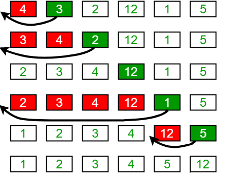{width="48%"}
:::

Since we care most about the asymptotic performance, we are interested
on finding the running time $\color{ocre2}T(n)$.

::: algorithm
::: algorithmic
$key = A[j]$

$i = j - 1$

$A[i+1] = A[i]$

$i = i - 1$

$A[i+1] = key$
:::
:::

The lectures note and textbook goes in-depth deriving the following
running time of insertion sort:
$$\color{ocre2}T(n) = c_1n + c_2(n - 1) + c_4(n - 1) + c_5\sum_{j = 2}^n t_j + c_6\sum_{j = 2}^n (t_j - 1)  + c_7\sum_{j = 2}^n (t_j - 1) + c_8(n - 1)$$
where $\color{ocre2}t_j$ is the number of times the while loop is
executed for that value of $\color{ocre2}j$.

The main takeaway is knowing how it sorts and the function for best and
worst-case running time of the following algorithm is. In the next
lecture, we will go more in-depth on analyzing the time complexity using
asymptotic notations, which simplifies all of this stuff.

-3ex -0.1ex -.4ex 0.5ex .2ex Best-Case Complexity The best-case scenario
is when the array is already sorted.

::: center
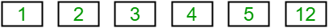{width="45%"}
:::

In this example, the while loop does the comparison but never enters the
loop, since it always find that
[`A[i]`]{style="background-color: light-gray"} is always less than or
equal to [`key`]{style="background-color: light-gray"}.

::: center
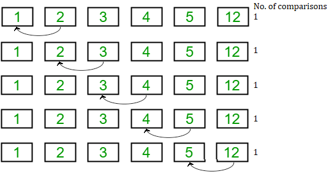{width="65%"}
:::

Thus, $\color{ocre2}t_j = 1$, we can derive the number of comparisons
for every outer loop iteration:
$$\color{ocre2}\sum_{j=2}^n t_j \to \sum_{j=2}^n 1 = (n - 2) + 1 = n - 1$$
Substituting this in the equation to the running time simplifies
$\color{ocre2}T(n)$ to $${\color{ocre2}
    \begin{split}
         T(n) &= c_1n + c_2(n - 1) + c_4(n - 1) + c_5(n - 1) + c_8(n - 1) \\
             &= (c_1 + c_2 + c_4 + c_5 + c_8)n - (c_2 + c_4 + 5 + c_8)
    \end{split}}$$ or equivalently, if we let $\color{ocre2}c_n$
simplify to some constants $\color{ocre2}a$ and $\color{ocre2}b$ then
$$\color{ocre2}T(n) = an - b$$

-3ex -0.1ex -.4ex 0.5ex .2ex Worst-Case Complexity The worst-case
scenario is when the array is sorted in reversefrom largest to smallest.

::: center
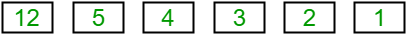{width="45%"}
:::

In this example, $\color{ocre2}t_j$ has to compare with all elements to
the left $\color{ocre2}j$-th positioncompare with $\color{ocre2}j - 1$
elements.

Thus, $\color{ocre2}t_j = j$, we can derive the number of comparisons
for every outer loop iteration
$$\color{ocre2}\sum_{j = 2}^{n} t_j \to \sum_{j = 2}^{n} j = 2 + 3 + 4 + \dots + n = \bigg[\sum_{j=1}^n j\bigg] - 1 = \frac{n(n+1)}{2} - 1$$
and as well the number of moves inside the while loop:
$$\color{ocre2}\sum_{j = 2}^{n} (t_j - 1) \to \sum_{j = 2}^{n} (j - 1) = 1 + 2 + 3 + \dots + n - 1 = \frac{n(n-1)}{2}$$
Substituting this in the equation to the running time simplifies
$\color{ocre2}T(n)$ to $${\color{ocre2}
    \begin{split}
         T(n) &= c_1n + c_2(n - 1) + c_4(n - 1) + c_5\bigg[\frac{n(n+1)}{2} - 1\bigg] + (c_6 + 
                 c_7)\bigg[\frac{n(n-1)}{2}\bigg] + c_8(n - 1) \\
              &= \bigg[\frac{c_5}{2} + \frac{c_6}{2} + \frac{c_7}{2}\bigg]n^2 + (c_1 + \dots + c_8)n - (c_2 + \dots + c_8)
    \end{split}}$$ or equivalently, if we let $\color{ocre2}c_n$
simplify to some constants $\color{ocre2}a$, $\color{ocre2}b$ and
$\color{ocre2}c$ then $$\color{ocre2}T(n) = an^2 + bn - c$$

-4ex -1ex -.4ex 1ex .2ex Merge Sort Merge sort closely follows the
divide-and-conquer paradigm. Intuitively, it operates as follows.

Divide:

:   Divide the $\color{ocre2}n$-element sequence to be sorted into two
    subsequences of $\color{ocre2}n = 2$ elements each.

Conquer:

:   Sort the two subsequences recursively using merge sort.

Combine:

:   Merge the two sorted subsequences to produce the sorted answer.

::: algorithm
[Merge-Sort]{.smallcaps} $(A,p,r) \to A[p \dots r]$

::: algorithmic
$q = \lfloor (p + r)/2 \rfloor$

[Merge-Sort($A,p,q$)]{.smallcaps}

[Merge-Sort($A,q + 1,r$)]{.smallcaps}

[Merge($A,p,q,r$)]{.smallcaps}
:::
:::

1.  Split the deck into two piles, until these become simple enoughan
    array of size $\color{ocre2}1$.

2.  Sort the left pile and sort the right pile using
    [`Merge-Sort()`]{style="background-color: light-gray"}.

3.  Merge both piles into the final pile.

::: list

In the [`Merge-Sort(A,p,r)`]{style="background-color: light-gray"}, the
floor function is used to determine
[`q`]{style="background-color: light-gray"}, so in the case there's a
decimalit will result in an integer, ex.
$\color{ocre2}\lfloor 7.5\rfloor = 7$.
:::

It may also be helpful to use a diagram like before to fully understand
what's happening. The number in red denotes the order in which steps are
processed.

::: center
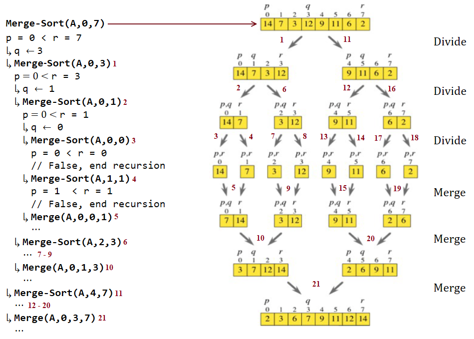{width="\\textwidth"}
:::

If you prefer are more concrete example, look at the code I wrote on the
left-side, which demonstrate how recursion works in this sorting
algorithm. Each indent indicates the recursion depth.

Step 1 to 3:

:   Calls [`Merge-Sort(A,p,q)`]{style="background-color: light-gray"} to
    split the left children with different values of $\color{ocre2}q$
    and $\color{ocre2}r$ (passing parameter by value).

Step 4:

:   Since left child can no longer split, call
    [`Merge-Sort(A,q+1,r)`]{style="background-color: light-gray"} to
    work on right child.

Step 5:

:   If both left and right child are already split, merge them by
    [`Merge(A,p,q,r)`]{style="background-color: light-gray"}.

Step 6:

:   Trace back to tree structure and find the node that does not
    complete the splitting, call
    [`Merge-Sort(A,q+1,r)`]{style="background-color: light-gray"} to
    work on the right children.

Step 7 to 8:

:   The same process is done as for Step 3 and 4.

Step 9:

:   Like in Step 5, merge them by
    [`Merge(A,p,q,r)`]{style="background-color: light-gray"}.

Most of the steps are just repeated for the other half of the array,
until all children have complete the splitting, then they are merged
together.

-3ex -0.1ex -.4ex 0.5ex .2ex Merge Algorithm The key operation of the
merge sort algorithm is the merging of two sorted sequences, after
divide and conquer.

::: algorithm
[Merge]{.smallcaps} $(A,p,q,r) \to A[p \dots q]$ and $A[q + 1 \dots r]$
where $p \leq q \leq r$

::: algorithmic
$n_1 = q - p + 1$

$n_2 = r - q$

Let L\[1 ...$n_1 + 1$\] and L\[1 ...$n_2 + 1$\] be new arrays

$L[i] = A[p + i - 1]$

$R[j] = A[q + j]$ $L[n_1 + 1] = \infty$

$R[n_2 + 1] = \infty$ $i = 1$ $j = 1$

$A[k] = L[i]$ $i = i + 1$ $j = j + 1$
:::
:::

It may look like a lot, but it's pretty simple. Most of the code are
explained in the comments listed in the right. The main focus here is
the [`for`]{style="background-color: light-gray"} loop in Line 12 to 17.

::: center
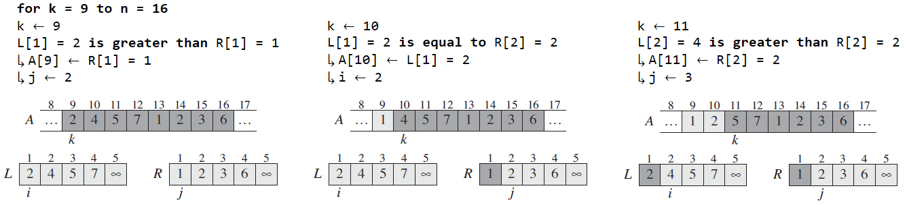{width="\\textwidth"}
:::

The heavily shaded elements in
[`A`]{style="background-color: light-gray"} contain values that will be
copied over, and heavily shaded elements in
[`L[]`]{style="background-color: light-gray"} and
[`R[]`]{style="background-color: light-gray"} contain values that have
already been copied back into
[`A[]`]{style="background-color: light-gray"}. The lightly shaded
elements in [`A[]`]{style="background-color: light-gray"} indicate their
final value.

-3ex -0.1ex -.4ex 0.5ex .2ex Time Complexity

Let's discuss the time complexity of the following algorithm, which we
can break down to the divide-and-conquer paradigm.

-   The time to split deck takes can be denoted by $\color{ocre2}c_1$,
    as it takes constant timedoes not depend on any input.

-   The time to sort left pile and sort right pile can be denoted by
    $\color{ocre2}2T(n/2)$, due to recursion, where the size is now
    divided by two, $\color{ocre2}n/2$.

-   The time to merge piles can be denoted by $\color{ocre2}c_2n + c_3$,
    as it takes linear timeonly the
    [`for`]{style="background-color: light-gray"} loop depends on input
    size, while the rest take constant time, thus simplified to that.

The time complexity results to
$$\color{ocre2}T(n) = c_1 + T(n/2) + T(n/2) + c_2n + c_3$$ Our goal is
to determine the most rapidly growing term in $\color{ocre2}T(n)$ and so
we can set a few rules. We set constants $\color{ocre2}c_n$ to either:

-   $\color{ocre2}0$, if they will not be significant in the most
    rapidly growing term or ...

-   $\color{ocre2}1$, if they will be

For $\color{ocre2}T(n)$, when $\color{ocre2}n > 1$, we can set
$\color{ocre2}c_1$ and $\color{ocre2}c_3$ to $\color{ocre2}0$ and
$\color{ocre2}c_2$ to $\color{ocre2}1$, which simplifies to:
$$\color{ocre2}T(n) = \begin{cases}c_1 & \text{if}\ n = 1 \\ 2T(n/2) + n & \text{if}\ n > 1 \end{cases}$$

::: list

Note that when $\color{ocre2}n = 1$, the code inside
[`if ... else`]{style="background-color: light-gray"} wont run, as
there's only one element $\color{ocre2}p \nless r$ or
$\color{ocre2}1 \nless 1$, so we write it as a constant.
:::

In order to solve the recurrence, when $\color{ocre2}n > 1$, we need a
base case, so for simplicity, $\color{ocre2}T(1) = 0$ and we can make a
deduction from it.

::: tabu
c \| c c \| c $\color{ocre2}n$ & $\color{ocre2}T(n/2)$ &
$\color{ocre2}2T(n/2) + n$ & $\color{ocre2}n\log_2{n}$\
$\color{ocre2}2$ & $\color{ocre2}0$ & $\color{ocre2}2(0) + 2 = 2$ &
$\color{ocre2}2$\
$\color{ocre2}4$ & $\color{ocre2}2$ & $\color{ocre2}2(2) + 4 = 8$ &
$\color{ocre2}8$\
$\color{ocre2}8$ & $\color{ocre2}8$ & $\color{ocre2}2(8) + 8 = 24$ &
$\color{ocre2}24$\
$\color{ocre2}16$ & $\color{ocre2}24$ & $\color{ocre2}2(24) + 16 = 64$ &
$\color{ocre2}64$\
$\color{ocre2}32$ & $\color{ocre2}64$ & $\color{ocre2}2(64) + 32 = 160$
& $\color{ocre2}160$\
:::

Examining the numbers allows us to form an educated guess it is growing
by a function of $\color{ocre2}n\log_2{n}$, which can also be deducted
by drawing a recursion tree.

1.  We start by representing $\color{ocre2}T(n) = 2T(n/2) + n$ as a
    graph where we put the non-recursive part ($\color{ocre2}n$ in this
    case) on the top row and put each recursive part on a row below.

::: center
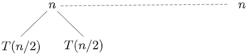{width="40%"}
:::

1.  Then expand downwards for the next level.

::: center
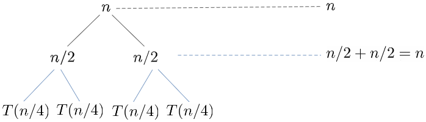{width="47.5%"}
:::

1.  Repeat the same process. Eventually, it will reach a certain height
    which it reaches the base case and stop.

::: center
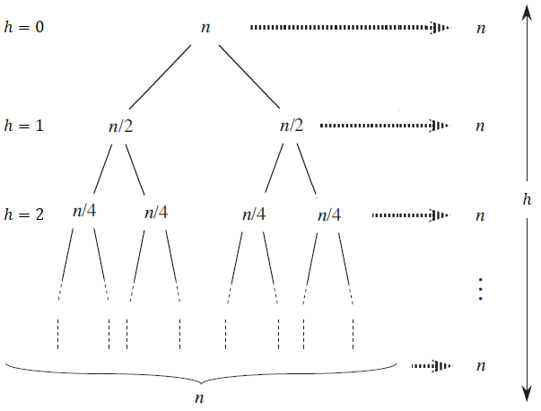{width="70%"}
:::

::: {#height_avl}
If you notice the sum of the non-recursive elements for each level is
$\color{ocre2}n$. Let's denote the depth or height of the tree as
$\color{ocre2}h$ and so we can say the time complexity is
:::

$$\color{ocre2}T(n) = n \times h$$ It will eventually reach the base
case which we set to some constant when $\color{ocre2}n=1$, where
$\color{ocre2}T(1) = 1$. We can rewrite the fraction in terms of the
depth, $\color{ocre2}h$, where
$$\color{ocre2}\frac{n}{2^h} = 1 \to n = 2^h \to h = \log_2{n}$$ Thus,
the time complexity is $$\color{ocre2}T(n) = n\log_2{n}$$ If you recall
the order-of-growth from Lecture 2, we know that
$\color{ocre2}n\log{n} < n^2$, and so merge sorting beats insertion sort
in the worst-case scenario, as it grows much more slowly.

-4ex -1ex -.4ex 1ex .2ex Selection Sort The final sorting algorithm will
cover is selection sort.

::: algorithm
[Selection-Sort$(A,n) \to A[1 \dots\ n]$]{.smallcaps}

::: algorithmic
$min = i$ $min = j$ Interchange $A[i]$ with $A[min]$
:::
:::

1.  Select the first element as
    [`min`]{style="background-color: light-gray"}

2.  Compare [`min`]{style="background-color: light-gray"} with the
    second element. If the second element is smaller than minimum,
    assign the second element as
    [`min`]{style="background-color: light-gray"}. Repeat until last
    element.

3.  After each iteration, [`min`]{style="background-color: light-gray"}
    is placed in the front of the unsorted list.

4.  For each iteration, indexing starts from the first unsorted element.
    The steps are repeated until sorted.

Let's use the example as we did for insertion sort, which is the
following array with 6 elements.

::: center
{width="45%"}
:::

The first iteration would like something like this. Let's denote the
[`min`]{style="background-color: light-gray"} in green and the line to
the element it's being compared to. The arrow indicates a swap to be
made.

::: center
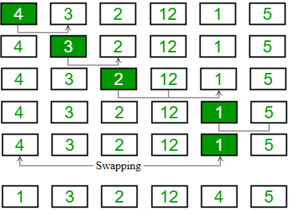{width="48%"}
:::

In the next iteration, the first unsorted element is
[`A[2]`]{style="background-color: light-gray"}, so it starts at
$\color{ocre2}3$.

::: center
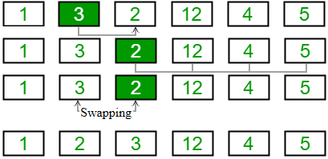{width="48%"}
:::

Then it is repeated until all the elements are placed at their correct
positions.

-3ex -0.1ex -.4ex 0.5ex .2ex Time Complexity As we have covered for the
other algorithm, let's analyze the time complexity of selection sort.

::: algorithm
::: algorithmic
$min = i$

$min = j$

Interchange $A[i]$ with $A[min]$
:::
:::

Combining each one of them, we get the following running time of
selection sort:
$$\color{ocre2}T(n) = c_1n + c_2(n-1) + c_3\sum_{j=2}^n j + c_4\sum_{j = 2}^n (j - 1) + c_5(n-1)$$
As we have previously done with insertion sort, we can simplify the
summation using the arithmetic series $${\color{ocre2}
    \begin{split}
         T(n) &= c_1n + c_2(n-1) + c_3\bigg[\frac{n(n+1)}{2} - 1\bigg] + c_4\bigg[\frac{n(n-1)}{2}\bigg] + c_5(n-1) \\
             &= \bigg[\frac{c_3}{2}+\frac{c_4}{2}\bigg]n^2 + (c_1 + \dots + c_5)n - (c_2 + \dots + c_5)
    \end{split}}$$ or equivalently, if we let $\color{ocre2}c_n$
simplify to some constants $\color{ocre2}a$, $\color{ocre2}b$ and
$\color{ocre2}c$ then $$\color{ocre2}T(n) = an^2 + bn - c$$ Comparing it
to the other two algorithms discussed, selection sort is on par with
insertion sort in the worst-case scenario and so merge sorting is better
than selection sort as well.

# Complexity Analysis

-4ex -1ex -.4ex 1ex .2ex Asymptotic Notations As covered briefly in the
growth rate of running time, it's hard to determine which algorithm is
better with no prior knowledge of the input size, so we consider the
asymptotic behavior of the two functions for very large input size
$\color{ocre2}n$.

We use specific notations called asymptotic notations to express
mathematical properties of asymptotic efficiency.

::: dBox
::: definitionT
**Definition 3.1** (Asymptotic efficiency). *The study of how the
running time of an algorithm increases as the size of the input
increases without bound.*
:::
:::

There are three asymptotic notations, which will go over in this
lecture:

-   Big-Oh notation, $\color{ocre2}\text{O}()$, for the upper bound or
    worst-case complexity

-   Big-Omega notation, $\color{ocre2}\Omega()$, for the lower bound or
    best-case complexity

-   Theta notation, $\color{ocre2}\Theta()$, for the average bound or
    average-case complexity

We can apply these to the previous lecture, which we covered three
different sorting algorithms with varying time complexity:

  ---------------- --------------------------------- -----------------------------------
     Algorithm              Time Complexity          
                                 Best                               Worst
   Insertion Sort      $\color{ocre2}\Omega(n)$         $\color{ocre2}\text{O}(n^2)$
     Merge Sort     $\color{ocre2}\Omega(n\log{n})$   $\color{ocre2}\text{O}(n\log{n})$
   Selection Sort     $\color{ocre2}\Omega(n^2)$        $\color{ocre2}\text{O}(n^2)$
  ---------------- --------------------------------- -----------------------------------

-3ex -0.1ex -.4ex 0.5ex .2ex Big-Oh Notation (O-notation) The notation
represents the upper bound of the running time of an algorithm. Thus, it
gives the worst-case complexity of an algorithm. $${\color{ocre2}
    \begin{aligned}
        \text{O}(g(n)) = \{f(n) \mid & \text{ there exists positive constant } c \text{ and } n_0 \text{ such that } 0 \leq f(n) \leq cg(n) \\
        & \text{ for all } n \geq n_0
    \end{aligned}}$$

::: center
{height="5cm"}
:::

Some tips for determining $\color{ocre2}\text{O}()$ complexity:

1.  Ignore the constants: $$\color{ocre2}5n \to n$$

2.  Certain terms dominate other, which we ignore lower order terms:
    $$\color{ocre2}\text{O}(1) < \text{O}(\log{n}) < \text{O}(n) < \text{O}(n\log{n}) < \text{O}(n^2) < \cdots < \text{O}(2^n) < \cdots < \text{O}(n!) < \text{O}(n^n)$$

It might be easier to understand if we have examples to determine the
big-Oh notation.

::: exampleT
**Example 3.1**. *Determine the upper bound $\color{ocre2}\text{O}()$
for $\color{ocre2}f(n)$:*

-   *$\color{ocre2}f_A(n) = an^2 + bn + c$ is
    $\color{ocre2}\text{O}(n^2)$*

-   *$\color{ocre2}f_B(n) = 2n + 3$ is $\color{ocre2}\text{O}(n)$*

-   *$\color{ocre2}f_C(n) = 5 + (15 \cdot 20)$ is
    $\color{ocre2}\text{O}(1)$*

-   *$\color{ocre2}f_D(n) = n^2\log{n} + n$ is
    $\color{ocre2}\text{O}(n^2\log{n})$*
:::

::: list

When writing the big-Oh notation, try to write the closest function to
the running time. While the function $\color{ocre2}\text{O}(n^2)$ is
true for $\color{ocre2}f_B(n)$, the function $\color{ocre2}\text{O}(n)$
is the closest to $\color{ocre2}f_B(n)$.
:::

The rules for determining the $\color{ocre2}\text{O}()$ complexity are
as listed:

1.  If $\color{ocre2}g(n) = \text{O}(G(n))$ and
    $\color{ocre2}f(n) = \text{O}(F(n))$, then:
    $$\color{ocre2}f(n) + g(n) = \text{O}(F(n)) + \text{O}(G(n)) = \text{O}(\text{max}[F(n), G(n)])$$
    $$\color{ocre2}f(n) \cdot g(n) = \text{O}(F(n)) \cdot \text{O}(G(n)) = \text{O}(F(n) \cdot G(n))$$

2.  If $\color{ocre2}g(n) = \text{O}(kG(n))$, where $\color{ocre2}k$ is
    a constant, then $\color{ocre2}g(n) = \text{O}(G(n))$.

3.  If $\color{ocre2}f(n)$ is a polynomial of degree
    $\color{ocre2}d\ (P(n) = \sum_{i=0}^d a_in^i$ where
    $\color{ocre2}a_d \neq 0)$, then $\color{ocre2}f(n)$ is
    $\color{ocre2}\text{O}(n^d)$.

-3ex -0.1ex -.4ex 0.5ex .2ex Big-Omega Notation ($\Omega$-notation) The
notation represents the lower bound of the running time of an algorithm.
Thus, it provides the best-case complexity of an algorithm.
$${\color{ocre2}
    \begin{aligned}
        \Omega(g(n)) = \{f(n) \mid & \text{ there exists positive constant } c \text{ and } n_0 \text{ such that } 0 \leq cg(n) \leq f(n) \\
        & \text{ for all } n \geq n_0
    \end{aligned}}$$

::: center
{height="5cm"}
:::

The rules for determining $\color{ocre2}\text{O}()$ complexity is also
true for determining the $\color{ocre2}\Omega()$ complexity. Let's use
an example from before.

::: exampleT
**Example 3.2**. *Determine the lower bound $\color{ocre2}\Omega()$ for
$\color{ocre2}f(n) = 2n + 3$:*

1.  *If we look at the order-of-growth for functions,
    $\color{ocre2}T(n)$ belongs to the linear function, $\color{ocre2}n$
    and if we define our lower and upper bounds as such
    $${\color{ocre2}\overunderbraces{&\br{2}{\text{Lower bound}}}%
        {&1 < \log{n} < \sqrt{n} <& n &< n\log{n} < n^2 < n^3 < \cdots < 2^n < 3^n < \cdots < n! < n^n&}
        {& &\br{2}{\text{Upper bound}}}}$$*

2.  *So the lower bound can be defined by any of the following:
    $$\color{ocre2}\Omega(1) < \Omega(\log{n}) < \Omega(n)$$*

3.  *Similar to the upper bound, we want the function closest to
    $\color{ocre2}f(n)$ and so $\color{ocre2}f(n) = 2n + 3$ is
    $\color{ocre2}\Omega(n)$.*
:::

-3ex -0.1ex -.4ex 0.5ex .2ex Theta Notation ($\Theta$-notation) The next
notation encloses the function from above and below. Since it represents
the upper and the lower bound of the running time of an algorithm, it is
used for analyzing the average-case complexity of an algorithm.
$${\color{ocre2}
    \begin{aligned}
        \text{O}(g(n)) = \{f(n) \mid & \text{ there exists positive constant } c_1,\ c_2, \text{ and } n_0 \text{ such that } \\ 
        &\ 0 \leq c_1g(n) \leq f(n) \leq c_2g(n) \text{ for all } n \geq n_0
    \end{aligned}}$$

::: center
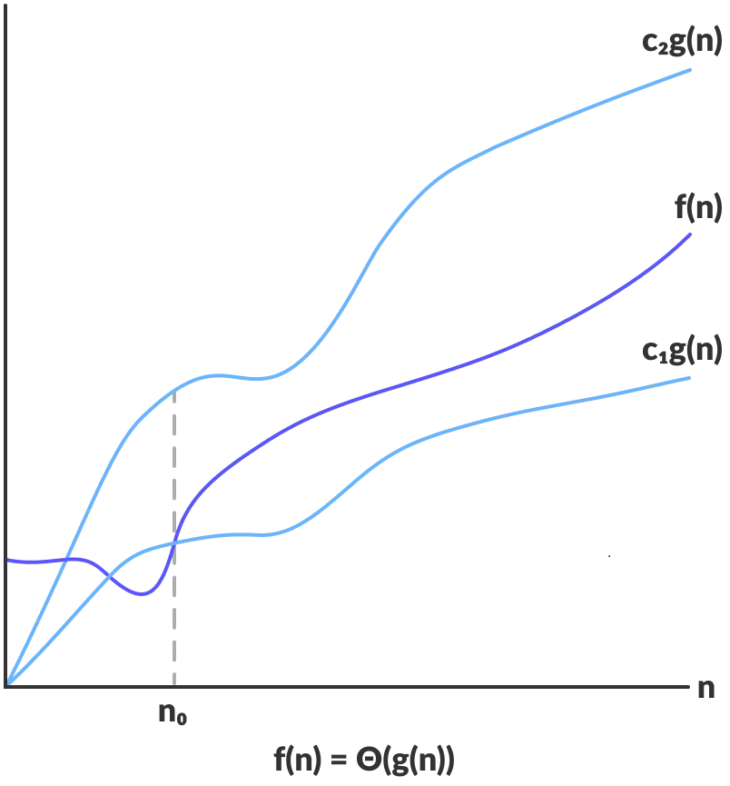{height="5cm"}
:::

Equivalently, $\color{ocre2}f(n)$ is $\color{ocre2}\Theta(g(n))$ if and
only if $\color{ocre2}f(n)$ is both $\color{ocre2}\text{O}(g(n))$ and
$\color{ocre2}\Omega(g(n))$.

One notable example which we used previously is the function
$\color{ocre2}f(n) = 2n + 3$, which as we demonstrated in previous
notations are $\color{ocre2}\text{O}(n)$ and $\color{ocre2}\Omega(n)$,
thus $\color{ocre2}f(n)$ is $\color{ocre2}\Theta(n)$.

-4ex -1ex -.4ex 1ex .2ex Complexity of Code Structures Loops are
considered as dynamic if they depend on input size, otherwise they are
static statements, everything within a loop is considered as static
statementtakes a constant amount of time, $\color{ocre2}\text{O}(1)$.
The complexity is determined by:

-   number of iterations in the loops $\color{ocre2}\times$ number of
    static statement

-3ex -0.1ex -.4ex 0.5ex .2ex For Loop The following example is a simple
for loop:

``` {style="C"}
for (int i = 0; i < n; i++) { 
    // statement
}
```

The for loop is a dynamic statement, as it depends on the size of
$\color{ocre2}n$. We are interested in the amount of times
[`statement`]{style="background-color: light-gray"} runs, which
determines the time complexity of the following loop. Suppose
$\color{ocre2}n = 3$ then let's determine how many iterations:

::: tabu
c c c Iteration & $i$ &\
& i = 0 &\
2 & i = 1 &\
3 & i = 2 &\
4 & i = 3 &\
:::

You can see that the loop executes $\color{ocre2}3$ times or in general,
we can say $\color{ocre2}n$ times. Thus, the time complexity is:
$$\color{ocre2}n \cdot 1 = \text{O}(n)$$

Note that there might be few variations of the for loop. Suppose there
are also consecutive statements:

``` {style="C"}
for (int i = 0; i < n; i++) { 
    // statement
}
for (int i = 1; i <= n; i++) {
    // statement
}
```

In both examples, the loop executes for $\color{ocre2}n$ times. When we
have consecutive statements, we would just add them together. If you
recall, we ignore any constants of lower order terms. Thus, the time
complexity is:
$$\color{ocre2}\underbrace{n \cdot 1}_{\substack{\text{The first} \\ \text{for loop}}} + \underbrace{n \cdot 1}_{\substack{\text{The second} \\ \text{for loop}}} = 2n = \text{O}(n)$$

Note that this is not always the case for every for loop, as it depends
on the initialization, condition test, and update statement. Suppose we
have the following for loop to analyze:

``` {style="C"}
for (int i = 1; i <= n; i = i * 2) {
    // statement
}
```

Let's list out each iterations of the loop, till $\color{ocre2}k$
iterations, since we do not know how many times this loop will execute.

::: tabu
c c c Iteration & $i$\
& i = 1 & $2^0$\
2 & i = 2 & $2^1$\
3 & i = 4 & $2^2$\
⋮& ⋮\
$k$ & i = $2^{k - 1}$ &\
:::

From the condition, we know that the loop will terminate once
[`i > n`]{style="background-color: light-gray"}. So we assume
$\color{ocre2}i = n$, when it has reach $\color{ocre2}k$ iterations; our
very last iteration. Then we will solve for $\color{ocre2}k$:
$${\color{ocre2}
\begin{split}
2^{k - 1} &= n \\
k - 1 &= \log_2{n} \\
k &= \log_2{n} + 1 
\end{split}}$$

If you recall from earlier, we ignore lower order terms. Thus, the time
complexity is:
$$\color{ocre2}(\log_2{n} + 1) \cdot 1 = \text{O}(\log_2{n})$$

-3ex -0.1ex -.4ex 0.5ex .2ex Nested Loop The following example is a
nested for loop:

``` {style="C"}
for (int i = 0; i < n; i++) {   
    for (int j = 0; j < n, j++) { 
        // statement                      
    }
}
```

As we covered earlier, the following for loop executes $\color{ocre2}n$
times. Suppose now we have an inner loop, which also executes
$\color{ocre2}n$ times, then the statement is run
$\color{ocre2}n \times n$ times. Thus, the time complexity is:
$$\color{ocre2}(n \cdot n) \cdot 1 = \text{O}(n^2)$$

The general formula for a nested loop is the time complexity of the
outer loop times the inner loops. This also applies if we have a outer
while loop with an inner for loop.

-3ex -0.1ex -.4ex 0.5ex .2ex If Else Statement The following example is
an if else statement:

``` {style="C"}
if (n == 0) {
    // statement 1
} else {
    for (int i = 0; i < n; i++) { 
        // statement 2
    }
}
```

If you notice, there's two possibilities that could occur: the if part,
where[`statement 1`]{style="background-color: light-gray"} will run
once, $\color{ocre2}\text{O}(1)$ or the else part, where
[`statement 2`]{style="background-color: light-gray"} will run for
$\color{ocre2}n$ times, $\color{ocre2}\text{O}(n)$.

In general, the time complexity of an if else statement is:
$$\color{ocre2}\text{O}(if-else) = \text{O}\Big(\text{max}\Big[\text{O}(\text{condition1}), \text{O}(\text{condition2}), \dots, \text{O}(\text{branch}1), \text{O}(\text{branch2}), \dots\Big]\Big)$$
As we are typically interested in the worst-cases, we only consider the
branch with the largest running time. The condition runs once and then
we add whichever is larger, which is the else part, thus, the time
complexity is: $$\color{ocre2}1 + n = \text{O}(n)$$ or equivalently
$$\color{ocre2}\text{O}\Big(\text{max}\Big[\text{O}(1), \text{O}(1), \text{O}(n)\Big]\Big) = \text{O}(n)$$

-3ex -0.1ex -.4ex 0.5ex .2ex Switch Statement The following example is a
switch statement:

``` {style="C"}
switch (key) {
    case 'a':
        for (int i = 0; i < n; i++) { 
            // statement 1
        }
    case 'b':
        for (int i = 0; i < n; i++) {   
            for (int j = 0; j < n, j++) { 
                // statement 2                      
            }
        }
    default:
        // statement 3
        break;
}
```

Similar to the if else statement, we only consider the case with the
largest running time, including the default case. In this example, for
[`case ’b’`]{style="background-color: light-gray"},
[`statement 2`]{style="background-color: light-gray"} will run for $n^2$
times, $\color{ocre2}\text{O}(n^2)$. Thus, the time complexity is:
$$\color{ocre2}1 + n^2 = \text{O}(n^2)$$ or equivalently
$$\color{ocre2}\text{O}\Big(\text{max}\Big[\text{O}(1), \text{O}(n), \text{O}(n^2), \text{O}(1)\Big]\Big) = \text{O}(n^2)$$

# Recurrence Equations

-4ex -1ex -.4ex 1ex .2ex Introduction In Lecture 2, we described the
worst-case running time $\color{ocre2}T(n)$ of merge-sort procedure by
the recurrence:
$$\color{ocre2}T(n) = \begin{cases} 1 & \text{if}\ n = 1 \\ 2T(n/2) + n & \text{if}\ n > 1 \end{cases}$$
whose solution we claimed to be $\color{ocre2}T(n) = \Theta(n\log n)$.
Previously, we didn't really have a general method for finding the form
of recurrences. Our goal for this lecture is to go in-depth in ways we
can analyze recursive algorithms and form a general formula.

::: dBox
::: definitionT
**Definition 4.1** (Recursive algorithm). *An algorithm which calls
itself to solve smaller problems.*
:::
:::

Recurrence can be polymorphic, meaning it can take many forms:

-   A recursive algorithm which divides to two problem with equal sizes.
    $$\color{ocre2}T(n) = 2T(n/2) + \Theta(n)$$

-   A recursive algorithm might divide subproblems into unequal sizes.
    $$\color{ocre2}T(n) = T(2n/3) + T(n/3) + \Theta(n)$$

-   They are not necessarily constrained to being a constant fraction of
    the original problem size.
    $$\color{ocre2}T(n) = T(n-1) + \Theta(1)$$

-4ex -1ex -.4ex 1ex .2ex Finding the Asymptotic Bounds There are three
methods for solving recurrencesthat is, for obtaining asymptotic
"$\color{ocre2}\Theta$" or "$\color{ocre2}\text{O}$" bounds on the
solution:

1.  Substitution Method

2.  Recursion-Tree Method

3.  Master Method

-3ex -0.1ex -.4ex 0.5ex .2ex Substitution Method This method is
powerful, but we must be able to guess the form of the answer in order
to apply it. It comprises of the following steps:

Step 1:

:   Try a few substitutions to find a pattern.

Step 2:

:   Guess the recurrence formula after $\color{ocre2}k$ iterations (in
    terms of $\color{ocre2}k$ and $\color{ocre2}n$).

Step 3:

:   Set $\color{ocre2}k$ so we get the base case.

Step 4:

:   Put $\color{ocre2}k$ back into the formula to find a potential
    closed form.

Step 5:

:   Prove the potential closed form using induction.

Using the merge-sort algorithm as an example, which has the following
recurrence:
$$\color{ocre2}T(n) = \begin{cases} 1 & \text{if}\ n = 1 \\ 2T(n/2) + n & \text{if}\ n > 1 \end{cases}$$
Let's go step-by-step, as described.

1.  The easiest way to find a pattern, is by simply writing out the
    first few iterations. Let's denote $\color{ocre2}k$ as our number of
    iterations starting from $\color{ocre2}1$.
    $${\color{ocre2}\begin{split}
                k &= 1 & T(n) &= 2T(n/2) + n \\
                k &= 2 & T(n) &= 2\Big[2T(n/4) + n/2\Big] + n = 4 \cdot T(n/4) + 2n \\
                k &= 3 & T(n) &= 2\bigg[2\Big[2T(n/8) + n/4\Big] + n/2\bigg] + n = 8 \cdot T(n/8) + 3n \\
            \end{split}}$$

2.  Our goal is to generalize this for $\color{ocre2}k$ iterations. In
    other words, relating each of the constants to $\color{ocre2}k$. We
    can rewrite it as such $${\color{ocre2}\begin{split}
                k &= 1 & T(n) &= 2^1 \cdot T(n/2^1) + 1n \\
                k &= 2 & T(n) &= 2^2 \cdot T(n/2^2) + 2n \\
                k &= 3 & T(n) &= 2^3 \cdot T(n/2^3) + 3n \\
            \end{split}}$$ Thus, we can form a general formula, using in
    terms of $\color{ocre2}k$ and $\color{ocre2}n$
    $$\color{ocre2}T(n) = 2^k \cdot T(n/2^k) + kn$$

3.  We know the base case is set to $\color{ocre2}T(1) = 1$. From our
    general formula, we can determine how many iterations there are in
    terms of $\color{ocre2}n$ to reach the base case, by solving for
    $\color{ocre2}k$. $${\color{ocre2}\begin{split}
                \frac{n}{2^k} = 1 \ \to\ n &= 2^k \\
                k &= \log_2{n}
            \end{split}}$$

4.  Substituting $\color{ocre2}k = \log_2{n}$ back into the general
    formula, we get a potential closed form, as $\color{ocre2}T()$ is no
    longer inside our formula. $${\color{ocre2}\begin{split}
                T(n) &= 2^{\log_2{n}} \cdot T(n/2^{\log_2{n}}) + n\log_2{n} \\
                &= n + n\log_2{n}
            \end{split}}$$

5.  We can guess that the solution is
    $\color{ocre2}T(n) = \text{O}(n\log{n})$. However, we need a
    definite proof that this is true, by using mathematical induction
    for the following statement.
    $$\color{ocre2}0 \leq T(n) \leq cn\log{n} \hspace{1cm} \exists c > 0,\ \forall n \geq n_0$$

-2ex -0.1ex -.2ex .2ex .2ex Mathematical Induction In order to prove
something is true, we use mathematical induction. We must show that we
can choose the constant $\color{ocre2}c$ large enough so that
$\color{ocre2}T(n) \leq cn\log{n}$ is true.

1.  Remember, the base case is $\color{ocre2}T(1) = 1$. Then for
    $\color{ocre2}n = 1$, it yields
    $\color{ocre2}T(1) \nleq c(1)\log{1} = 0$. Consequently, the base
    case fails to hold, so what now?

2.  For asymptotic notation we can specify a specific bound,
    $\color{ocre2}\forall n \geq n_0$, where $\color{ocre2}n_0$ is
    something we can choose. Thus $\color{ocre2}n_0 = 2$, removing it
    from consideration in the induction proof.

3.  The induction proof consists of three parts: the base case,
    inductive hypothesis and inductive step.

Let's assume $\color{ocre2}n$ is some power of $\color{ocre2}2$ or
$\color{ocre2}n = 2^k$, for sake of convenience.

Base Case:

:   Let $\color{ocre2}k = 1$ or $\color{ocre2}n = 2$ then:
    $$\color{ocre2}T(2) = 2T(1) + 2 = 2 + 2 = 4 \leq c(2)\log{2}$$ We
    can see that the inequality holds true for the base case, such that
    there $\color{ocre2}c \geq 2$.

Inductive hypothesis:

:   We will now assume that our proposition,
    $\color{ocre2}T(n) = \text{O}(n\log{n})$, holds true for
    $\color{ocre2}k -1$, which equivalently is $\color{ocre2}n/2$,
    therefore: $$\color{ocre2}T(n/2) \leq c(n/2)\log{(n/2)}$$ To prove
    the inductive step, one assumes the induction hypothesis for
    $\color{ocre2}k-1$ and then uses this assumption to prove that the
    statement holds for $\color{ocre2}k$. If instead, we assume our
    hypothesis to hold for $\color{ocre2}k$, then we must prove it holds
    for $\color{ocre2}k+1$.

Inductive step:

:   From our hypothesis, prove the guess of correct for
    $\color{ocre2}k$. Using the following:
    $$\color{ocre2}T(n) = 2T(n/2) + n$$ Since we know
    $\color{ocre2}T(n/2) \leq c(n/2)\log{(n/2)}$, then we can rewrite it
    as such: $${\color{ocre2}\begin{split}
            T(n) &\leq 2\Big[c(n/2)\log{(n/2)}\Big] + n \\
            &\leq cn\log{(n/2)} + n = cn\log{n} - cn\log{2} + n \\
            &\leq cn\log{n} + (1 - c)n \\
            &\leq cn\log{n}\qquad (\forall c \geq 1)
        \end{split}}$$ From the inductive step, we proved that
    proposition is true as we found that there exists some value of
    $\color{ocre2}c$.

-3ex -0.1ex -.4ex 0.5ex .2ex Recursion-Tree Method In a recursion tree,
we sum the costs within each level of the tree to obtain a set of
per-level costs, and then we sum all the per-level costs to determine
the total cost of all levels of the recursion.

Step 1:

:   Start by substituting the parent with non-recursive part of the
    formula and adding child nodes for each recursive part.

Step 2:

:   Expand each node repeating the step above, until you reach the base
    case.

We already covered how to do this using merge-sort algorithm, so let's
start off simple, by using the following recurrence:
$$\color{ocre2}T(n) = \begin{cases} 1 & \text{if}\ n = 1 \\ T(n-1) + n & \text{if}\ n > 1 \end{cases}$$
As usual, let's go step-by-step.

1.  The non-recursive part, $\color{ocre2}n$, will be the parent node
    and the recursive part, $\color{ocre2}T(n-1)$, will be the child
    node. The costs within each level is displayed in the right-hand
    side.

    ::: center
    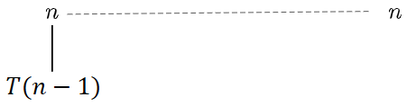{width="37.5%"}
    :::

2.  Expand on $\color{ocre2}T(n-1)$, similar to the previous step.

    ::: center
    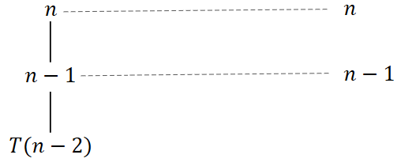{width="37.5%"}
    :::

    Eventually, it will reach the base case of $\color{ocre2}T(1) = 1$.
    The fully expanded tree has height $\color{ocre2}n$.

    ::: center
    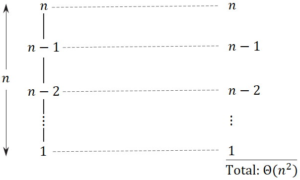{width="42.5%"}
    :::

    Notice how the sum of all the per-level cost is equivalently the
    arithmetic series, thus:
    $$\color{ocre2}T(n) = 1 + \cdots + (n-2) + (n-1) + n = \frac{n(n+2)}{2} = \Theta(n^2)$$

Suppose you consider something a bit more complex, which divides the
subproblems into unequal sizes, for the following recurrence:
$$\color{ocre2}T(n) = T(n/4) + T(n/2) + n^2$$

1.  The non-recursive part, $\color{ocre2}n^2$, will be the parent node
    and the recursive part, $\color{ocre2}T(n/4)$ and
    $\color{ocre2}T(n/2)$, will be the child nodes.

    ::: center
    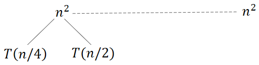{width="37.5%"}
    :::

2.  Expand on $\color{ocre2}T(n/4)$ and $\color{ocre2}T(n/2)$, similar
    to the previous step.

    ::: center
    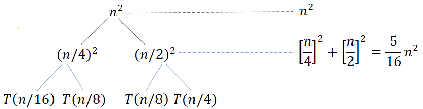{width="52.5%"}
    :::

    Eventually, it will reach the base case of $\color{ocre2}T(1)$.

    ::: center
    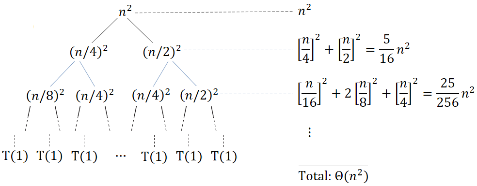{width="65%"}
    :::

    Notice how the sum of all the per-level cost is equivalently the
    geometric series, thus:
    $$\color{ocre2}T(n) = n^2\bigg[1 + \Big[\frac{5}{16}\Big] + \Big[\frac{5}{16}\Big]^2 + \cdots\bigg] = \Theta(n^2)$$

-3ex -0.1ex -.4ex 0.5ex .2ex Master Method The master method provides a
"cookbook" method for solving recurrences of the form:
$$\color{ocre2}T(n) = aT(n/b) + f(n)$$ where $\color{ocre2}a \geq 1$,
$\color{ocre2}b > 1$ and $\color{ocre2}f(n)$ be a function of
$$\color{ocre2}f(n) = n^k\log^p{n}$$ Note that there are various
variations of the master theorem, but this is definition is what I found
the easiest to understand. It consists of memorizing these three cases:

Case One:

:   If $\color{ocre2}\log_b{a} > k$, then
    $\color{ocre2}T(n) = \Theta(n^{\log_b{a}})$.

Case Two:

:   If $\color{ocre2}\log_b{a} = k$ and ...

    (a) $\color{ocre2}p > -1$, then
        $\color{ocre2}T(n) = \Theta(n^k\log^{p+1}{n})$.

    (b) $\color{ocre2}p = -1$, then
        $\color{ocre2}T(n) = \Theta(n^k\log({\log{n}}))$.

    (c) $\color{ocre2}p < -1$, then $\color{ocre2}T(n) = \Theta(n^k)$.

Case Three:

:   If $\color{ocre2}\log_ba < k$ and ...

    (a) $\color{ocre2}p \geq 0$, then
        $\color{ocre2}T(n) = \Theta(n^k\log^{p}{n})$.

    (b) $\color{ocre2}p < 0$, then $\color{ocre2}T(n) =\Theta(n^k)$.

It looks a bit complicated at first glance, but once we get to the
examples, it becomes quite easy.

::: exampleT
**Example 4.1**. *Suppose we have the following recurrence:
$$\color{ocre2}T(n) = 2T(n/2) + 1$$*

1.  *We know $\color{ocre2}a = 2$ and $\color{ocre2}b = 2$, but how do
    we get $\color{ocre2}k$ and $\color{ocre2}p$? We can rewrite it in
    the form of $\color{ocre2}n^k\log^p{n}$:
    $$\color{ocre2}f(n) = 1 = n^0\log^0{n}$$ You can confirm that both
    equations are identical, thus $\color{ocre2}k = 0$ and
    $\color{ocre2}p = 0$.*

2.  *Since $\color{ocre2}\log_2{2} > k$, then
    $\color{ocre2}T(n) = \Theta(n^{\log_b{a}})$. Substituting in the
    values for $\color{ocre2}a$ and $\color{ocre2}b$, we get:
    $$\color{ocre2}T(n) = \Theta(n^{\log_2{2}}) = \Theta(n)$$*
:::

You can refer to this
[[video]{.underline}](https://youtu.be/kGcO-nAm9Vc) for more examples
covering the three cases.

# Elementary Data Structures

-4ex -1ex -.4ex 1ex .2ex Stacks Stacks are dynamic sets in which the
element removed from the set by the delete operation is prespecified.
What defines a stack is that it implements a last-in, first-out (LIFO)
principle, so only the top element is accessible.

::: center
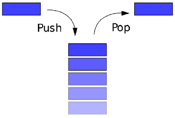{height="3cm"}
:::

There are three main methods on a stack:

-   [`push(S,x)`]{style="background-color: light-gray"} - Inserts an
    object $\colorbox{light-gray}{\texttt{x}}$ onto top of Stack
    [`S`]{style="background-color: light-gray"}.

-   [`pop(S)`]{style="background-color: light-gray"} - Removes the top
    object of stack [`S`]{style="background-color: light-gray"}; if the
    stack is empty, an error occurs.

-   [`top(S)`]{style="background-color: light-gray"} - Returns the top
    object of the stack [`S`]{style="background-color: light-gray"},
    without removing it; if the stack is empty, an error occurs.

::: center
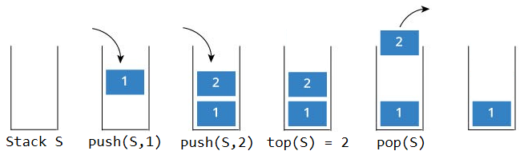{height="3cm"}
:::

The following support methods should also be defined:

-   [`size()`]{style="background-color: light-gray"} - Returns the
    number of objects in stack
    [`S`]{style="background-color: light-gray"}.

-   [`isEmpty()`]{style="background-color: light-gray"} - Indicates if
    stack [`S`]{style="background-color: light-gray"} is empty.

We can implement each of the stack operations with just a few lines of
code:

::: algorithm
[Stack-Empty]{.smallcaps} $(S)$

::: algorithmic
$\textsc{True}$ $\textsc{False}$
:::
:::

::: algorithm
[Push]{.smallcaps} $(S,x)$

::: algorithmic
$S\,.\,top  = S\,.\,top  + 1$ $S[S\,.\,top ] = x$
:::
:::

::: algorithm
[Pop]{.smallcaps} $(S)$

::: algorithmic
\"underflow\" $S\,.\,top  = S\,.\,top  - 1$ $S[S\,.\,top  + 1]$
:::
:::

-3ex -0.1ex -.4ex 0.5ex .2ex Performance and Limitations Let's now look
at an array implementation of a stack
[`S`]{style="background-color: light-gray"} with $\color{ocre2}7$
elements. Let $\color{ocre2}S\,.\,top$ be a pointer to keep track of the
last element (or top).

1.  When $\color{ocre2}S\,.\,top = 0$, there is no elements and is
    empty, so stack [`S`]{style="background-color: light-gray"} has
    $\color{ocre2}0$ elements.

    ::: center
    {height="2cm"}
    :::

2.  When we call [`push(S,15)`]{style="background-color: light-gray"},
    $\color{ocre2}S\,.\,top$ moves up by $\color{ocre2}1$ and inserts
    element $\color{ocre2}15$ to the stack.

    ::: center
    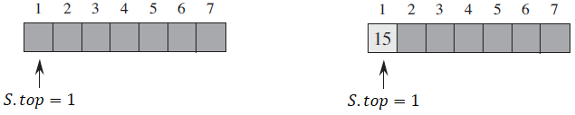{height="2cm"}
    :::

3.  Suppose we call the following:
    [`push(S,6)`]{style="background-color: light-gray"},
    [`push(S,2)`]{style="background-color: light-gray"} and
    [`push(S,3)`]{style="background-color: light-gray"}. The array is
    shown below.

    ::: center
    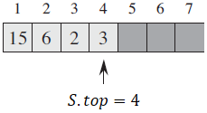{height="2cm"}
    :::

4.  When we call [`pop(S)`]{style="background-color: light-gray"},
    $\color{ocre2}S\,.\,top$ moves down by $\color{ocre2}1$ and returns
    the element that was removed, which is element $\color{ocre2}3$.

    ::: center
    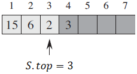{height="2cm"}
    :::

5.  Although element $\color{ocre2}3$ still appears in the array, it is
    no longer in the stack. When we call
    [`push(S,9)`]{style="background-color: light-gray"},
    $\color{ocre2}S\,.\,top$ moves up by $\color{ocre2}1$ and overwrites
    element $\color{ocre2}3$ with $\color{ocre2}9$.

    ::: center
    {height="2cm"}
    :::

If you notice, when pushing an element or popping an element off the
stack, it takes a constant amount of time. Let $\color{ocre2}n$ be the
numbers of elements in the stack.

-   Each operation runs in time $\color{ocre2}\text{O}(1)$.

-   The space used is $\color{ocre2}\text{O}(n)$.

There are a few limitations we must consider:

-   The maximum size of the stack must be defined priority and cannot be
    changed.

-   When pushing a new element into a full stack, it causes an
    implementation error.

-4ex -1ex -.4ex 1ex .2ex Queue Queue are another type of dynamic sets,
which implements first-in, first-out (FIFO) principle, so queue items
are removed in exactly the same order as they were added to the queue.

::: center
{height="3.5cm"}
:::

There are exist the following operations on a queue:

-   [`enqueue(Q,x)`]{style="background-color: light-gray"} - Inserts an
    element $\colorbox{light-gray}{\texttt{x}}$ at the rear of the queue
    [`Q`]{style="background-color: light-gray"}.

-   [`dequeue(Q)`]{style="background-color: light-gray"} - Removes the
    element at the front of queue
    [`Q`]{style="background-color: light-gray"}.

-   [`front()`]{style="background-color: light-gray"} - Returns the
    front element of the queue without removing it.

-   [`new()`]{style="background-color: light-gray"} - Creates an empty
    queue.

-   [`size()`]{style="background-color: light-gray"} - Returns the
    number of objects in queue.

-   [`isEmpty()`]{style="background-color: light-gray"} - Indicates if
    queue is empty.

::: center
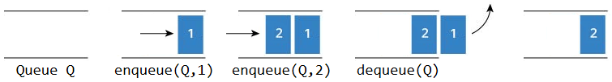{height="1.5cm"}
:::

Assume $\color{ocre2}n = Q\,.\,length$. The pseudocode for enqueue and
dequeue is shown below:

::: algorithm
[Enqueue]{.smallcaps} $(Q,x)$

::: algorithmic
$Q[Q\,.\,tail] = x$ $Q\,.\,tail = 1$
:::
:::

::: algorithm
[Dequeue]{.smallcaps} $(Q)$

::: algorithmic
$x = Q[Q\,.\,head]$ $Q\,.\,head = 1$
:::
:::

Note that we didn't account for the error when underflow and overflow
occurs.

-3ex -0.1ex -.4ex 0.5ex .2ex Performance and Limitations Let's now look
at an array implementation of a queue
[`Q`]{style="background-color: light-gray"} with $\color{ocre2}7$
elements. Let $\color{ocre2}Q\,.\,head$ be a pointer for the front of
the queue and $\color{ocre2}Q\,.\,tail$ be the back of the queue.

1.  When $\color{ocre2}Q\,.\,head = \color{ocre2}Q\,.\,tail$, there is
    no elements, so queue [`Q`]{style="background-color: light-gray"}
    has $\color{ocre2}0$ elements.

    ::: center
    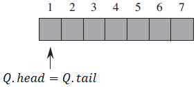{height="2cm"}
    :::

2.  When we call
    [`enqueue(Q,15)`]{style="background-color: light-gray"}, element
    $\color{ocre2}15$ is added to the queue then
    $\color{ocre2}Q\,.\,tail$ moves up by $\color{ocre2}1$.

    ::: center
    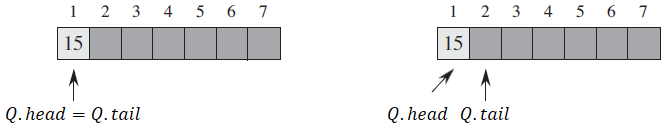{height="2cm"}
    :::

3.  Suppose we call the following:
    [`enqueue(Q,6)`]{style="background-color: light-gray"},
    [`enqueue(Q,2)`]{style="background-color: light-gray"} and
    [`enqueue(Q,9)`]{style="background-color: light-gray"}. The array is
    shown below.

    ::: center
    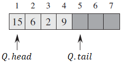{height="2cm"}
    :::

4.  When we call [`dequeue(Q)`]{style="background-color: light-gray"},
    element $\color{ocre2}15$ located at the front of queue indicated by
    $\color{ocre2}Q\,.\,head$, is removed then $\color{ocre2}Q\,.\,head$
    moves up by $\color{ocre2}1$ to element $\color{ocre2}6$.

    ::: center
    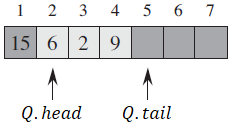{height="2cm"}
    :::

5.  As the final scenario, suppose we filled the array from
    $\color{ocre2}Q[2 .. 7]$, as shown below.

    ::: center
    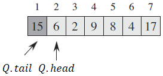{height="2cm"}
    :::

    When we call $\colorbox{light-gray}{\texttt{enqueue(Q,x)}}$ or add
    one more element, $\color{ocre2}Q\,.\,tail$ will have to move up by
    one where $\color{ocre2}Q\,.\,head = \color{ocre2}Q\,.\,tail$.

    ::: center
    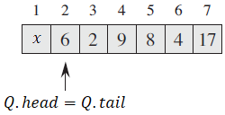{height="2cm"}
    :::

    But, if you recall, this means the queue is empty, which is not the
    case and so the queue overflows.

Similar to a stack, when enqueueing or dequeueing an element, it takes a
constant amount of time. Let $\color{ocre2}n$ be the numbers of elements
in the queue.

-   Each operation runs in time $\color{ocre2}\text{O}(1)$.

There are also a few limitations we must consider which carries over for
queue:

-   The maximum size of the stack must be defined priority and cannot be
    changed.

-   If we attempt to dequeue an element from an empty queue, the queue
    underflows.

-   If we attempt to enqueue an element from a full queue, the queue
    overflows and so we can only store $\color{ocre2}n - 1$ elements.

-4ex -1ex -.4ex 1ex .2ex Linked Lists A collection of nodes that
together form a linear ordering. Unlike an array, however, in which the
linear order is determined by the array indices, the order in a linked
list is determined by a pointer in each object. It consists of:

-   A sequence of nodes

-   Each node contains a value and link reference to some other node

-   The last node contains a null link

-3ex -0.1ex -.4ex 0.5ex .2ex Singly Linked Lists The most basic of all
linked data structures, which are used to implement stacks and queues.
Each node has data and a pointer to the next node.

::: center
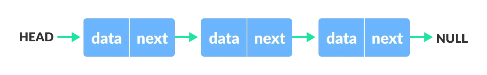{width="75%"}
:::

Searching a singly linked list.

:   

::: algorithm
[List-Search]{.smallcaps} $(L,k)$

::: algorithmic
$x = L\,.\,head$ $x = x\,.\,next$ $x$
:::
:::

> To search a list of $\color{ocre2}n$ elements, the
> [List-Search]{.smallcaps} procedure takes $\color{ocre2}\Theta(n)$
> time in the worst-case, since it may have to search the entire
> listsimilar to insertion sort.

Inserting into a singly linked list.

:   The [List-Insert]{.smallcaps} procedure splices the inserted
    element, [`x`]{style="background-color: light-gray"}, onto the front
    of the linked list.

::: center
{width="\\textwidth"}
:::

> The running time for [List-Insert]{.smallcaps} on a list of
> $\color{ocre2}n$ elements is $\color{ocre2}\text{O}(1)$.

Deleting from a singly linked list.

:   The [List-Delete]{.smallcaps} procedure removes an element,
    [`x`]{style="background-color: light-gray"}, from a linked list by
    getting a pointer to $\colorbox{light-gray}{\texttt{x}}$ and it
    splices [`x`]{style="background-color: light-gray"} out of the list
    by updating pointers.

::: center
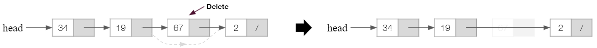{width="\\textwidth"}
:::

> The running time for [List-Delete]{.smallcaps} runs in
> $\color{ocre2}\text{O}(1)$ time, but if we wish to delete an element
> with a given key, $\color{ocre2}\text{O}(n)$ time is required in the
> worst case.

Some applications of singly linked lists are:

-   Implement stacks and queues, as shown below.

-   Dynamic memory allocation, which will cover in the very end.

-3ex -0.1ex -.4ex 0.5ex .2ex Doubly Linked Lists We add a pointer to the
previous node. Thus, we can go in either direction: forward or backward.

::: center
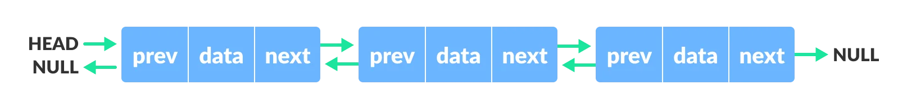{width="90%"}
:::

Searching a doubly linked list.

:   A singly and linked list uses the same algorithm for searching.
    Thus, both take $\color{ocre2}\Theta(n)$ times in the worst-case to
    search through a list of $\color{ocre2}n$ elements.

```{=html}
<!-- -->
```

Inserting into a doubly linked list.

:   The [List-Insert]{.smallcaps} procedure is also similar to the
    singly, but now we also have to account for the previous pointer.

::: center
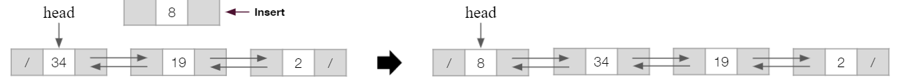{width="\\textwidth"}
:::

::: algorithm
[List-Insert]{.smallcaps} $(L,x)$

::: algorithmic
$x\,.\,next = L\,.\,head$ $L\,.\,head\,.\,prev = x$ $L\,.\,head = x$
$x\,.\,prev =$ [nil]{.smallcaps}
:::
:::

> The running time for [List-Insert]{.smallcaps} on a list of
> $\color{ocre2}n$ elements is $\color{ocre2}\text{O}(1)$.

Deleting from a doubly linked list.

:   Likewise, same thing can be said for the [List-Delete]{.smallcaps}
    procedure, in which we now have to also assign the previous pointer

::: center
{width="\\textwidth"}
:::

::: algorithm
[List-Delete]{.smallcaps} $(L,x)$

::: algorithmic
$x\,.\,prev\,.\,next = x\,.\,next$ $L\,.\,head = x\,.\,next$
$x\,.\,next\,.\,prev = x\,.\,prev$
:::
:::

> The running time for [List-Delete]{.smallcaps} runs in
> $\color{ocre2}\text{O}(1)$ time, but if we wish to delete an element
> with a given key, $\color{ocre2}\text{O}(n)$ time is required in the
> worst case.

Some applications of doubly linked lists are:

-   Browsers to implement backward and forward navigation of visited web
    pagesthe back and forward button.

-   Various application to implement Undo and Redo functionality.

-3ex -0.1ex -.4ex 0.5ex .2ex Circularly Linked Lists A circularly singly
linked list is a variation of a linked list in which the last element is
linked to the first element. This forms a circular loop.

::: center
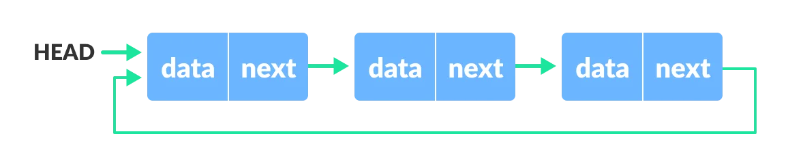{width="70%"}
:::

A circularly doubly linked list, in which in addition to the one above,
the first element is linked to the last element.

::: center
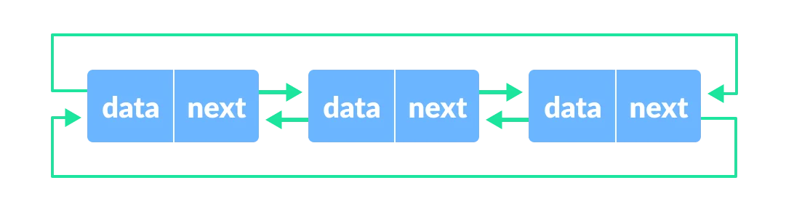{width="65%"}
:::

In a circularly linked list, we used a sentinelrepresented by the dark
grey node [`L.nil`]{style="background-color: light-gray"}.

::: center
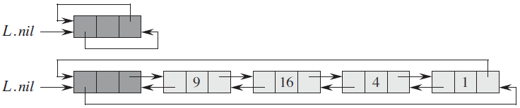{height="2.5cm"}
:::

It represents [nil]{.smallcaps} which lies between the head and tail. It
functions like any other object in a doubly linked list, which it has a
pointer from the previous and next node. Below are the procedures used
for circularly doubly linked list with sentinel.

::: algorithm
[List-Search/]{.smallcaps} $(L,k)$

::: algorithmic
$x = L\,.\,nil\,.\,next$ $x = x\,.\,next$ $x$
:::
:::

::: algorithm
[List-Insert']{.smallcaps} $(L,x)$

::: algorithmic
$x\,.\,next = L\,.\,nil\,.\,next$ $L\,.\,nil\,.\,next\,.\,prev = x$
$L\,.\,nil\,.\,next = x$ $x\,.\,prev = L\,.\,nil$
:::
:::

::: algorithm
[List-Delete']{.smallcaps} $(L,x)$

::: algorithmic
$x\,.\,prev\,.\,next = x\,.\,next$ $x\,.\,next\,.\,prev = x\,.\,prev$
:::
:::

Some applications of circularly linked lists are:

-   Useful for implementation of queue.

-   Circular lists are useful in applications to repeatedly go around
    the list.

-   Circular doubly linked lists are used for implementation of advanced
    data structures like Fibonacci Heap.

-3ex -0.1ex -.4ex 0.5ex .2ex Implementing Pointers and Objects We can
implement pointers and objects in languages that do not provide them by
synthesizing them from arrays and array indices. For this example, let's
use the following doubly linked list:

::: center
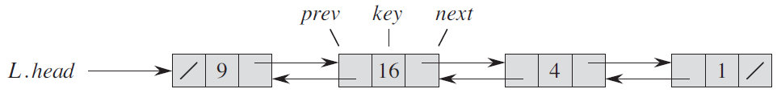{width="70%"}
:::

Single-array representation of objects.

:   Analogous to storing an object in the memory.

::: center
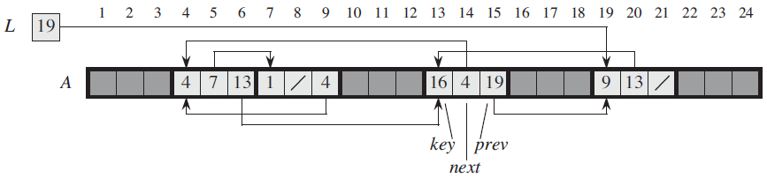{height="3cm"}
:::

> Each object is represented by a contiguous sub-array of length
> $\color{ocre2}3$. The three attributes
> [`key`]{style="background-color: light-gray"},
> [`next`]{style="background-color: light-gray"}, and
> [`prev`]{style="background-color: light-gray"} correspond to the
> offsets: $\color{ocre2}0$, $\color{ocre2}1$, and $\color{ocre2}2$ of
> the sub-array.

Multiple-array representation of objects.

:   We can represent a collection of objects that have the same
    attributes by using an array for each attribute.

::: center
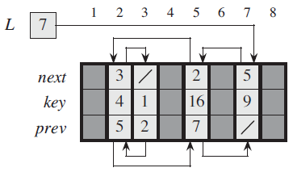{height="3cm"}
:::

> You can think of each column (or vertical slice) as a single object.
> The pointers resides in the
> [`next`]{style="background-color: light-gray"} and
> [`prev`]{style="background-color: light-gray"} array, which point to
> the index where the next object resides.

Allocating and freeing objects.

:   To insert a key into a dynamic set represented by a doubly linked
    list, we must allocate a pointer to a currently unused object in the
    linked-list representation.

::: center
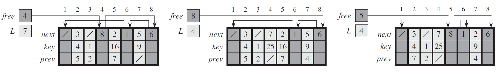{width="\\textwidth"}
:::

> We keep the free objects in a singly linked list (only
> [`next`]{style="background-color: light-gray"} pointer), which we call
> the free list. The free list acts like a stackthe next object
> allocated is the last one freed.

-4ex -1ex -.4ex 1ex .2ex Heaps The (binary) heap data structure is an
array of object that we can view as a nearly complete binary tree. Each
node of the tree corresponds to an element of the array.

::: center
{height="4cm"}
:::

There are two kinds of binary heap. In both kinds, the values in the
nodes satisfy a heap property, the specifics of which depend on the kind
of heap.

Max-heap.

:   The max-heap property is that for every node $\color{ocre2}i$ other
    than the root: $$\color{ocre2}A[\textsc{Parent}(i)] \geq A[i]$$
    which means that a child node can't have a greater value than its
    parent.

Min-heap.

:   The min-heap property is the opposite, which for every node
    $\color{ocre2}i$ other than the root:
    $$\color{ocre2}A[\textsc{Parent}(i)] \leq A[i]$$ which means that a
    parent node can't have a greater value than its child nodes.

If all the nodes satisfy the heap property, then a binary tree is a
heap. However, if a node does not have the heap property, the node is
swapped with the parent. This operation is called sifting up.

::: center
{width="\\textwidth"}
:::

-3ex -0.1ex -.4ex 0.5ex .2ex Constructing a Heap A heap can be stored as
an array $\color{ocre2}A$, where the:

-   Root of tree is $\color{ocre2}A[1]$. The cell at index
    $\color{ocre2}0$ is not used, thus we start at index
    $\color{ocre2}1$.

-   Parent of $\color{ocre2}A[i]$ is
    $\color{ocre2}A[\lfloor i/2 \rfloor]$.

-   Left child of $\color{ocre2}A[i]$ is $\color{ocre2}A[2i]$.

-   Right child of $\color{ocre2}A[i]$ is $\color{ocre2}A[2i + 1]$.

To construct a heap:

1.  Start with a single node.

2.  Add a node to the right of the rightmost node in the deepest level.
    If the deepest level is full, start a new level.

3.  Each time we add a node, we may destroy heap property of its parent
    node. To fix this, sift up until either:

    -   We reach nodes whose values don't need to be swappedthe parent
        node is larger than both children.

    -   We reach the root.

Suppose we have an array $\color{ocre2}A = [8, 10, 5, 12, 14]$, we would
construct the heap as such:

::: center
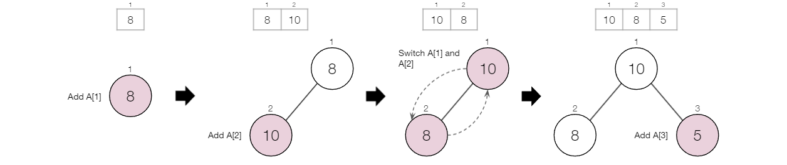{width="90%"}
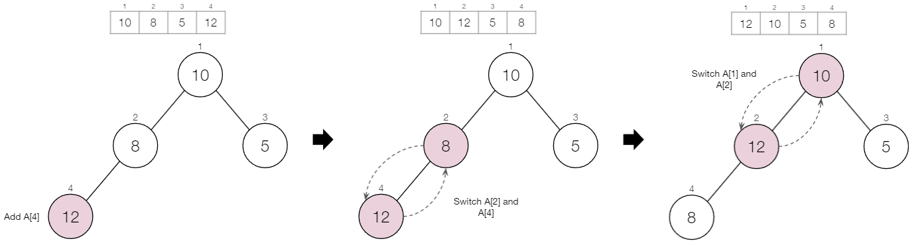{width="\\textwidth"}
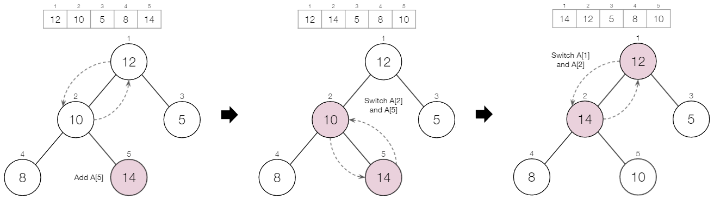{width="\\textwidth"}
:::

Our final heap should look like this:

::: center
{height="3.5cm"}
:::

-3ex -0.1ex -.4ex 0.5ex .2ex Maintaining Heap Property To implement
this:

1.  Represent an arbitrary array as a binary tree.

2.  Devise a [`Max-Heapify()`]{style="background-color: light-gray"}
    algorithm that maintains the heap property of any given node
    $\color{ocre2}i$ in the heap with sub-trees $\color{ocre2}l$ and
    $\color{ocre2}r$ rooted at $\color{ocre2}i$th children, given to be
    heaps.

3.  Devise a [`Build-Max-Heap()`]{style="background-color: light-gray"}
    algorithm that uses
    [`Max-Heapify()`]{style="background-color: light-gray"} algorithm to
    construct a heap.

::: algorithm
[Max-Heapify]{.smallcaps} $(A,n)$

::: algorithmic
:::
:::

::: algorithm
[Build-Max-Heap]{.smallcaps} $(A)$

::: algorithmic
:::
:::

The worst-case time complexity of:

-   [Max-Heapify]{.smallcaps} is $\color{ocre2}\text{O}(\log{n})$

-   [Build-Max-Heap]{.smallcaps} is $\color{ocre2}\text{O}(n)$

The heapsort algorithm is based on the heap data structure, which uses
these two main parts: building a max-heap and sorting it, to sort

::: algorithm
[Heapsort]{.smallcaps} $(A)$

::: algorithmic
:::
:::

Thus, heapsort has a worst-case time complexity of
$\color{ocre2}\text{O}(n\log{n})$ like merge sort, but heapsort has a
space complexity of $\color{ocre2}\text{O}(1)$, since it sorts in-place,
taking a constant amount of memory.

-3ex -0.1ex -.4ex 0.5ex .2ex Priority Queue One of the most popular
implementations of a heap, a priority queue is a data structure for
maintaining a set $\color{ocre2}S$ of elements, each with an associated
value called a key. As with heaps, there are two kinds of priority
queues: max-priority queue and min-priority queue.

::: center
{width="\\textwidth"}
:::

We will focus here on how to implement max-priority queues, which are in
turn based on max-heaps. A max-priority queue supports dynamic-set
operations:

-   [`Insert(S,x)`]{style="background-color: light-gray"} - Inserts
    element [`x`]{style="background-color: light-gray"} into set
    [`S`]{style="background-color: light-gray"}.

-   [`Maximum(S)`]{style="background-color: light-gray"} - Returns an
    element of [`S`]{style="background-color: light-gray"} with largest
    key.

-   [`Extract-Max(S)`]{style="background-color: light-gray"} - Removes
    and returns element of [`S`]{style="background-color: light-gray"}
    with largest key.

-   [`Increase-Key(S,x,k)`]{style="background-color: light-gray"} -
    Increases value of element
    [`x`]{style="background-color: light-gray"}'s key to
    [`k`]{style="background-color: light-gray"}. Assume
    [`k \geq x`]{style="background-color: light-gray"}'s current key
    value.

The procedure [Heap-Maximum]{.smallcaps} has a running time of
$\color{ocre2}\Theta(1)$.

::: algorithm
[Heap-Maximum]{.smallcaps} $(A)$

::: algorithmic
:::
:::

The procedure [Heap-Extract-Max]{.smallcaps} has a running time of
$\color{ocre2}\text{O}(\log{n})$.

::: algorithm
[Heap-Extract-Max]{.smallcaps} $(A)$

::: algorithmic
:::
:::

The procedure [Heap-Increase-Key]{.smallcaps} has a running time of
$\color{ocre2}\text{O}(\log{n})$.

::: algorithm
[Heap-Increase-Key]{.smallcaps} $(A,i,key)$

::: algorithmic
:::
:::

The procedure [Max-Heap-Insert]{.smallcaps} has a running time of
$\color{ocre2}\text{O}(\log{n})$.

::: algorithm
[Max-Heap-Insert]{.smallcaps} $(A,key)$

::: algorithmic
:::
:::

In summary, a heap can support any priority-queue operation on a set of
size $\color{ocre2}n$ in $\color{ocre2}\text{O}(\log{n})$ time.

# Hash Tables

-4ex -1ex -.4ex 1ex .2ex Introduction Many applications require a
dynamic set that supports only the dictionary operations.

::: dBox
::: definitionT
**Definition 6.1** (Dictionary). *A data structure that stores (key,
value) pairs and supports the operations [Insert]{.smallcaps},
[Search]{.smallcaps}, and [Delete]{.smallcaps}.*
:::
:::

So far we have seen a couple ways to implement dictionaries, such as
linked lists. Now we will learn how to use a hash tables.

-3ex -0.1ex -.4ex 0.5ex .2ex How It Works? A hash tables takes a key
(typically a string of characters or numbers) and passes it through a
hash function to convert it into an index of the array to store the
associated value.

::: center
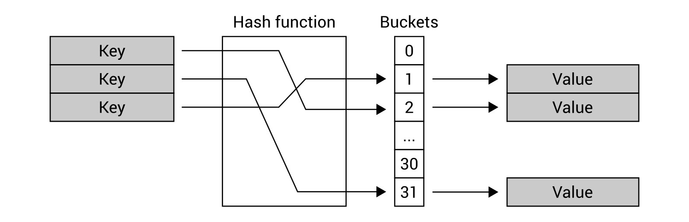{height="3cm"}
:::

Suppose you need to find a value of the key, you do not need to iterate
through all items in the collection, because you can just use the hash
function to easily find the index.

-   Using a hash table offers a very fast lookup for a value based on
    the key, which should be the $\color{ocre2}\text{O}(1)$ operation.

-   It is a generalization of an ordinary array.

-3ex -0.1ex -.4ex 0.5ex .2ex Sample Problem As an example, you can think
of a phone book. In the phone book, a person's name can be considered as
a key, by which we can find a phone number.

Case One:

:   The simple and straightforward way to lookup number is to check all
    names in the phone book until we find a matching name. The
    worst-case search time is $\color{ocre2}\text{O}(n)$.

Case Two:

:   Use a hash function that helps us to lookup entries much faster.

Suppose we have a person's name \"James Davis\" with the phone number
\"416-999-1234\". A hash function takes the key and maps it to an
integer that is within the size of the array:
$$\color{ocre2}\text{String}\ \Rightarrow\ \boxed{\text{Hash Function}}\ \Rightarrow\ \text{Index}$$
Then it stores the value of the phone number to an index of the array.
If we continue to add more people, it would map each one to an index of
the array.

::: center
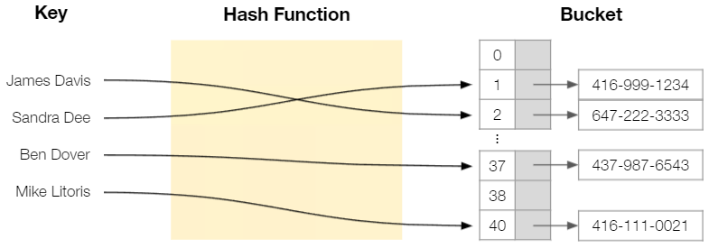{height="4cm"}
:::

If we wanna lookup a person's phone number, all we need is the person's
name and we can easily find the index it is stored in the array, by
passing it through a hash function.

Obviously, this is a watered-down explanation and doesn't go
in-depthlike the possibility when two or more keys hash to the same
slot. But before moving further, let's understand how direct-address
table works to see the benefits of using hash tables instead.

-3ex -0.1ex -.4ex 0.5ex .2ex Direct Address Table With an ordinary
array, we store element whose key is $\color{ocre2}k$ in position
$\color{ocre2}k$ of the array.

::: center
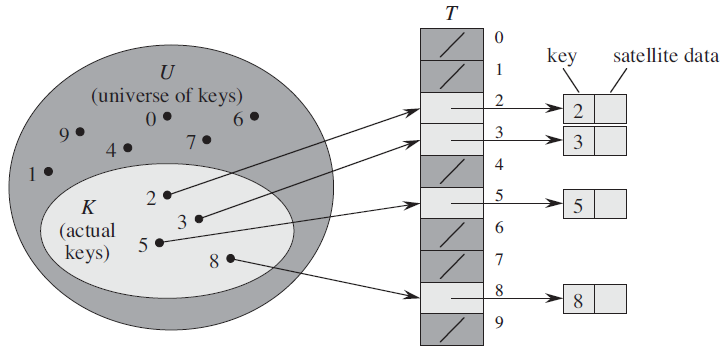{height="5cm"}
:::

::: dBox
::: definitionT
**Definition 6.2** (Direct addressing). *Given a key $\color{ocre2}k$,
we find the element whose key is $\color{ocre2}k$ by just looking in the
$\color{ocre2}k$th position of the array.*
:::
:::

A direct-address table (DAT) uses the keys as indices of the array and
stores the values at those bucket locations.

::: center
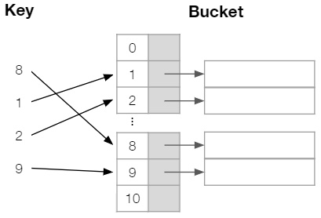{height="4cm"}
:::

It does facilitate fast searching, fast inserting and fast deletion
operations:

-   Inserting or deleting an element in the table, is the same as you
    would do for an array, hence we can do that in
    $\color{ocre2}\text{O}(1)$ time as we already know the index (via
    key).

-   Searching an element takes $\color{ocre2}\text{O}(1)$ times, as we
    can easily access an element in an array in linear time if we
    already know the index of that element.

Direct addressing is applicable when we can afford to allocate an array
with one position for every possible key, and so it comes at a cost:

-   It cannot handle collisionstwo keys are equal and contain different
    values.

-   It is not recommended using the direct address table if the key
    values are very large.

It has serious disadvantages, making it not suitable for the practical
usage of current world scenarios, which is why we make use of hash
tables.

-3ex -0.1ex -.4ex 0.5ex .2ex Hash Table As a recap, from the
introduction, instead of storing an element with key $\color{ocre2}k$ in
index $\color{ocre2}k$, we use a hash function $\color{ocre2}h$ and
store the element in index $\color{ocre2}h(k)$.

::: center
{height="5cm"}
:::

::: dBox
::: definitionT
**Definition 6.3** (Hash function). *A hash function $\color{ocre2}h$
maps all possible keys to the slots of an array
$\color{ocre2}T[0 \dots n - 1]$.*
:::
:::

While hash table offer the same time complexity of
$\color{ocre2}\text{O}(1)$ when we talk about insertion, deletion, or
searching an element, the main focus is in its ability to maintains the
size constraint.

The problem with DAT is if the universe $\color{ocre2}U$ of keys is
large, storing a table of size of $\color{ocre2}|U|$ may be impractical
or impossible. Often, the set of keys $\color{ocre2}K$ actually stored
is small, compared to $\color{ocre2}U$.

::: problem
**Problem 6.1**. *Suppose we have a key of $\color{ocre2}7898$, which in
turn is a large number.*
:::

Case One:

:   Using a DAT table, we would need a huge array, for the key in index
    $\color{ocre2}7898$ to store the value at $\color{ocre2}T[7898]$. In
    turn, we are wasting too much space, as most of the allocated space
    for the array is wasted.

Case Two:

:   But, in the case of a hash table, we can process this key via a hash
    function. The hash function $\color{ocre2}h(7898)$ maps it to an
    index within the hash table $\color{ocre2}T[0 \dots n - 1]$.

Regarding the size of the hash table $\color{ocre2}n$ it typically
varies, as it depends in part on choice of the hash function and
collision resolution, where a situation might arise when two or more
keys hash to the same slot.

-4ex -1ex -.4ex 1ex .2ex Hash Function A good hash function should
minimizes collision as mush as possible. It is usually specified as the
composition of two functions $\color{ocre2}h(k) = h_2\big(h_1(k)\big)$:

Hash code.

:   $\color{ocre2}h_1: \text{keys}\ \to\ \text{integers}$

Compression function.

:   $\color{ocre2}h_2: \text{integers}\ \to\ [0 \dots n - 1]$

::: center
{height="4cm"}
:::

The goal of the hash function is to disperse the keys in an apparently
random way.

-3ex -0.1ex -.4ex 0.5ex .2ex Hash Code As mentioned previously, keys can
be a string of characters. Thus, if the keys are not natural numbers, we
find a way to interpret them as natural numbers. Some popular hash code
maps are:

Summing hash code.

:   By adding up the [[ASCII
    values]{.underline}](https://www.cs.cmu.edu/~pattis/15-1XX/common/handouts/ascii.html)
    of each letters in a string, we get an integer in return. For
    example, if the key is \"stop\":
    $$\color{ocre2}h_1("stop") = 115 + 116 + 111 + 112$$ However, this
    is not suitable for strings cause two different strings can have the
    same set of letters, but have different meaning\"post\", \"tops\",
    and \"pots\" will have the same hash code.

Polynomial hash code.

:   A better hash code takes into account the position of each
    character. Using the example from before:
    $$\color{ocre2}h_1("stop") = (115 \times a^0) + (116 \times a^1) + (111 \times a^2) + (112 \times a^3)$$
    where $\color{ocre2}a$ is a non-zero constantcompared to \"post\",
    \"tops\", and \"pots\", all have unique hash codes, which is ideal.

-3ex -0.1ex -.4ex 0.5ex .2ex Compression Function The hash code
typically returns a large range of integers and so the compression
functions maps it in the range $\color{ocre2}[0 \dots n - 1]$, the
indices of the hash table. There's two methods:

Division Method.

:   A simple-modulo based compression rule:
    $$\color{ocre2}h_2(k) = k\ \text{mod}\ n$$ The size $\color{ocre2}n$
    of the hash table is usually chosen to be a prime number, to help
    spread out the distribution of hash values.

MAD Method.

:   The Multiply-Add-Divide method still use
    $\color{ocre2}\text{mod}\ n$ to get the numbers in the range, but a
    little fancier by spreading the numbers out first:
    $$\color{ocre2}h_2(k) = [(ak + b)\ \text{mod}\ p]\ \text{mod}\ n$$
    The values $\color{ocre2}a$ and $\color{ocre2}b$ are chosen at
    random as positive integers and $\color{ocre2}p$ is a prime number,
    where $\color{ocre2}p > n$. With the addition of
    $\color{ocre2}(ak + b)\ \text{mod}\ p$, it eliminates patterns
    provided by $\color{ocre2}k\ \text{mod}\ n$.

Both incorporate the modulo operator, as it guarantees the output to be
within the size of the hash table. Suppose we have a key of
$\color{ocre2}7898$ from the previous example and a hash table with
$\color{ocre2}23$ slots:
$$\color{ocre2}h_2(7898) = 7898\ \text{mod}\ 23 = 9$$ Then the key will
be mapped to index $\color{ocre2}9$ of the hash table.

-4ex -1ex -.4ex 1ex .2ex Collision Handling Collision occurs when
different elements are mapped to the same index of the arraywhen
$\color{ocre2}h(k_1) = h(k_2)$, but $\color{ocre2}k_1 \neq k_2$.

::: center
{height="4cm"}
:::

Avoiding collision is ideal, nonetheless, it is impossible, so we use
closed or open addressing to overcome this problem. Each of them have
their pros and cons.

-3ex -0.1ex -.4ex 0.5ex .2ex Closed Addressing Closed addressing (or
open hashing) is also known as separate chaining.

When collision occurs, the index keeps a reference to a linked list or
dynamic array that stores all items with the same index. Let
$\color{ocre2}e_1$ and $\color{ocre2}e_2$ represent the values attached
to $\color{ocre2}k_1$ and $\color{ocre2}k_2$ respectively.

::: center
{height="4cm"}
:::

Separate chaining is fairly simple to implement and faster than open
addressing in general. However, it is memory inefficient as it requires
a secondary data structure and longs chains can result in
$\color{ocre2}\text{O}(n)$ times.

-3ex -0.1ex -.4ex 0.5ex .2ex Open Addressing Instead of referencing to a
list or an array, open addressing (or closed hashing) resolves collision
by searching for another empty bucket.

::: center
{height="4cm"}
:::

There's three types of open addressing:

Linear Probing.

:   When collision occurs, we linearly probe for the next bucket by
    increasing the index linearly until it finds an empty bucket:
    $$\color{ocre2}\text{Index} = \big[h(k) + i\big]\ \text{mod}\ n$$
    where $\color{ocre2}i$ increases by one each iteration, until it
    finds an empty bucket.

Quadratic Probing.

:   Similar to the previous one, but instead we increase the index
    quadratically until it finds an empty bucket:
    $$\color{ocre2}\text{Index} = \big[h(k) + i^2\big]\ \text{mod}\ n$$
    where $\color{ocre2}i$ increases by one each iteration, until it
    finds an empty bucket.

Double Hashing.

:   Using a secondary hash function $\color{ocre2}h'(k)$, it places the
    colliding item in the first available cell by:
    $$\color{ocre2}\text{Index} = \big[h(k) + jh'(k)\big]\ \text{mod}\ n$$
    where $\color{ocre2}j$ increases by one each iteration, until it
    finds an empty bucket. The secondary hash function cannot have zero
    values and is typically written as such:
    $$\color{ocre2}h'(k) = q -(k\ \text{mod}\ q)$$ where
    $\color{ocre2}q$ is a prime number, such that $\color{ocre2}q > n$.

Unlike separate chaining, open addressing is more memory efficient, as
it stores element in empty indices. However, it can create cluster:

-   Linear probing can result in primary clustering.

-   Quadratic probing can result in secondary clustering.

Compared to the two, double hashing distributes the keys more evenly and
produces a uniform distribution of records throughout the hash table.

# Trees

-4ex -1ex -.4ex 1ex .2ex Introduction A tree is a dynamic set of nodes
storing elements in a parent-child relationship (edge) with the
following properties:

-   It has a special node called root.

-   Each node different from the root has a parent node.

-   There is a single unique path along the edges from the root to any
    particular nodedoesn't have any cycles.

::: center
{height="3cm"}
:::

-3ex -0.1ex -.4ex 0.5ex .2ex Tree Terminology In a tree, we often refer
to certain parts of tree, which are listed below. For reference:

::: center
{height="4cm"}
:::

-   Root: The top element with no parent ($\color{ocre2}A$).

-   Siblings: Children of the same parent ($\color{ocre2}G, H$ both have
    the parent $\color{ocre2}C$).

-   External node: Also referred to as leave, ndoes with no children
    ($\color{ocre2}E, I, J, K, G, H$).

-   Internal node: nodes with one or more children
    ($\color{ocre2}A, B, C, F$).

-   Ancestors: A node that is connected to all lower-level node
    ($\color{ocre2}A, B, F$ are ancestors of $\color{ocre2}I, J, K$).

-   Descendants: The connected lower-level nodes ($\color{ocre2}I$ is a
    descendant of $\color{ocre2}A, B, F$).

-   Depth of a node: Number of ancestors ($\color{ocre2}I$ has a depth
    of $\color{ocre2}3$).

-   Height of a tree: The max node depth (The height of tree is
    $\color{ocre2}3$).

-   Sub-tree: A tree consisting of a node and all its descendants (Refer
    to the red triangle above).

-3ex -0.1ex -.4ex 0.5ex .2ex Tree Traversals A traversal is defined as a
systematic way of accessing or visiting all nodes of a tree. Let's use
the following tree as an example:

::: center
{height="3cm"}
:::

There's three ways a tree can be traverse, but we'll only go over two of
them. The last one will be covered in the next section.

Preorder traversal.

:   Root is visited first and then sub-trees rooted at its children are
    visited recursively
    ($\color{ocre2}A \to B \to D \to E \to C \to F \to G$).

Postorder traversal.

:   Recursively traverse the sub-trees rooted at children and then visit
    the root itself
    ($\color{ocre2}D \to E \to F \to G \to B \to C \to A$).

-4ex -1ex -.4ex 1ex .2ex Binary Search Tree Search trees are designed to
support efficient search operations, including [Search]{.smallcaps},
[Minimum]{.smallcaps}, [Maximum]{.smallcaps}, [Predecessor]{.smallcaps},
[Successor]{.smallcaps}, [Insert]{.smallcaps}, and [Delete]{.smallcaps}.

A binary tree is a tree with the following:

-   Each internal node has at most two children.

-   The children of a node are an ordered pairleft child, right child
    and left sub-tree, right sub-tree.

-   The keys satisfy the binary-search tree property:
    $\color{ocre2}u.key \leq v.key \leq w.key$

    -   Node $\color{ocre2}u$ is a node (any node) in the left sub-tree
        of node $\color{ocre2}v$.

    -   Node $\color{ocre2}w$ is a node (any node) in the right sub-tree
        of node $\color{ocre2}v$.

::: center
{height="3cm"}
:::

In other words, the value of the key of the parent should be between the
value of the key of the left child and right child.

A binary search tree (BST) is organized, as the name suggests, in a
binary tree, where [`root[T]`]{style="background-color: light-gray"}
points to the root of tree [`T`]{style="background-color: light-gray"}
and each node contains the fields:

-   [`key`]{style="background-color: light-gray"} (and possibly other
    satellite data)

-   [`left`]{style="background-color: light-gray"} which points to left
    child.

-   [`right`]{style="background-color: light-gray"} which points to
    right child.

-   [`p`]{style="background-color: light-gray"} which points to parent,
    where [`p[root[T]] = nil`]{style="background-color: light-gray"}

-3ex -0.1ex -.4ex 0.5ex .2ex Inorder Traversal The binary-search tree
property allows us to print out all the keys in sorted tree by a simple
recursive algorithm, called an inorder tree walk, which can be
visualized as such:

::: center
{height="3.5cm"}
:::

$$\color{ocre2}D \to B \to E \to A \to F \to C \to G$$ How
[Inorder-Tree-Walk]{.smallcaps} works:

1.  Check to make sure that [`x`]{style="background-color: light-gray"}
    is not [`nil`]{style="background-color: light-gray"}.

2.  Recursively, print the keys of the nodes in the
    [`x`]{style="background-color: light-gray"}'s left sub-tree.

3.  Print [`x`]{style="background-color: light-gray"}'s key.

4.  Recursively, print the keys of the nodes in the
    [`x`]{style="background-color: light-gray"}'s right sub-tree.

::: algorithm
[Inorder-Tree-Walk]{.smallcaps} $(x)$

::: algorithmic
:::
:::

-3ex -0.1ex -.4ex 0.5ex .2ex Querying Binary search tree can support
such queries as [Search]{.smallcaps}, [Minimum]{.smallcaps},
[Maximum]{.smallcaps}, [Predecessor]{.smallcaps}, and
[Successor]{.smallcaps} operations.

The [Tree-Search]{.smallcaps} procedure starts at the root and traces a
simple path downward in the tree. The running time is
$\color{ocre2}\text{O}(h)$, where $\color{ocre2}h$ is the height of the
tree.

::: algorithm
[Tree-Search]{.smallcaps} $(x,k)$

::: algorithmic
:::
:::

The [Iterative-Tree-Search]{.smallcaps} is more efficient in which works
by \"unrolling\" the recursion into a while loop.

::: algorithm
[Tree-Search]{.smallcaps} $(x,k)$

::: algorithmic
:::
:::

Refer to the diagram below:

::: center
{height="4cm"}
:::

The binary search-tree property guarantees that:

-   the leftmost node is the minimum key of the binary search tree

-   the rightmost node is the maximum key of the binary search tree

Thus, the [Tree-Minimum]{.smallcaps} and [Tree-Maximum]{.smallcaps}
procedure traverse the appropriate points until [nil]{.smallcaps} is
reached. The running time for both is $\color{ocre2}\text{O}(h)$.

::: algorithm
[Tree-Minimum]{.smallcaps} $(x)$

::: algorithmic
:::
:::

::: algorithm
[Tree-Maximum]{.smallcaps} $(x)$

::: algorithmic
:::
:::

Refer to the diagram below:

::: center
{height="4cm"}
:::

Before going over the procedure for successor and predecessor, let's
define what it means. Assuming all keys are unique, if $\color{ocre2}x$
has two children:

-   The successor is the minimum value in its right sub-tree.

-   The predecessor is the maximum value in its left sub-tree.

Refer to this example using the key value of $\color{ocre2}25$:

::: center
{height="4cm"}
:::

If you recall from earlier, when we performed inorder traversal, we can
find the successor and predecessor based entirely on the tree structure.

::: algorithm
[Tree-Successor]{.smallcaps} $(x)$

::: algorithmic
:::
:::

We can break the code for [Tree-Successor]{.smallcaps} into two cases:

1.  If [`x.right`]{style="background-color: light-gray"} is non-empty,
    then [`x`]{style="background-color: light-gray"}'s successor is the
    minimum in [`x`]{style="background-color: light-gray"}'s right
    sub-tree.

2.  If [`x.right`]{style="background-color: light-gray"} is empty, then
    go up the tree until the current node is a left child. If you cannot
    go up further and you reached root, then
    [`x`]{style="background-color: light-gray"} is the largest element.

For example, if we want to find the successor of the key value of
$\color{ocre2}20$:

1.  The right sub-tree is empty, so we go up the tree to the key value
    of $\color{ocre2}19$.

2.  Since $\color{ocre2}20$ is not a left child or located in the left
    sub-tree of $\color{ocre2}19$, go up the tree to the key value of
    $\color{ocre2}15$.

3.  Likewise, it is not a left child of $\color{ocre2}15$, so go up the
    tree to the key value of $\color{ocre2}25$.

4.  The key value of $\color{ocre2}25$ has $\color{ocre2}20$ as a left
    child, therefore, the successor of $\color{ocre2}20$ is
    $\color{ocre2}25$.

Refer to the diagram below:

::: center
{width="\\textwidth"}
:::

The [Tree-Predecessor]{.smallcaps} procedure is symmetric to
[Tree-Predecessor]{.smallcaps} procedure, which instead uses
[`x . left`]{style="background-color: light-gray"}. The running time for
both is $\color{ocre2}\text{O}(h)$.

-3ex -0.1ex -.4ex 0.5ex .2ex Insertion and Deletion The operations of
insertion and deletion cause the dynamic set represented by a binary
search tree to change. Thus, the binary-search tree property must hold
after this change.

The [Tree-Insert]{.smallcaps} procedure works quite similar to
[Tree-Search]{.smallcaps} and [Iterative-Tree-Search]{.smallcaps}, which
begins at the root of the tree.

::: algorithm
[Tree-Insert]{.smallcaps} $(T,z)$

::: algorithmic
:::
:::

In the code, we are trying to insert
[`z`]{style="background-color: light-gray"} to the tree
[`T`]{style="background-color: light-gray"}:

-   The pointer [`x`]{style="background-color: light-gray"} traces a
    simple path downward looking for a [nil]{.smallcaps} to replace with
    the input [`z`]{style="background-color: light-gray"}.

-   The trailing pointer [`y`]{style="background-color: light-gray"}
    maintains the parent of [`x`]{style="background-color: light-gray"}.

Suppose we want to insert an item with key $\color{ocre2}9$. The while
loop in lines 3-8 can be expressed as:

::: center
{width="90%"}
:::

The [nil]{.smallcaps} occupies the position where we wish to place the
input item [`z`]{style="background-color: light-gray"}. The lines 10-15
set the pointers that cause [`z`]{style="background-color: light-gray"}
to be inserted.

Deletion is somewhat more tricky than insertion. The process for
deleting node [`z`]{style="background-color: light-gray"} can be broken
into three cases:

Case One:

:   If [`z`]{style="background-color: light-gray"} has no children, then
    we simply remove it by modifying it's parent to replace
    [`z`]{style="background-color: light-gray"} with [nil]{.smallcaps}.

::: center
{width="\\textwidth"}
:::

Case Two:

:   If [`z`]{style="background-color: light-gray"} has one child, then
    delete [`z`]{style="background-color: light-gray"} by making the
    parent of [`z`]{style="background-color: light-gray"} point to
    [`z`]{style="background-color: light-gray"}'s child, instead of
    [`z`]{style="background-color: light-gray"}.

::: center
{width="\\textwidth"}
:::

Case Three:

:   If [`z`]{style="background-color: light-gray"} has two children,
    then delete [`z`]{style="background-color: light-gray"}'s successor,
    [`y`]{style="background-color: light-gray"}, from the tree (via Case
    One or Case Two) and replace
    [`z`]{style="background-color: light-gray"}'s key and satellite data
    with [`y`]{style="background-color: light-gray"}.

::: center
{width="\\textwidth"}
:::

The [Tree-Delete]{.smallcaps} procedure executes the three cases as
follows. The running time is $\color{ocre2}\text{O}(h)$.

::: algorithm
[Tree-Delete]{.smallcaps} $(T,z)$

::: algorithmic
:::
:::

As you may have notice, the running time for these operations:
[Search]{.smallcaps}, [Minimum]{.smallcaps}, [Maximum]{.smallcaps},
[Predecessor]{.smallcaps}, [Successor]{.smallcaps},
[Insert]{.smallcaps}, and [Delete]{.smallcaps} all take
$\color{ocre2}\text{O}(h)$, where $\color{ocre2}h$ is the height of the
tree. These operations are fast if the height of the tree is small.

For binary search trees given we have $\color{ocre2}n$ items, the
minimum height of a binary tree can be $\color{ocre2}\log{n}$ and the
maximum be $\color{ocre2}n$. It can be depicted as such:

::: center
{width="\\textwidth"}
:::

Ideally we want make sure the height of the binary tree is always
$\color{ocre2}\log{n}$, as it provides the worst-case running time of
$\color{ocre2}\text{O}(\log{n})$, thus comes the motivation for the next
topic.

-3ex -0.1ex -.4ex 0.5ex .2ex Balanced Search Tree One way we can ensure
our tree is always balanced is by implementing a self-balancing binary
search tree. A search-tree data structure for which a height of
$\color{ocre2}\log{n}$ is guaranteed when implementing dynamic set of
$\color{ocre2}n$ items.

-   AVL Tree

-   Red-Black Tree

It ensures the $\color{ocre2}\text{O}(\log{n})$ time complexity at all
times, by maintaining the binary-search tree property and height-balance
property of the tree, whenever insertion or deletion is performed.

-4ex -1ex -.4ex 1ex .2ex Red-Black Trees Red-black trees are one of many
search-tree schemes that are "balanced" in order to guarantee that basic
dynamic-set operations take $\color{ocre2}\text{O}(\log{n})$ time in the
worst case.

::: center
{height="5cm"}
:::

It is a binary tree that satisfies the following red-black properties:

1.  Every node is either red or black.

2.  The root and leaves ([nil]{.smallcaps}) are black.

3.  If a node is red, then both of its children are black.

4.  For each node, all simple paths from the node to ([nil]{.smallcaps})
    descendant leaves contain the same number of black nodes.

To expand more on property 4, let's find the black-height of the key
value of $\color{ocre2}7$. These are all the simple paths that can be
taken indicated by the grey dashed arrow above:

-   7, 3, [nil]{.smallcaps}

-   7, 18, 10, 8, [nil]{.smallcaps}

-   7, 18, 10, 11, [nil]{.smallcaps}

-   7, 18, 22, 26, [nil]{.smallcaps}

If we don't include the root node, notice how all simple paths consists
of the (same number of) $\color{ocre2}2$ black nodes. Likewise, the same
can be said for every node in the tree.

The red-black tree is a BST, so we can implement the dynamic-set
operations [Search]{.smallcaps}, [Minimum]{.smallcaps},
[Maximum]{.smallcaps}, [Predecessor]{.smallcaps}, and
[Successor]{.smallcaps} in $\color{ocre2}\text{O}(\log{n})$ time.

-3ex -0.1ex -.4ex 0.5ex .2ex Recoloring and Rotation However, it does
not directly support the dynamic-set operations [Insert]{.smallcaps} and
[Delete]{.smallcaps}. Because they modify the tree, the result may
violate the red-black properties.

-   We must change color of some nodes via recoloring

-   Restructure the links of the tree via rotation

For starters, let's go over the relationship in a binary tree:

::: center
{height="3cm"}
:::

There's two types of procedures called [Left-Rotate]{.smallcaps} and
[Right-Rotate]{.smallcaps}.

::: center
{width="80%"}
:::

The letters $\color{ocre2}\alpha$, $\color{ocre2}\beta$, and
$\color{ocre2}\gamma$ represent an arbitrary sub-treeall of them have
the same black-height. First, determine if recoloring needs to be done.

Case One:

:   If [`x`]{style="background-color: light-gray"}'s uncle,
    [`y`]{style="background-color: light-gray"}, is red. Proceed with
    recoloring.

Push $\color{ocre2}C$'s black onto $\color{ocre2}A$ and
$\color{ocre2}D$. Recurse and check for $\color{ocre2}C$'s uncle if it
exists.

::: center
{height="4cm"}
:::

Case Two:

:   If [`x`]{style="background-color: light-gray"}'s uncle,
    [`y`]{style="background-color: light-gray"}, is black and there's a
    LR or RL imbalance.

::: center
{height="4cm"}
:::

There are four restructuring configurations depending on whether the
double red nodes ($\color{ocre2}A$ and $\color{ocre2}B$) are left or
right children.

::: center
{width="\\textwidth"}
:::

If there's a LR imbalance, perform [Left-Rotate]{.smallcaps} on middle
node. Proceed to Case Three.

::: center
{width="70%"}
:::

If there's a RL imbalance, perform [Right-Rotate]{.smallcaps} on middle
node. Proceed to Case Three.

::: center
{width="70%"}
:::

Case Three:

:   If [`x`]{style="background-color: light-gray"}'s uncle,
    [`y`]{style="background-color: light-gray"}, is black and there's a
    LL or RR imbalance. Preserve the color

If there's a LL imbalance, perform [Right-Rotate]{.smallcaps} on top
node.

::: center
{width="70%"}
:::

If there's a RR imbalance, perform [Left-Rotate]{.smallcaps} on top
node.

::: center
{width="70%"}
:::

-3ex -0.1ex -.4ex 0.5ex .2ex Insertion and Deletion To perform
insertion, we insert [`x`]{style="background-color: light-gray"} and
color it red. The motivation for using the color red is that only
property 2 and 3 might be brokenthese violation are fairly easy to fix.

The [RB-Insert]{.smallcaps} procedure performs the following three cases
describe in the previous section. The running time is
$\color{ocre2}\text{O}(\log{n})$.

Suppose we want to insert $\color{ocre2}15$ using the red-black tree
shown in the beginning, then we would insert as we normally would in a
BST and color it red. Refer to the diagram below:

::: center
{width="\\textwidth"}
:::

Just like deleting a node in a BST, it's just as complicated to delete a
node in a red-black tree. The process for deleting node can be broken
into three cases:

Case One:

:   If the deleted node is red, perform the deletion as you would in
    BST. No color changes should occur.

::: center
{width="90%"}
{width="90%"}
{width="90%"}
:::

Case Two:

:   If the deleted node is black and has one red child. Reattach the red
    child in place of the black node we removed, then recolor the red
    node as black to fix black-height of the tree.

::: center
{width="90%"}
:::

Case Three:

:   If the deleted node is black. Reattach a black child in place of the
    black node we removed, then recolor as a double black.

::: center
{width="90%"}
:::

The double black is to keep track of where we violated the black depth
property. Denoted as [`r`]{style="background-color: light-gray"} and the
sibling of [`r`]{style="background-color: light-gray"} as
[`y`]{style="background-color: light-gray"}, we'll divide this into
three sub-cases based on [`y`]{style="background-color: light-gray"}:

::: list

The color of [`x`]{style="background-color: light-gray"}, parent of
[`z`]{style="background-color: light-gray"}, displayed can be black or
red. These three sub-cases differ only on the color of
[`y`]{style="background-color: light-gray"}, sibling of
[`r`]{style="background-color: light-gray"}.
:::

Case Three (a):

:   The sibling [`y`]{style="background-color: light-gray"} of
    [`r`]{style="background-color: light-gray"} is black and has a red
    child [`z`]{style="background-color: light-gray"}.

::: center
{width="60%"}
:::

If [`z`]{style="background-color: light-gray"} is a left child, perform
[Right-Rotate]{.smallcaps} on
[`y`]{style="background-color: light-gray"}, then proceed below.

::: center
{width="90%"}
:::

> If [`z`]{style="background-color: light-gray"} is a right child,
> perform [Right-Rotate]{.smallcaps} on
> [`x`]{style="background-color: light-gray"}. We color
> [`x`]{style="background-color: light-gray"} and
> [`z`]{style="background-color: light-gray"} black, give
> [`y`]{style="background-color: light-gray"} the former color of
> [`x`]{style="background-color: light-gray"}, and color
> [`r`]{style="background-color: light-gray"} black.

::: center
{width="90%"}
:::

As you can see, we managed to achieve the same configuration as the
original tree prior to the deletion of node. We basically converted the
red node to be a black node, thus maintaining the red-black tree
property.

Case Three (b):

:   The sibling [`y`]{style="background-color: light-gray"} of
    [`r`]{style="background-color: light-gray"} is black and both
    children of [`y`]{style="background-color: light-gray"} are black.

::: center
{width="60%"}
:::

If [`x`]{style="background-color: light-gray"} is red, we color it
black, then we color [`r`]{style="background-color: light-gray"} black
and [`y`]{style="background-color: light-gray"} red.

::: center
{width="90%"}
:::

Otherwise, we only color [`r`]{style="background-color: light-gray"}
black and [`y`]{style="background-color: light-gray"} red.

::: center
{width="90%"}
:::

In this case, we are essentially removing one black-height from the
other sub-tree, to deal with the double black.

Case Three (c):

:   The sibling [`y`]{style="background-color: light-gray"} of
    [`r`]{style="background-color: light-gray"} is red. Perform an
    adjustment operation.

::: center
{width="60%"}
:::

> If [`y`]{style="background-color: light-gray"} is the right child of
> [`x`]{style="background-color: light-gray"}, perform
> [Left-Rotate]{.smallcaps} on
> [`x`]{style="background-color: light-gray"}. We color
> [`y`]{style="background-color: light-gray"} black and
> [`x`]{style="background-color: light-gray"} red.

::: center
{width="90%"}
:::

> If [`y`]{style="background-color: light-gray"} is the left child of
> [`x`]{style="background-color: light-gray"}, perform
> [Right-Rotate]{.smallcaps} on
> [`x`]{style="background-color: light-gray"}. We color
> [`y`]{style="background-color: light-gray"} black and
> [`x`]{style="background-color: light-gray"} red.

::: center
{width="90%"}
:::

The sibling of [`r`]{style="background-color: light-gray"} should be
black now, thus solve using Case Three (a) or Case Three (b).

::: list

In Case Three (a) and Case Three (b), if
[`r`]{style="background-color: light-gray"} is in the right-side instead
of the left-side, the direction of rotation changese.g.
[Right-Rotate]{.smallcaps} instead of [Left-Rotate]{.smallcaps} and
vice-versa, as we have done in Case Three (c).
:::

-3ex -0.1ex -.4ex 0.5ex .2ex Comparing AVL and Red-Black Trees Since
both provide dynamic-set operations in $\color{ocre2}\text{O}(\log{n})$
time, which one to choose?

-   AVL trees provide faster lookups than Red Black Trees because they
    are more strictly balanced.

-   Red-Black Trees provide faster insertion and removal operations than
    AVL trees as fewer rotations are done due to relatively relaxed
    balancing.

-   AVL trees store balance factors or heights with each node, thus
    requires storage for an integer per node whereas Red Black Tree
    requires only 1 bit of information per node.

-   Red-Black Trees are used in most of the language libraries like map,
    multi-map, multi-set in C++ whereas AVL trees are used in databases
    where faster retrievals are required.

# Graph

-4ex -1ex -.4ex 1ex .2ex Properties of a Graph A graph should consists
of the following:

1.  Vertices (nodes), which specify some entities we are interested in.

2.  Edges (lines), which specify the relationship between entities.

3.  Weights (number in lines), which specify the weight the edge
    represent.

The formal definition of a graph is a pair $\color{ocre2}(V,E)$ where:

-   $\color{ocre2}V$ is a collection of nodes, called vertices.

-   $\color{ocre2}E$ is a collection of pairs of vertices, called edges.

::: exampleT
**Example 8.1**. *We can represent the following graph using the given
vertices and edges:*

-   *$\color{ocre2}V = \{a,b,c,d,e,f\}$*

-   *$\color{ocre2}E = \{(a,c),(b,c),(c,f),(b,d),(d,f),(c,d)\}$*

::: center
{height="3cm"}
:::
:::

A graph can be categorized into one of two types, depending on the edge
type:

Undirected Graph.

:   Edges do not have a directionundirected edge are unordered pair of
    vertices, such that $\color{ocre2}(u,v)$ and $\color{ocre2}(v,u)$
    are the same edge.

    ::: center
    {height="0.75cm"}
    :::

Directed Graph.

:   Edges with directiondirected edges are ordered pair of vertices,
    such that $\color{ocre2}\langle u,v \rangle$ and
    $\color{ocre2}\langle v,u \rangle$ are two different edges.

    ::: center
    {height="0.75cm"}
    {height="0.75cm"}
    :::

To distinguish between the two edge types, we use round brackets
$\color{ocre2}( )$ for unordered pairs and angle brackets
$\color{ocre2}\langle \rangle$ for ordered pairs.

-3ex -0.1ex -.4ex 0.5ex .2ex Graph Terminology We will go over a few
graph terminologies, some of which you should be familiar with.

-   The degree of a vertex is the number of incident edges of this
    vertex. Below are some examples. Pay close attention to the degree
    of vertex $\color{ocre2}z$.

    ::: center
    {height="3cm"}
    :::

    Let $\color{ocre2}m$ be the number of edges and
    $\color{ocre2}\deg(a)$ be the degree of vertex $\color{ocre2}a$,
    then $$\color{ocre2}\sum_{a \in V}\deg(a) = 2m$$

-   For undirected graphs, parallel edges are edges that have the same
    endpoints, whereas for directed graph, they are edges that have the
    same origin and destination.

    ::: center
    {height="3cm"}
    :::

-   Self-loop is an edge whose endpoints coincide, such as the edge
    $\color{ocre2}(z,z)$

    ::: center
    {height="3cm"}
    :::

In this course, we will deal almost exclusively with simple graphs,
which are graphs that do not have a parallel edge or self-loop. Let
$\color{ocre2}n$ be the number of vertices and $\color{ocre2}m$ the
number of edges, then $$\color{ocre2}m \leq \frac{n(n - 1)}{2}$$

There are various definitions used to describe the movement in a graph:

-   A path is a sequence of vertices, such that consecutive vertices are
    adjacent.

    -   A simple path is path such that all its vertices are distinct.

    ::: center
    {height="3cm"}
    :::

-   A cycle is a path on which the first vertex is equal to the last
    vertex.

    -   A simple cycle is a cycle such that all its vertices are
        distinct, except the first and last one.

    ::: center
    {height="3cm"}
    :::

Lastly, we'll cover the characteristics of a connected graph and the
definition of a subgraph.

-   A connected graph is a graph in which there is a path from any
    vertex to any other vertex in the graph.

    ::: center
    {height="3cm"}
    :::

-   We can say a tree is a connected graph without a cycleany two
    vertices are connected by exactly one path.

    ::: center
    {height="2cm"}
    :::

-   A subgraph of a graph $\color{ocre2}(V,E)$ is a pair
    $\color{ocre2}(V', E')$ where $\color{ocre2}V' \subseteq V$ and
    $\color{ocre2}E' \subseteq E$. Both endpoints of edges in
    $\color{ocre2}E'$ are in $\color{ocre2}V'$.

    ::: center
    {height="5cm"}
    :::

-   Then a spanning tree is a subgraph of a connected graph, which
    includes all vertices of the connected graph.

    ::: center
    {height="5cm"}
    :::

-4ex -1ex -.4ex 1ex .2ex Representations of Graphs We can choose between
two standard ways to represent a graph $\color{ocre2}G = (V,E)$, as a
collection of:

1.  Adjacency list

2.  Adjacency matrix

Either way applies to both directed and undirected graph. They are
useful in representing dense and sparse graphs:

Sparse graphs.

:   A graph with only a few edge.

Dense graphs.

:   The number of edges is close to the maximal number of edges.

::: center
{height="2.5cm"}
:::

-3ex -0.1ex -.4ex 0.5ex .2ex Adjacency List The adjacency-list
representation of a graph consists of an array
$\color{ocre2}\textit{Adj}$ of $\color{ocre2}|V|$ list, one for each
vertex in $\color{ocre2}V$.

-   For an undirected graph, the adjacency list
    $\color{ocre2}\textit{Adj}[u]$ contains all the vertices
    $\color{ocre2}v$ such that there is an edge
    $\color{ocre2}(u,v), (v,u) \in E$.

    ::: center
    {height="3cm"}
    :::

    Alternatively, you can think of it as a list of all the vertices
    adjacent to $\color{ocre2}u$.

    ::: center
    {height="2.5cm"}
    :::

```{=html}
<!-- -->
```
-   For a directed graph, the adjacency list
    $\color{ocre2}\textit{Adj}[u]$ contains all the vertices
    $\color{ocre2}v$ such that there is an edge
    $\color{ocre2}\langle u,v \rangle \in E$.

    ::: center
    {height="3cm"}
    :::

    Alternatively, you can think of it as a list of destinations given
    the origin $\color{ocre2}u$.

    ::: center
    {height="2.5cm"}
    :::

::: list

Note that in an adjacency list, the order doesn't matter, meaning we
could have listed the vertex in any order.
:::

A useful thing we could do with adjacency list is to represent weighted
graphsedges with an associated weight to them. It can easily be done by
storing it with vertex $\color{ocre2}v$ in $\color{ocre2}u$'s adjacency
list.

::: center
{height="3cm"}
:::

A potential disadvantage of the adjacency-list representation is that
there is no quicker way to determine if a given edge
$\color{ocre2}(u,v)$ is present in the graph.

1.  We would need to search for $\color{ocre2}v$ in the adjacency list
    $\color{ocre2}\textit{Adj}[u]$.

2.  If we want to check the edge $\color{ocre2}(2,4)$, then we would
    need search through $\color{ocre2}\textit{Adj}[2]$.

    ::: center
    {height="2.5cm"}
    :::

3.  The worst-case running time would be the number of adjacent
    vertices, which is not ideal.

A solution would be to use an adjacency-matrix representation, which
requires a constant time $\color{ocre2}\text{O}(1)$, but at the cost of
using asymptotically more memory.

-3ex -0.1ex -.4ex 0.5ex .2ex Adjacency Matrix The adjacency-matrix
representation of a graph consists of a $\color{ocre2}|V| \times |V|$
matrixassuming the vertices are numbered from $\color{ocre2}1$,
$\color{ocre2}2$, ..., to $\color{ocre2}|V|$.

We can represent the elements inside the matrix $\color{ocre2}A$ as
$\color{ocre2}a_{ij}$, where $\color{ocre2}i$ and $\color{ocre2}j$
indicate the row and column.

-   For an undirected graph, if there is an edge
    $\color{ocre2}(i,j), (j,i) \in E$, then set
    $\color{ocre2}a_{ij} = 1$, otherwise, $\color{ocre2}a_{ij} = 0$.

    ::: center
    {height="3cm"}
    :::

    Notice how $\color{ocre2}a_{22}$ is $\color{ocre2}0$, since the edge
    $\color{ocre2}(2,2)$ does not exist.

    ::: center
    {height="2.5cm"}
    :::

-   For a directed graph, if there is an edge
    $\color{ocre2}\langle i, j \rangle \in E$, then set
    $\color{ocre2}a_{ij} = 1$, otherwise, $\color{ocre2}a_{ij} = 0$.

    ::: center
    {height="3cm"}
    :::

Like the adjacency-list representation of a graph, an adjacency matrix
can represent a weighted graph. Instead of storing $\color{ocre2}0$'s
and $\color{ocre2}1$'s, we store the weight of the given edge.

::: center
{height="3cm"}
:::

If an edge does not exist, we can store a [nil]{.smallcaps} value,
depicted as empty in the diagram above.

-3ex -0.1ex -.4ex 0.5ex .2ex Comparison As we have demonstrated both are
applicable to undirected and directed graphs, each with their own
advantages and disadvantages.

                                                                    **Adjacency List**             **Adjacency Matrix**
  ---------------------------------------------------------- -------------------------------- ------------------------------
                          **Space:**                          $\color{ocre2}\Theta(|V + E|)$   $\color{ocre2}\Theta(|V|^2)$
   **Time:** List all vertices adjacent to $\color{ocre2}u$   $\color{ocre2}\Theta(\deg(u))$    $\color{ocre2}\Theta(|V|)$
      **Time:** Determine if $\color{ocre2}(u,v) \in E$       $\color{ocre2}\Theta(\deg(u))$     $\color{ocre2}\Theta(1)$

The choice of which one to use comes down to the following criteria:

-   The adjacency-list representation provides a compact way to
    represent sparse graphsthose for which $\color{ocre2}|E|$ is much
    less than $\color{ocre2}|V|^2$.

-   However, if $\color{ocre2}|E|$ is close to $\color{ocre2}|V|^2$,
    then we may choose an adjacency-matrix representation since it
    almost have the same space complexity as the adjacency-list.

-   Alternatively, if we need to be able to tell quickly if there is an
    edge connecting two given vertices, an adjacency-matrix
    representation is used.

-4ex -1ex -.4ex 1ex .2ex Graph Traversals A traversal (or graph
searching) is a systematic procedure for exploring a connected graph by
examining all its vertices and/or edges. There's two types of traversal
algorithms:

1.  Breadth-First Search (BFS)

2.  Depth-First Search (DFS)

-3ex -0.1ex -.4ex 0.5ex .2ex Breadth-First Search Breadth-first search
(BFS) is one of the simplest algorithms for searching a graph, which
uses a queue data structure.

For simplicity, we will use a tree to describe breadth-first search:

1.  Let's start at the root of tree. Let's add $\color{ocre2}A$ to the
    queue.

    ::: center
    {height="3cm"}
    :::

2.  We want to explore all the vertices that are adjacent to
    $\color{ocre2}A$, which are $\color{ocre2}B$ and $\color{ocre2}C$.
    We will add them to the queue.

    ::: center
    {height="3cm"}
    :::

    Note that the order they are placed in queue does not matter. We
    could have stored $\color{ocre2}C$ first.

3.  Since we finished \"exploring\" $\color{ocre2}A$, we will move on,
    then $\color{ocre2}B$ is next in queue.

    ::: center
    {height="3cm"}
    :::

4.  Likewise, we add all vertices adjacent to $\color{ocre2}B$, which
    are $\color{ocre2}D$ and $\color{ocre2}E$, to the queue.

    ::: center
    {height="3cm"}
    :::

5.  Since we finished \"exploring\" $\color{ocre2}B$ , we will move to
    $\color{ocre2}C$.

    ::: center
    {height="3cm"}
    :::

6.  We will add the vertices adjacent to $\color{ocre2}C$. which are
    $\color{ocre2}F$ and $\color{ocre2}G$ to the queue.

    ::: center
    {height="3cm"}
    :::

7.  When we move to vertex $\color{ocre2}D$, you will see there are no
    adjacent vertices, thus we don't add anything to the queue and move
    on to $\color{ocre2}E$.

    ::: center
    {height="3cm"}
    :::

8.  The same can be said for $\color{ocre2}E$ through $\color{ocre2}G$,
    in which we finish our breadth-first search.

    ::: center
    {height="3cm"}
    :::

This is a simplified explanation, but should provide a general idea of
how it works. We associate the vertex colors to guide the algorithm:

-   White vertices have not been discovered. All vertices start out
    white.

-   Grey vertices are discovered but not fully explored.

-   Black vertices are discovered and fully explored.

The algorithm attaches several attributes to each vertex, such as color
[`u.color`]{style="background-color: light-gray"}, parent
[`u.\pi`]{style="background-color: light-gray"}, and distance
[`u.d`]{style="background-color: light-gray"} which is computed by the
algorithm.

-   To keep track of progress, breadth-first search colors each vertex
    white, grey, or black.

-   Distance is used to represent the smallest number of edges that must
    be traverse from the starting vertex
    [`s`]{style="background-color: light-gray"} to end vertex
    [`v`]{style="background-color: light-gray"}.

::: algorithm
[BFS]{.smallcaps} $(G,s)$

::: algorithmic
:::
:::

We start off by painting every vertex
[`white`]{style="background-color: light-gray"} except our starting
vertex [`s`]{style="background-color: light-gray"} and setting the
distance to [`\infty`]{style="background-color: light-gray"}, as we not
sure how far it is from the starting vertex or whether it is even
reachable.

::: algorithm
::: algorithmic
:::
:::

Then we paint our starting vertex
[`s`]{style="background-color: light-gray"} to
[`grey`]{style="background-color: light-gray"}, set the distance to
[`0`]{style="background-color: light-gray"}, since it's our starting
point. The parent of [`s`]{style="background-color: light-gray"} is
[`nil`]{style="background-color: light-gray"}doesn't exist.

::: center
{height="2cm"}
:::

Note that vertex [`s`]{style="background-color: light-gray"} is
something that we chose, which in this example is
[`5`]{style="background-color: light-gray"}.

::: algorithm
::: algorithmic
:::
:::

Then we initialize [`Q`]{style="background-color: light-gray"} to the
queue containing just the vertex
[`s`]{style="background-color: light-gray"} which is
[`5`]{style="background-color: light-gray"}.

::: center
{height="2cm"}
:::

::: algorithm
::: algorithmic
:::
:::

The [`while`]{style="background-color: light-gray"} loop functions
similarly to what we have demonstrated in the first example.

::: center
{width="\\textwidth"}
{width="\\textwidth"}
{width="\\textwidth"}
{width="\\textwidth"}
:::

The total running time of the [BFS]{.smallcaps} procedure is
$\color{ocre2}\text{O}(V + E)$. As you may have notice, it is
particularly useful for finding the shortest path from the starting
vertex [`s`]{style="background-color: light-gray"} to some vertex
[`v`]{style="background-color: light-gray"} in the graph.

-3ex -0.1ex -.4ex 0.5ex .2ex Depth-First Search Depth-first search (DFS)
as the name implies, searches \"deeper\" first until it cannot go
further at which point it backtracks and continues, which uses a stack
data structure.

Let's use the same tree as we have used for BFS, to compare the
difference:

1.  As before, we will start at the root of three. Let's add
    $\color{ocre2}A$ to the stack.

    ::: center
    {height="3cm"}
    :::

2.  Then we arbitrarily pick an edge outwards of $\color{ocre2}A$, which
    will choose $\color{ocre2}B$ and add to the stack.

    ::: center
    {height="3cm"}
    :::

    Note there's multiple ways, so we could have also chosen to go with
    vertex $\color{ocre2}C$ instead.

3.  Continue to pick an edge outwards, which there is only one, so will
    choose $\color{ocre2}D$.

    ::: center
    {height="3cm"}
    :::

4.  Since there's no more vertices to explore, we backtrack to vertex
    $\color{ocre2}B$.

    ::: center
    {height="3cm"}
    :::

5.  Continue to pick an edge outwards that has not been visited yet,
    which is vertex $\color{ocre2}E$.

    ::: center
    {height="3cm"}
    :::

6.  Then we backtrack all the way to vertex $\color{ocre2}A$, since all
    of vertex $\color{ocre2}B$ and $\color{ocre2}E$ has been explored.

    ::: center
    {height="3cm"}
    :::

7.  Then, we repeat the same steps for the right sub-tree, by picking
    some arbitrary edge outwards until we have fully discovered every
    vertex.

DFS uses the same color scheme as we previously described in BFS.
However, one unique thing about the algorithm is the it uses two
timestamps for:

-   when it first discovers the vertex
    [`u.d`]{style="background-color: light-gray"} and ...

-   when it finishes exploring the vertex
    [`u.f`]{style="background-color: light-gray"}.

This is similar to BFS, which we paint every vertex
[`white`]{style="background-color: light-gray"}. The
[`time`]{style="background-color: light-gray"} is set to
[`0`]{style="background-color: light-gray"}, which will use to compute
the discovery time [`u.d`]{style="background-color: light-gray"} and
finishing time [`u.f`]{style="background-color: light-gray"}.

::: algorithm
[DFS]{.smallcaps} $(G)$

::: algorithmic
:::
:::

For this example, we'll use a directed graph as it's \"easier\" to pick
an edge outwards and demonstrate.

::: center
{height="2.5cm"}
:::

For demonstration purposes, the discovery time and finishing time is
denoted below the vertex, shown on the right.

::: algorithm
[DFS-Visit]{.smallcaps} $(G,u)$

::: algorithmic
:::
:::

We'll choose vertex [`8`]{style="background-color: light-gray"} as our
starting vertex. It'll recursively call
[`DFS-Visit`]{style="background-color: light-gray"} until it reaches a
dead end then it colors the vertex black.

::: center
{width="\\textwidth"}
:::

Once the recursion finishes, it goes to the next
[`v`]{style="background-color: light-gray"} that is in
[`Adj[u]`]{style="background-color: light-gray"} and repeats the same
thing.

::: center
{width="\\textwidth"}
{width="\\textwidth"}
:::

Since there's no more [`v`]{style="background-color: light-gray"} (or
vertex to explore) in [`Adj[u]`]{style="background-color: light-gray"}.
We pick a new [`u`]{style="background-color: light-gray"}.

::: center
{width="\\textwidth"}
:::

The total running time of the [DFS]{.smallcaps} procedure is
$\color{ocre2}\text{O}(V + E)$, similar to [BFS]{.smallcaps} procedure.
It provides valuable information about the structure of a graph and is
more suitable for decision treelike a maze.

We can use depth-first search to perform a topological sort of a
directed acyclic graph (dag)a directed graph with no cycles.

::: center
{width="\\textwidth"}
:::

By performing topological sort, we can find the topological
orderingordering of its vertices along a horizontal line so that all
directed edges go from left to right.

::: center
{width="\\textwidth"}
:::

Note how the order they are listed in regarding their finishing times.
The [Topological-Sort]{.smallcaps} sorts a dag by:

::: algorithm
[Topological-Sort]{.smallcaps} $(G)$

::: algorithmic
:::
:::

We can perform [Topological-Sort]{.smallcaps} in
$\color{ocre2}\text{O}(V + E)$ time, since DFS takes
$\color{ocre2}\text{O}(V + E)$.

# Elementary Graph Algorithms

-4ex -1ex -.4ex 1ex .2ex Minimum Spanning Tree The minimum spanning tree
is the spanning tree of a weighted graph with minimum total edge weight.
What this means, is suppose we have a connected graph with weighted
edges.

::: center
{height="3cm"}
:::

We are interested in the subset of the edges which connects all vertices
together, while minimizing the total edge cost. We can form three
variations of the graph's spanning tree:

::: center
{height="3cm"}
:::

As you can see, tree 1 in particular is our minimum spanning tree
because it posses the minimum total edge weight of $\color{ocre2}71$.

Obviously when there's more vertices and edges, it will be much harder
to figure out the MST. And so we'll go over two types of algorithms
which does the following:

-   Kruskal's algorithm

-   Prim's algorithm

For both algorithm, we will try and find the minimum spanning tree of
the following completed graph below and compare them after.

::: center
{height="3cm"}
:::

-3ex -0.1ex -.4ex 0.5ex .2ex Kruskal's Algorithm This algorithm creates
a forest of trees. It works by picking the smallest edge then checking
if it forms a cycle with the spanning tree formed so far. If not, the
edge is added, otherwise, discard it.

1.  We start off by selecting the smallest edge in the graph, which is
    $\color{ocre2}(6,1)$, as it has an edge weight of $\color{ocre2}10$.

    ::: center
    {height="3cm"}
    :::

2.  Then, we select the next smallest edge, which is
    $\color{ocre2}(4,3)$, with an edge weight of $\color{ocre2}12$.

    ::: center
    {height="3cm"}
    :::

3.  The next minimum edge is $\color{ocre2}(7,2)$, with an edge weight
    of $\color{ocre2}14$.

    ::: center
    {height="3cm"}
    :::

4.  The next minimum edge is $\color{ocre2}(2,3)$, with an edge weight
    of $\color{ocre2}16$.

    ::: center
    {height="3cm"}
    :::

5.  The next minimum edge is $\color{ocre2}(7,4)$, with an edge weight
    of $\color{ocre2}18$. However, notice that it forms a cycle, so we
    discard it.

    ::: center
    {height="3cm"}
    :::

    Instead, we go to the next minimum edge, $\color{ocre2}(5,4)$, with
    an edge weight of $\color{ocre2}22$.

    ::: center
    {height="3cm"}
    :::

6.  The next minimum edge is $\color{ocre2}(5,6)$, with an edge weight
    of $\color{ocre2}25$.

    ::: center
    {height="3cm"}
    :::

7.  Once we have all our vertices or have $\color{ocre2}|V| - 1$ edges,
    we are done with the algorithm. Our MST is complete, which has the
    weight of $\color{ocre2}99$.

-3ex -0.1ex -.4ex 0.5ex .2ex Prim's Algorithm This algorithm starts with
one node. It then adds a node one by one that is unconnected to the new
graph. For this example, let's start at vertex $\color{ocre2}6$.

1.  Since we started with $\color{ocre2}6$, we have to select the
    smallest edge that is connected to $\color{ocre2}6$, which are
    either: $\color{ocre2}25$ or $\color{ocre2}10$.

    ::: center
    {height="3cm"}
    :::

    We'll select the edge weight of $\color{ocre2}10$, since that's the
    smallest.

2.  Likewise, we now have to select the smallest edge that is connected
    to either $\color{ocre2}6$ or $\color{ocre2}1$, which will pick edge
    $\color{ocre2}(6,5)$, with an edge weight of $\color{ocre2}25$.

    ::: center
    {height="3cm"}
    :::

3.  We are basically repeating the same step, but now with more and more
    edges to pick from. The dashed lines indicate the possible edges to
    select.

    ::: center
    {height="3cm"}
    {height="3cm"}
    {height="3cm"}
    {height="3cm"}
    :::

    While it was not demonstrated in this example, but if an edge is
    selected and it forms a cycle, we will discard it and choose the
    next minimum edge, similar to Kruskal's algorithm.

4.  Once we have all our vertices or have $\color{ocre2}|V| - 1$ edges,
    we are done with the algorithm, which also have a weight of
    $\color{ocre2}99$.

As you can see, we have obtained the same MST for both Kruskal and
Prim's algorithm, so which one to choose?

-   Kruskal's algorithm runs faster in sparse graph, with the time
    complexity of $\color{ocre2}\text{O}(E\log{V})$.

-   Prim's algorithm runs faster in dense graph, with the time
    complexity of $\color{ocre2}\text{O}(E\log{V})$, but it can be
    improved up to $\color{ocre2}\text{O}(E + V\log{V})$ using Fibonacci
    heaps.

-4ex -1ex -.4ex 1ex .2ex Shortest Path We define the shortest path as
the minimum length path from a vertex to another vertex in
$\color{ocre2}G$, if such a path exists. Previously, we have done
something similar with breadth-first search with an unweighted graph, in
which each edge has a weight of $\color{ocre2}1$.

::: center
{height="3cm"}
:::

We are particularly interested in the single-source shortest path's
problem, that is given a graph $\color{ocre2}G = (V,E)$, what is the
shortest path from a given source vertex $\color{ocre2}s \in V$ to each
vertex $\color{ocre2}v \in V$.

::: center
{height="3cm"}
:::

Suppose we chose $\color{ocre2}A$ as our source vertex, then the
shortest-paths tree are:

::: center
{height="3cm"}
:::

If you calculate the weight from the source vertex $\color{ocre2}A$ to
every other vertex, you will get the minimum edge weight possible.

-   From $\color{ocre2}A$ to $\color{ocre2}B$, the total edge weight is
    $\color{ocre2}3$.

-   From $\color{ocre2}A$ to $\color{ocre2}C$, the total edge weight is
    $\color{ocre2}5$.

-   From $\color{ocre2}A$ to $\color{ocre2}D$, the total edge weight is
    $\color{ocre2}9$.

-   From $\color{ocre2}A$ to $\color{ocre2}E$, the total edge weight is
    $\color{ocre2}11$.

You also may have notice that the shortest-paths tree are not unique,
meaning there can also be more than one shortest-path tree, nonetheless
should still provide the same answers. In this section, we'll go over
two algorithms which does the following:

-   Dijkstra's algorithm

-   Bellman-Ford's algorithm

As will demonstrate, each algorithm have their advantages and
disadvantages when choosing one over the other.

Both algorithm uses the [Relax]{.smallcaps} procedure, but implement
them in varying ways.

::: algorithm
[Relax]{.smallcaps} $(u,v,w)$

::: algorithmic
:::
:::

The process of \"relaxing\" an edge is to check if its worth going
through the edge $\color{ocre2}\langle u,v \rangle$ which would improve
the shortest path from source vertex to some vertex
[`v`]{style="background-color: light-gray"}.

-   Dijkstra's Algorithm relax each edge exactly once.

-   Bellman-Ford's Algorithm relaxes each edge $\color{ocre2}|V| - 1$
    times.

For example, assume we have the obtained the following weighted,
directed graph and we wanna find the shortest path to vertex
$\color{ocre2}D$. Suppose we start by relaxing the edge
$\color{ocre2}\langle C,D \rangle$.

::: center
{height="3cm"}
:::

Every vertex initially start with a distance of $\color{ocre2}\infty$
and since $\color{ocre2}\infty > 7 + 6 = 13$, we used the edge
$\color{ocre2}\langle C,D \rangle$. But now let's relax the other edge,
$\color{ocre2}\langle B,D \rangle$.

::: center
{height="3cm"}
:::

Since $\color{ocre2}13 > 6 + 4 = 10$, we now use the edge
$\color{ocre2}\langle B,D \rangle$ instead of
$\color{ocre2}\langle C,D \rangle$.

-3ex -0.1ex -.4ex 0.5ex .2ex Dijkstra's Algorithm As we shall see,
Dijkstra's algorithm is pretty similar to Prim's algorithm, which we
covered in Minimum Spanning Tree. One limitation of this algorithm is
that all edge weights must be non-negative.

1.  Let's pick $\color{ocre2}A$ as our source vertex. There's a table in
    the right-side, which will use to keep track of distances from the
    source vertex to each vertex.

    ::: center
    {height="3cm"}
    :::

    We put infinity for the other vertices as we haven't visited them
    yet. A change in the distance will be indicated by the grey boxes in
    each step.

2.  Next, we examine the edges leaving $\color{ocre2}A$. As denoted in
    the table, we can reach $\color{ocre2}B$ and $\color{ocre2}C$ with
    an edge weight of $\color{ocre2}10$ and $\color{ocre2}3$
    respectively.

    ::: center
    {height="3cm"}
    :::

3.  We always pick the smallest edge weight of which the vertex hasn't
    been discovered. In this case, it's
    $\color{ocre2}\langle A,C \rangle$.

    ::: center
    {height="3cm"}
    :::

    Notice how we don't include the edge
    $\color{ocre2}\langle A,B \rangle$ in consideration as
    $\color{ocre2}B$ is now reachable from
    $\color{ocre2}\langle A,C \rangle$ and
    $\color{ocre2}\langle C,B \rangle$ with a smaller total edge weight
    of $\color{ocre2}7$.

4.  Now $\color{ocre2}D$ and $\color{ocre2}E$ are now reachable. As
    usual, we'll pick the next smallest edge, which is
    $\color{ocre2}\langle C, E \rangle$.

    ::: center
    {height="3cm"}
    :::

    Similar to what was described before, we don't consider the edge
    $\color{ocre2}\langle E, D \rangle$, since $\color{ocre2}D$ has a
    shortest path using the edge $\color{ocre2}\langle C, D \rangle$
    instead of $\color{ocre2}\langle E, D \rangle$.

5.  Our only options left are $\color{ocre2}\langle C,B \rangle$ and
    $\color{ocre2}\langle C,D \rangle$. We pick
    $\color{ocre2}\langle C, B \rangle$, as it has the smallest edge
    weight of $\color{ocre2}7$.

    ::: center
    {height="3cm"}
    :::

    From $\color{ocre2}A$ to $\color{ocre2}D$, the edge
    $\color{ocre2}\langle C, D \rangle$ will results in a distance of
    $\color{ocre2}11$, while $\color{ocre2}\langle B,D \rangle$ will
    result in a distance of $\color{ocre2}9$.

6.  So all that's left is to pick the last remaining edge, which is
    $\color{ocre2}\langle B, D \rangle$.

    ::: center
    {height="3cm"}
    :::

7.  All the edges have been discovered, so we are done with the
    algorithm.

-3ex -0.1ex -.4ex 0.5ex .2ex Bellman-Ford's Algorithm Bellman-Ford's
algorithm is more general than Dijkstra's algorithm, such that it can
deal with negative edge weights. However, it is a bit more time
consuming in comparison.

1.  As usual, let start with vertex $\color{ocre2}A$ as our source
    vertex and the distances to each vertex listed in the right.

    ::: center
    {height="3cm"}
    :::

2.  With Bellman-Ford's algorithm, we want to relax all the edges. In
    other words, we should test out all the possible edges that will
    result in the shortest path.

3.  So this will be our first iteration. Starting at $\color{ocre2}A$,
    we can reach $\color{ocre2}B$ and $\color{ocre2}C$ with a weight of
    $\color{ocre2}10$ and $\color{ocre2}3$, using the edges,
    $\color{ocre2}\langle A,B \rangle$ and
    $\color{ocre2}\langle A,C \rangle$ respectively.

    ::: center
    {height="3cm"}
    :::

4.  From $\color{ocre2}B$, we can reach $\color{ocre2}D$ at a total
    weight of $\color{ocre2}12$ using the edge
    $\color{ocre2}\langle B,D \rangle$. Note that we won't use the edge
    $\color{ocre2}\langle B,C \rangle$, as it result in a longer path
    from $\color{ocre2}A$ to $\color{ocre2}C$.

    ::: center
    {height="3cm"}
    :::

5.  From $\color{ocre2}C$, we can reach $\color{ocre2}E$ at a total
    weight of $\color{ocre2}5$ using the edge
    $\color{ocre2}\langle C,E \rangle$.

    ::: center
    {height="3cm"}
    :::

    Also, notice if we use the edge $\color{ocre2}\langle C,B \rangle$,
    we will get a shorter path to $\color{ocre2}B$ with a total weight
    of $\color{ocre2}7$. Consequently, it also lowers the total weight
    of $\color{ocre2}D$ to $\color{ocre2}9$.

    ::: center
    {height="3cm"}
    :::

    Since we found a better path, we'll remove the edge
    $\color{ocre2}\langle A,B \rangle$.

6.  From $\color{ocre2}D$, we only have one edge to work with, which is
    $\color{ocre2}\langle D,E \rangle$, however, notice how this
    increases the total weight of $\color{ocre2}E$ from $\color{ocre2}5$
    to $\color{ocre2}16$, so, we don't use it.

    ::: center
    {height="3cm"}
    :::

7.  Similarly for $\color{ocre2}E$, we have the edge
    $\color{ocre2}\langle E,D \rangle$, however, this also increase the
    weight of $\color{ocre2}D$ by $\color{ocre2}9$ to $\color{ocre2}12$,
    so we don't use it.

    ::: center
    {height="3cm"}
    :::

    Since we have checked all vertex. we're done with our first
    iteration.

8.  The algorithm at most takes $\color{ocre2}|V| - 1$ iterations to
    fully obtain the shortest-tree path. However, it can sometimes be
    less if there's no changes occurring after the next iteration.

9.  In our second iteration, we proceed to the do the following, but
    using the graph we got from our first iteration.

    ::: center
    {height="3cm"}
    :::

    Our only option is $\color{ocre2}\langle A,B \rangle$, however, this
    doesn't improve the distances of $\color{ocre2}B$, so we don't
    update the graph.

10. Same thing can be said for $\color{ocre2}B$, $\color{ocre2}C$,
    $\color{ocre2}D$ and $\color{ocre2}E$. So after our second
    iteration, we are finished.

::: list

In the actual exam, they might provide you the edges in which you should
relax them by order. The process will still be the same as described
from above, but the order may be different, as they might ask you to
relax the edges of $\color{ocre2}E$ before $\color{ocre2}D$ or etc.
:::

One useful property of Bellman-Ford algorithm is that we can also use it
to check for the existence of negative cycleone in which the overall sum
of the cycle becomes negative.

::: center
{height="3cm"}
:::

If you add the weights of its edges, it's negative
($\color{ocre2}-6 + 3 + 2 = -1$). The concept of a shortest path is
meaningless if there is a negative cycle, as we'll have a continuous
loop. Refer to the example below.

To demonstrate this, let's use the following weighted, directed graph
and set $\color{ocre2}A$ as the source vertex. As you can see, we will
loop through the cycle $\color{ocre2}B$, $\color{ocre2}C$, and
$\color{ocre2}D$, such that total weight keeps decreasing.

::: center
{width="\\textwidth"}
:::

As mentioned before, Bell-man Ford's algorithm runs for
$\color{ocre2}|V| - 1$ iterations and it guarantees that at the end, the
distances are guaranteed to be correct or
[`v.d > u.d + w(u,v)`]{style="background-color: light-gray"} is false.

::: center
{width="\\textwidth"}
:::

However, as you can see that is not the case, such that
[`v.d > u.d + w(u,v)`]{style="background-color: light-gray"} is still
true, thus, it will detect a negative cycle.

As a summary, comparing the two algorithms we've covered in this
section::

-   The Dijkstra's algorithm is less time consuming, as it has a time
    complexity of $\color{ocre2}\text{O}(E\log{V})$, compared to
    Bellman-Ford's algorithm which is $\color{ocre2}\text{O}(VE)$.
- Bellman-Ford works when there is negative weight edge, it also detects the negative weight cycle. Dynamic programming approach is taken to implement the algorithm.
- While Dijkstra's algorithm doesn't work when there is a negative weight edge. Greedy approach is taken to implement the algorithm.
