??? Introduction
    This will cover various topics for the course ELE404: Electronic Circuits I, using the textbook, *Microelectronic Circuits*, by A. Sedra, K. Smith, T. Carusone, and V. Gaunet, and lectures notes provided by the professor, Dr. Fei Yuan.

    Other resources used:

    - The textbook, *Electronic Devices (Electron Flow Version)* , by T. Floyd

  
  

Last Updated: 2022-04-17

# Diodes and Their Application

## Semiconductors 

The first few topics covered in beginning of the module, might be reminiscent of topics covered in PCS224, so it won't go to in-depth. As a recap, a link to the notes from Fall 2021:

## Application of Diodes 

We will now go over the actual application of diodes and ways to analyze them.

-3ex -0.1ex -.4ex 0.5ex .2ex Diode Rectifier and Filter One of the most
important applications of diodes is in the design of rectifier
circuitsconvert an AC voltage to a DC voltage. There's two types:
half-wave and full-wave rectifier.

::: center
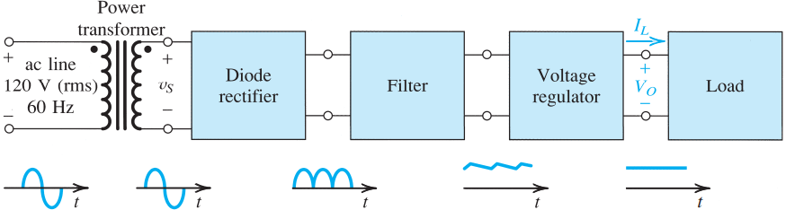{width="80%"}
:::

-2ex -0.1ex -.2ex .2ex .2ex Half-Wave Rectifier The half-wave rectifier
utilizes alternate half-cycles of the input sinusoid. The circuit is
shown below.

::: center
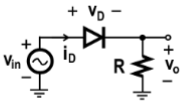{height="2.5cm"}
:::

The circuit functions as follows:

Positive Cycle:

:   When $v_{in} \geq v_D$, the output voltage $v_O = v_{in} - v_D$, due
    to the constant-voltage-drop diode.

Negative Cycle:

:   When $v_{in} < v_D$, the output voltage $v_O = 0$, since the diode
    is reverse-biased.

Note that for an ideal diode, the voltage drop would be $v_D = 0$, as
shown in the left. However, since these do not actually exists, we use a
more realistic model, as shown in the right.

::: center
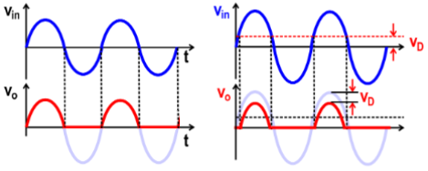{height="4cm"}
:::

As you can see in the graph, a half-wave rectifier has a low energy
efficiency as half of the input is wasted.

-2ex -0.1ex -.2ex .2ex .2ex Half-Wave Rectifier with a Filter Capacitor
In order to filter out the ripples, a large capacitor $C$ is
neededreducing the substantially the variations in the rectifier output
voltage $v_O$. The circuit is shown below

::: center
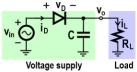{height="2.5cm"}
:::

As a result, when $v_{in}$ drops from its peak, the capacitor will
discharge, instead of a dropping all the way to $\SI{0}{\volt}$.

::: center
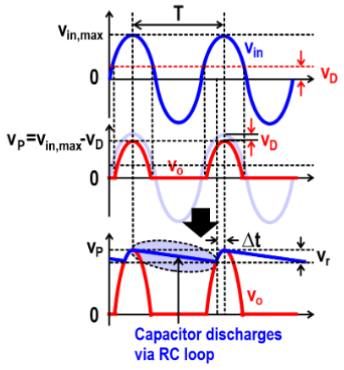{width="7cm"}
:::

A closer look at the output voltage, we can derive a few equations. The
peak voltage $V_P$ is the maximum value of the DC source, where
$$V_P = v_{in,\ max} - v_D$$ The ripple voltage $V_r$ is the residual
periodic variation of the DC voltagethe difference between $V_P$ and the
voltage when discharging ends.
$$V_r = \frac{T}{\tau}V_P = \frac{V_P}{fR_LC} = \frac{i_L}{fC}$$ The
output DC voltage $\overline{v_O}$ can be obtained by taking the average
of the extreme values of $v_O$.
$$\overline{v_O} = V_P - \frac{1}{2}V_r$$

-2ex -0.1ex -.2ex .2ex .2ex Full-Wave Rectifier The full-wave rectifier
has improve efficiency, by utilizing both halves of the sinusoid. The
circuit is shown below.

::: center
{height="2.5cm"}
:::

The circuit functions as follows:

Positive Cycle:

:   When $v_{in} \geq v_D$, the upper diode $D_1$ will be ON, while
    lower diode $D_2$ will be OFF, and the output voltage
    $v_O = v_{in} - v_D$.

Negative Cycle:

:   When $v_{in} \leq -v_D$, the upper diode $D_1$ will be OFF, while
    lower diode $D_2$ will be ON, and the output voltage
    $v_O = |v_{in}| - v_D$.

::: center
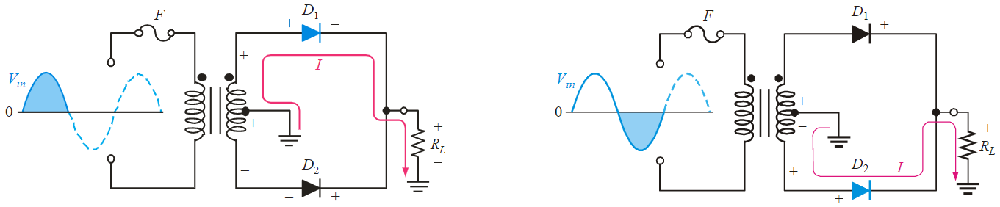{width="90%"}
:::

The output voltage is shown below.

::: center
{height="4cm"}
:::

-2ex -0.1ex -.2ex .2ex .2ex Full-Wave Rectifier with a Filter Capacitor
Likewise, a large shunt capacitor is used to filter out voltage ripples.
The circuit is shown below.

::: center
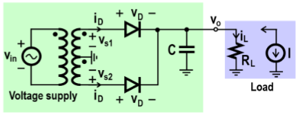{height="3.25cm"}
:::

The only notable difference that can be seen from the graph is the
period $T$ cut in half.

::: center
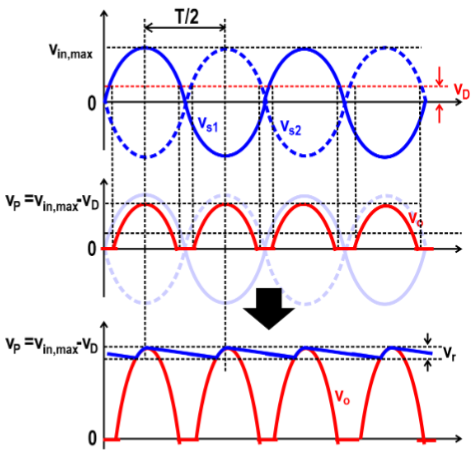{width="7cm"}
:::

The peak voltage $V_P$ is still the same as previously shown, where
$$V_P = v_{in,\ max} - v_D$$ For the ripple voltage $V_r$, the period
$T$ is replaced by $T/2$ or $2f$, resulting in
$$V_r = \frac{V_P}{2fR_LC} = \frac{i_L}{2fC}$$ As in the half-wave case,
the output DC voltage $\overline{v_O}$ doesn't change.
$$\overline{v_O} = V_P - \frac{1}{2}V_r$$

-2ex -0.1ex -.2ex .2ex .2ex Bridge Rectifier A cheaper implementation of
the full-wave rectifier with no center-tapped transformer. However, it
uses two diodes in conjunction, resulting in a bigger voltage loss. The
circuit is shown below.

::: center
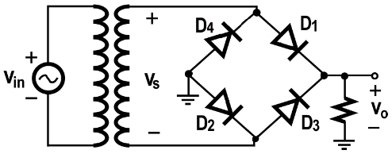{height="2.5cm"}
:::

The circuit functions as follows:

Positive Cycle:

:   When $v_{in} \geq 2v_D$, the diodes $D_1$, $D_2$ will be ON, while
    diodes $D_3$, $D_4$ will be OFF, and the output voltage
    $v_O = v_{in} - 2v_D$.

Negative Cycle:

:   When $v_{in} \leq 2v_D$, the diodes $D_1$, $D_2$ will be OFF, while
    diodes $D_3$, $D_4$ will be ON, and the output voltage
    $v_O = |v_{in}| - 2v_D$.

::: center
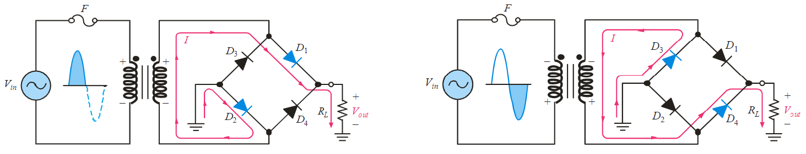{width="\\textwidth"}
:::

-2ex -0.1ex -.2ex .2ex .2ex Bridge Rectifier with a Filter Capacitor
Let's apply a capacitor again to filter out the ripples. The circuit is
shown below.

::: center
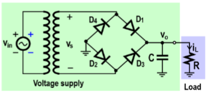{height="3.25cm"}
:::

Like the full-wave rectifier, the period is also half $T/2$ of the input
wave.

::: center
{width="7cm"}
:::

However, the peak voltage has a bigger voltage loss of $2v_D$ due to the
two diodes. $$V_P = v_{in,\ max} - 2v_D$$ The ripple voltage $V_r$ is
the same as stated in the full-wave rectifier
$$V_r = \frac{V_P}{2fR_LC} = \frac{i_L}{2fC}$$ The same case for the
output DC voltage $\overline{v_O}$ which also doesn't change.
$$\overline{v_O} = V_P - \frac{1}{2}V_r$$

-3ex -0.1ex -.4ex 0.5ex .2ex Voltage Regulator A voltage regulator is a
circuit whose purpose is to provide a constant DC voltage between its
output terminalsto further reduce the voltage ripple.

-2ex -0.1ex -.2ex .2ex .2ex Resistor-based Voltage Regulator The
resistor-based voltage regulator is not the most ideal as you'll see
why. The circuit is shown below

::: center
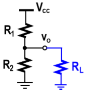{height="3cm"}
:::

The output voltage $v_O$ is given by
$$v_O = \frac{R_L \parallel R_2}{R_L \parallel R_2 + R_1}V_{CC}$$ For an
ideal voltage regulator, we want $v_O$ to be independent of $R_L$, as
it's something we have no control over. Though one may consider the case
if $R_L \gg R_1, R_2$, then $R_L \parallel R_2 \approx R_2$
$$v_O \approx \frac{R_2}{R_1 + R_2}V_{CC}$$ While $v_O$ is independent
of $R_L$, there are still some flaws in the design:

(1) It is still proportional to $V_{CC}$resulting in $v_O$ fluctuating
    based on $V_{CC}$

(2) Since $R_1$ and $R_2$ is very small, a very large current will flow
    through them; resulting in a rapid increase of temperature and
    smoke.

-2ex -0.1ex -.2ex .2ex .2ex Diode-based Voltage Regulator Suppose we now
replace $R_2$ with a forward-biased diode, as shown below.

::: center
{height="3.5cm"}
:::

If you recall, the equivalent of a forward-biased diode is to a small
voltage source $\SI{0.7}{\volt}$ in series with small resistance $r_D$.
The ideal output voltage $v_O$ is given by $$v_O = 0.7N$$ where $N$ is
the number of diodes cascaded and $r_D = \SI{0}{\ohm}$. Note that
$V_{CC} > 0.7N$ is required. However, the actual value of $v_O$ is
determined by including $r_D$. By performing KCL at node $v_O$, we get
$$G_L(v_O) + G(v_O - V_{CC}) + g_D(v_O - 0.7) = 0$$ Note that the
resistance is converted to conductance to minimize the use of fraction,
where
$$G = \frac{1}{R} \to G_L =  \frac{1}{R_L} \text{ and } g_D = \frac{1}{r_D}$$
Isolating for $v_O$, we get the actual output voltage which is given by
$$v_O \approx 0.7 \bigg[1 + \frac{GV_{CC}}{0.7g_D} - \frac{G_L + G}{g_D}\bigg]$$
We can determine the sensitivity of $v_O$ to $R_L$ and $V_{CC}$ to see
how much it fluctuates by
$$\frac{dv_O}{dR_L} = \frac{0.7}{g_D} = 0.7r_D \hspace{4cm} \frac{dv_O}{dV_{CC}} = \frac{G}{g_D} = \frac{r_D}{R}$$
Since $r_D$ is typically a small value, where $r_D \ll R, R_L$ or
$g_D \gg G, G_L$, the output voltage is less sensitive to both $V_{CC}$
and $R_L$, thus making it a good voltage regulator.

-2ex -0.1ex -.2ex .2ex .2ex Zener-diode-based Voltage Regulator Let's
now consider a Zener diode, which is reverse-biased, as shown below.

::: center
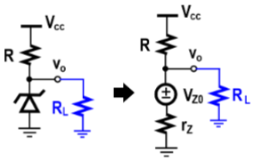{height="3.5cm"}
:::

Likewise, we can also draw the equivalent circuit of a Zener diode as
such. Then by performing KCL at node $v_O$, we get
$$G_Lv_O + G(v_O - V_{CC}) + g_Z(v_O - V_{Z0}) = 0$$ and isolating for
$v_O$, the actual output voltage is given by
$$v_O \approx V_{Z0}\bigg[1 + \frac{GV_{CC}}{V_{Z0}g_Z} - \frac{G_L + G}{g_Z}\bigg]$$
The sensitivity of $v_O$ to $R_L$ and $V_{CC}$ are
$$\frac{dv_O}{dG_L} = -\frac{V_{Z0}}{g_Z} = -V_{Z0}r_Z \hspace{4cm} \frac{dv_O}{dV_{CC}} = -\frac{G}{g_Z} = \frac{r_Z}{R}$$
If you notice, the sensitivity of $v_O$ for forward-bias and Zener diode
are almost identical, so how exactly do we determine which is better?

::: center
{height="4.5cm"}
:::

If we were to compare the slope side-by-side, you will notice that
$g_Z \gg g_D$, which means there's less fluctuations when using a Zener
diode voltage regulator oppose to a forward-biased diode.

-3ex -0.1ex -.4ex 0.5ex .2ex Limiting and Clamping Circuits In this
section, we will present other circuit applications of diodes apart from
rectifier circuits.

-2ex -0.1ex -.2ex .2ex .2ex Voltage Clipper As the name suggest, it
takes an input waveform and clips or cuts off its top half, bottom half
or both halves depending on the orientation and number of diode.

::: center
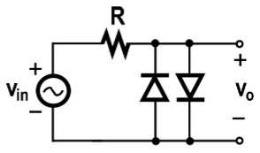{height="2.5cm"}
:::

The circuit works by alternating between the two diodes in forward and
reverse-bias, resulting in both halves being clipped. The sinusoidal
wave is displayed below.

::: center
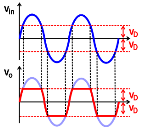{height="4cm"}
:::

A few other variety of basic limiting circuits with respect to its
transfer characteristics:

::: center
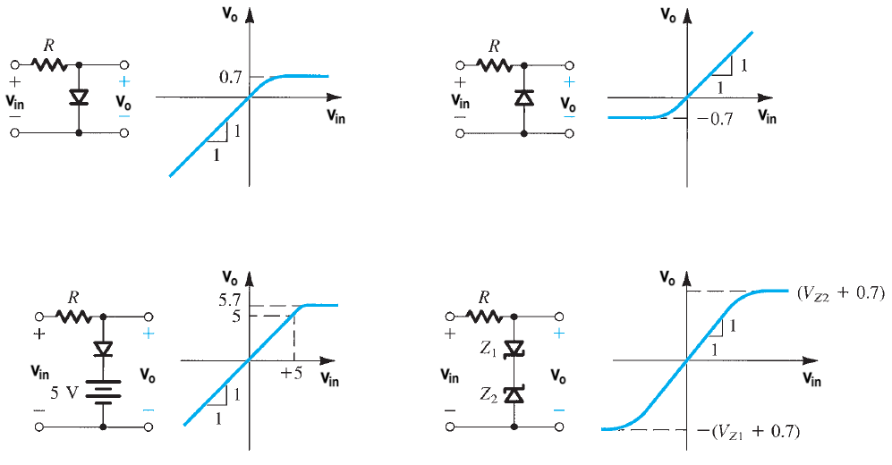{width="85%"}
:::

-2ex -0.1ex -.2ex .2ex .2ex Peak Detector A peak detector is used to
detect maximum value of the input voltage. The circuit looks similar to
that of a half-wave rectifier, just without a load connected onto.

::: center
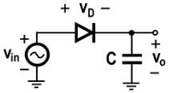{height="2.5cm"}
:::

Since there's no load to discharge on, the output voltage $v_O$ remains
constant. It will only rise when in forward-biased and there exists a
$v_{in} > v_O$. The sinusoidal wave is displayed below.

::: center
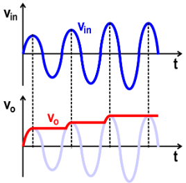{height="4cm"}
:::

Keep in mind, we assumed the diode is an ideal diode. For an actual
diode, there will be some voltage drop $v_D$ across the peak. Similar to
a real half-wave rectifier, as discussed previously.

-2ex -0.1ex -.2ex .2ex .2ex Voltage Doubler The last application of
diode which will cover is a voltage doubler.

::: center
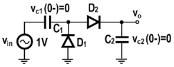{height="2.5cm"}
:::

The circuit can be broken down into two sections: the positive and
negative phase.

::: center
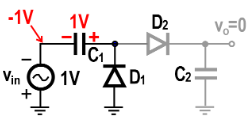{height="2.5cm"}
:::

During the negative phase, $D_1$ will be ON and $D_2$ will be OFF, which
leaves the capacitor $C_1$ to charge up.

::: center
{height="2.5cm"}
:::

Then when it enters the positive phase, $D_1$ will be OFF and $D_2$ will
be ON, the output voltage $V_O$ is the sum of the input voltage and the
voltage of $C_1$ obtained in the previous half cycle.

# Bipolar Junction Transistors

A bipolar transistor is a semiconductor device commonly used for
amplificationbipolar as in both holes and electrons serve as current
carriers.

-4ex -1ex -.4ex 1ex .2ex Structure of BJT They are of two types of
bipolar junction transistors (BJTs) namely;

1.  NPN transistor

    ::: center
    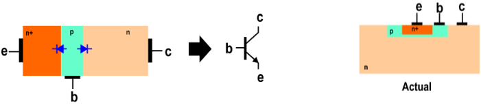{height="2.75cm"}
    :::

2.  PNP transistor

    ::: center
    {height="2.75cm"}
    :::

::: list

The direction of the arrow in the transistor symbol (between base and
emitter) tells you the direction of current.
:::

The BJT consists of three differently doped semiconductor region: the
emitter region (e), the base region (b), and the collector region (c).

Emitter:

:   $n^+$ for NPN transistors and $p^+$ for PNP transistors.

Base:

:   $p$ for NPN transistors and $n$ for PNP transistors.

Collector:

:   $n$ for NPN transistor and $p$ for PNP transistors.

If you notice the width is not symmetrical due to the doping ratios,
where the emitter is heavily doped, the collector is moderately doped
and the base is lightly doped.

-4ex -1ex -.4ex 1ex .2ex Operation of BJT If you notice from the diagram
earlier, the transistor consists of two pn junctions, the emitter--base
junction (EBJ) and the collector--base junction (CBJ). Depending on the
bias condition of each of these junctions, different modes of operation
of the BJT are obtained, as shown below.

::: tabu
c c c **Mode** & **Emitter-Base Junction** & **Collector-Base
Junction**\
Cut-Off & Reverse & Reverse\
Active & Forward & Reverse\
Saturation & Forward & Forward\
:::

Let's define the bias conditions for modes of operation in the EBJ.

::: center
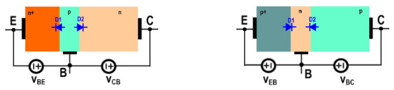{height="3cm"}
:::

The order of subscript matter, which implies the order in which they are
calculated. For NPN, $V_{BE} = V_B - V_E$, whereas for PNP,
$V_{EB} = V_E - V_B$. Likewise, the same implies for $V_{CB}$ and
$V_{BC}$.

Forward Bias:

:   When $V_{BE} > \SI{0.7}{\volt}$ or $V_{EB} > \SI{0.7}{\volt}$,
    electrons or holes in the emitter will exit and move to the base or
    collector.

Reverse Bias:

:   When $V_{BE} < \SI{0.7}{\volt}$ or $V_{EB} < \SI{0.7}{\volt}$, no
    flow of electrons or holes from the emitter to the base or
    collector.

::: list

Technically, the diode is forward-biased when $V > 0$ and the diode is
negative biased when $V < 0$. However, we account for the voltage drop
in diode, in this scenario, which is $\SI{0.7}{\volt}$.
:::

Figuratively, we can describe it using the $i$-$v$ relationship of the
emitter-base junction:

::: center
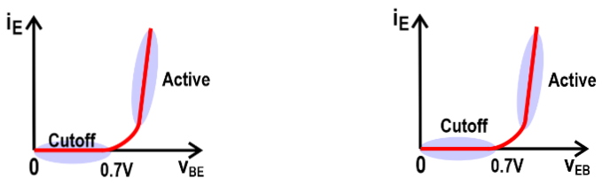{height="3cm"}
:::

Note that the small region in between cut-off and active region is not
the saturation regionwill get to this in a bit. Just know that we do not
operate in this region.

-3ex -0.1ex -.4ex 0.5ex .2ex Cut-Off Mode In cut-off mode, the EBJ is in
reverse bias ($V_{BE} < \SI{0.7}{\volt}$ for NPN and
$V_{EB} < \SI{0.7}{\volt}$ for PNP), which means no emitter current,
$i_E = 0$. Since $$i_E = i_C  + i_B$$ where the emitter current $i_E$ is
equal to the sum of the collector current $i_C$ and base current $i_B$.
We have $i_C = 0$ and $i_B = 0$. The transistor is essentially inactive,
thus appears as an open-circuit.

::: center
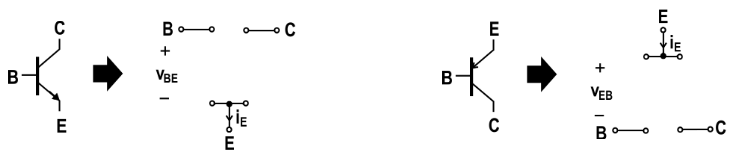{width="80%"}
:::

-3ex -0.1ex -.4ex 0.5ex .2ex Active Mode Of the three modes, the active
mode is the most important. In active mode, the EBJ is in forward bias
($V_{BE} > \SI{0.7}{\volt}$ for NPN and $V_{EB} > \SI{0.7}{\volt}$ for
PNP) and the CBJ is in reverse bias.

We'll focus on the NPN transistor, but note that PNP transistor operates
in the similar manner. As a reminder, current and electron flow are
backwards:

1.  Since the EBJ is forward-biased (the diode is ON), free electrons
    from the emitter region can easily cross the emitter-base junction.

    ::: center
    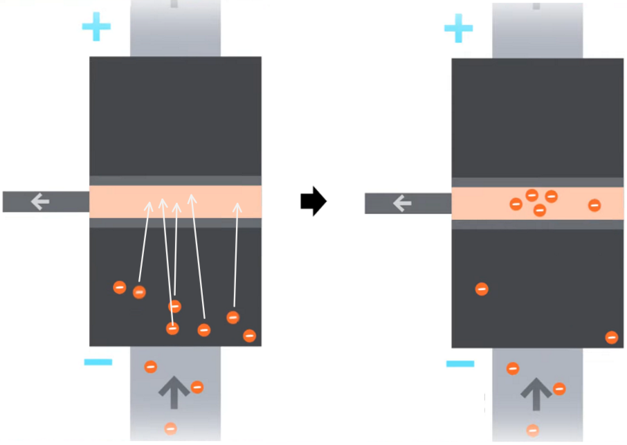{height="5cm"}
    :::

2.  If you remember, the base is lightly doped, so only a small
    percentage of the free electrons can recombine with the holes in the
    base region, which produces a small $i_B$.

    ::: center
    {height="5cm"}
    :::

3.  The free electrons that entered the base region but didn't recombine
    with the holes move toward the CBJ which is reverse-biased (the
    diode is OFF), producing $i_C$, such that $i_C \gg i_B$.

    ::: center
    {height="5cm"}
    :::

::: list

The collector region is connected to the $+$ of $V_{CB}$, so free
electrons in the base region are attracted to the $+$ side and are swept
across into the collector region, despite the diode being
reverse-biased. Refer to the zoomed-in diagram in the right.
:::

In order to use the BJT as an amplifier, it should be operated in the
active region. The conceptual circuit for NPN is shown below to
illustrate the operation of the transistor as an amplifier.

::: multicols
2

::: flushleft
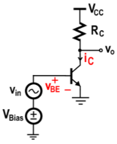{height="3.5cm"}
:::

The total base-emitter voltage becomes $$v_{BE} = V_{bias} + v_{in}$$
where $V_{bias}$ and $v_{in}$ are the DC and AC base-emitter voltage
respectively. Each serve a different purpose.
:::

The DC voltage, $V_{bias} > \SI{0.7}{\volt}$, allows us to operate where
$i_C-v_{BE}$ relation is linear. The input signal to be amplified is
represented by the AC voltage $v_{in}$ that is superimposed on
$V_{bias}$.

::: center
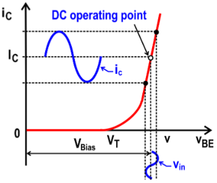{height="4cm"}
:::

We need to perform two types of analysis:

1.  DC analysis, to determine the operating point and ...

2.  AC analysis, to determine voltage gain.

In order to do these analysis, we need to model the BJT using two
transistor models: large-signal equivalent circuit and small-signal
equivalent circuit.

::: center
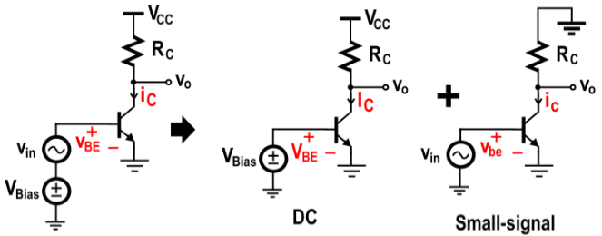{height="3.5cm"}
:::

-2ex -0.1ex -.2ex .2ex .2ex Large-Signal Equivalent Circuit (without
Base-Width Modulation) We'll begin by only considering the DC component,
so the small-signal source is eliminated for DC analysis, such that
$v_{BE} = V_{bias}$.

::: center
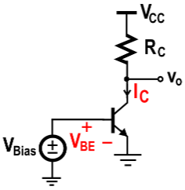{height="3.5cm"}
:::

An important thing to make note of, since $i_B \ll i_C$, we have the
approximation $$i_E \approx i_C$$ So you may often see $i_C$ and $i_E$
interchange. The collector current can be expressed as
$$\label{eq:collectorcurrent}
    i_C \approx I_Se^{v_{BE}/V_t}$$ If you notice, this is equivalently
the equation for diode current. The base current can be expressed as a
fraction of the collector current
$$i_B = \frac{i_C}{\beta} = \bigg[\frac{I_S}{\beta}\bigg]e^{v_{BE}/V_t}$$
where $\beta$ is a transistor parameter. Note for PNP, replace $v_{BE}$
with $v_{EB}$. We can form a set of relations between $i_C$, $i_B$, and
$i_E$: $$i_C = \alpha i_E \hspace{2cm} i_C = \beta i_B$$ where $\alpha$
is related to $\beta$ by $$\alpha = \frac{\beta}{\beta + 1}$$ We can
express the emitter current as $$\label{eq:emitter_nobase}
    i_E = i_B + i_C = \frac{i_C}{\alpha} = \bigg[\frac{I_S}{\alpha}\bigg]e^{v_{BE}/V_t}$$

Thus, the large-signal equivalent circuit of the BJT in active mode
would look like

::: center
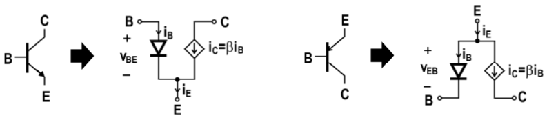{width="80%"}
:::

::: list

This circuit does not account for the base-width modulation, which
occurs when the connector-emitter voltage is increased. As noted in ,
the collector current is only affected by $v_{BE}$, but not by $v_{CE}$.
:::

-2ex -0.1ex -.2ex .2ex .2ex Large-Signal Equivalent Circuit (with
Base-Width Modulation) Previously, we assumed that if we increased the
connector-emitter voltage $v_{CE}$, that the collector current $i_C$
will remain constant. However, this is not the case as you'll see from
the $i_C$-$v_{CE}$ characteristics of a BJT.

::: center
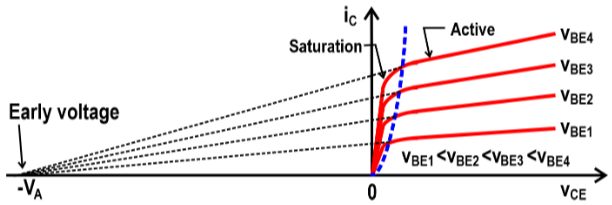{height="3cm"}
:::

In reality, $i_C$ does depends on $v_{CE}$. It varies linearly with
$v_{CE}$. This is due to the Early effect, which we can derive the
equation of the slope, by

::: center
{height="3cm"}
:::

So our collector current can be expressed as
$$\label{eq:collectorcurrentbw}
    i_C \approx I_Se^{v_{BE}/V_t} + I_Se^{v_{BE}/V_t}\bigg[\frac{v_{CE}}{V_A}\bigg] = I_Se^{v_{BE}/V_t}\bigg[1 + \frac{v_{CE}}{V_A}\bigg]$$
Alternatively, the preferred way of writing is expressed as
$$i_C \approx I_Se^{v_{BE}/V_t} + g_ov_{CE}$$ where $g_o$ is the output
conductance
$$g_o = \frac{1}{r_o} = \frac{I_Se^{v_{BE}/V_t}}{V_A} \approx \frac{I_C}{V_A}$$
One very important thing to make note of, $r_o$ is not a physical
resistorits intended to quantify the impact of base-width modulation
onto the circuit; more-so an artificial parameter.

Thus, the large-signal equivalent circuit of the BJT in active mode
would now look like

::: center
{width="90%"}
:::

We'll discuss the small-equivalent circuit in a separate section, as
they're a lot to talk about.

-3ex -0.1ex -.4ex 0.5ex .2ex Saturation Mode In saturation mode, the EBJ
is in forward bias ($V_{BE} > \SI{0.7}{\volt}$ for NPN and
$V_{EB} > \SI{0.7}{\volt}$ for PNP) and the CBJ is in forward bias
($V_{BC} > \SI{0.7}{\volt}$ for NPN and $V_{CB} > \SI{0.7}{\volt}$ for
PNP).

The BJT behaves as a resistor in saturation region. Looking back at the
$i_C-v_{CE}$ characteristics of a BJT, the active and saturation region
is separated by the blue dashed line.

::: center
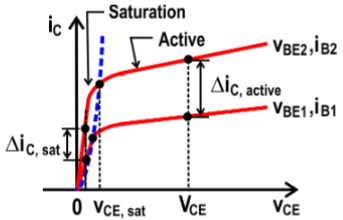{height="3.5cm"}
:::

This is the boundary voltage, $v_{CE,\, sat}$, typically around
$\SI{0.1}{\volt}$ to $\SI{0.2}{\volt}$. A closer look at the BJT in
saturation:

::: center
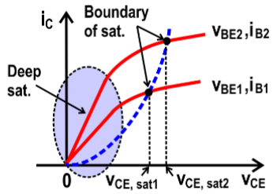{height="3.5cm"}
:::

In deep saturation, a better $i_C-v_{CE}$ linear relation exists, where
$v_{CE}$ is smaller. As mentioned earlier, the BJT behaves likes a
resistor which has a resistance of:
$$r_{CE,\, sat} = \frac{1}{\tfrac{di_C}{dv_{CE}}}$$ A few things to keep
note of:

-   $r_{CE,\, sat}$ is a physical resistor, unlike $r_o$, with a small
    value of a few ohms to a few tens of ohms. In comparison to the
    output resistance in active mode: $r_{CE,\, sat} \ll r_o$.

-   Increasing $v_{BE}$, increases the slope of $i_C-v_{CE}$ relation
    and $r_{CE,\, sat}$ drops.

The resistance, $r_{CE,\, sat}$, is due to the resistance of the emitter
$R_E$ and that of the collector $R_c$, which can be modelled as:

::: center
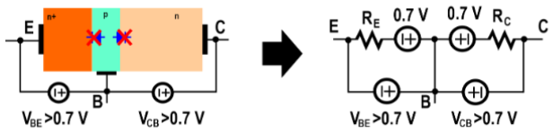{width="80%"}
:::

-4ex -1ex -.4ex 1ex .2ex Design of Amplifiers Previously, we discussed
the large-signal equivalent circuit, so now we will go over the
small-signal equivalent. When passing a small-signal, some components
function differently, as shown below:

Linear resistor:

:   The small-signal equivalent circuit of a linear resistor is the
    resistor itself.

    ::: center
    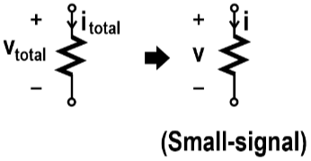{height="2cm"}
    :::

Linear capacitor:

:   The small-signal equivalent circuit of a linear capacitor is the
    capacitor itself.

    ::: center
    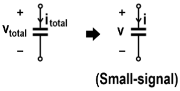{height="2cm"}
    :::

Independent voltage source:

:   The small-signal equivalent circuit of an independent voltage source
    is a short-circuit.

    ::: center
    {height="2cm"}
    :::

Independent current source:

:   The small-signal equivalent circuit of an independent current source
    is an open-circuit.

    ::: center
    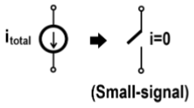{height="2cm"}
    :::

Controlled sources:

:   The small-signal equivalent circuit of a controlled source is the
    same controlled source.

::: center
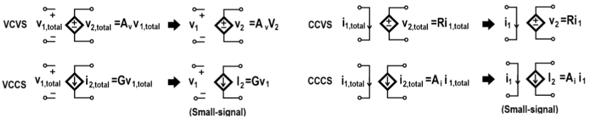{width="\\textwidth"}
:::

Referring back to $i_C-v_{BE}$ relation, the large slope gives rise to a
large transconductance.

::: multicols
2

::: flushleft
{height="4cm"}
:::

The transconductance $g_m$ at DC operating point
$$g_m = \bigg[\frac{i_C}{dv_{BE}}\bigg]_{DC} \approx \frac{d}{dv_{BE}}\bigg[I_Se^{v_{BE}/V_t}\bigg] = \frac{I_C}{V_t}$$
where $I_C = I_Se^{v_{bias}/V_t}$ denotes the DC current.
:::

As a follow up, BJT needs to have a large $g_m$, which is one reason we
do not operate in saturation region due to the small $g_m$.

::: center
{height="3cm"}
:::

-   If we compare $\Delta i_C$ in active and saturation mode, you can
    see that $\Delta i_{C,\, active} \gg i_{C,\, sat}$.

-   Referring back to the equation for transconductance $g_m$, we can
    approximate it to be equivalently the formula for the slope:
    $$g_m = \frac{di_C}{dv_{BE}} \approx \frac{\Delta i_C}{\Delta v_{BE}}$$

-   Since in both cases, $\Delta v_{BE} = v_{BE2} - v_{BE1}$ is the
    same, with the only difference being $\Delta i_C$, then
    $g_{m,\, active} \gg g_{m,\, sat}$

This all relates back to how voltage is amplified or rather how a large
voltage gain is obtained.

::: center
{height="4.5cm"}
:::

1.  In the first curve, the $i_C-v_{BE}$ relation, a small $v_{in}$ is
    mapped to a large $i_C$ via $g_m$: $i_C = g_mv_{in}$

2.  Notice how our amplified output is current, so we need to map it
    back to voltage, which is the second curve, the $i_C-v_{CE}$
    relation.

3.  The resultant $i_C$ is then mapped to a large $v_{ce}$ via $r_o$
    where $g_o = 1/r_o$: $v_{ce} = r_oi_C$

4.  As a result, voltage amplification is achieved.

-3ex -0.1ex -.4ex 0.5ex .2ex Small-Signal Equivalent Circuit Refer to
the lecture slides for the in-depth derivation. The collector current
can be expressed as $$i_C = g_ov_{ce} + g_mv_{be}$$ where $i_C$,
$v_{ce}$, and $v_{be}$ are small-signal (AC) quantities denoted by the
lower-case. Another version is using the relationship $\beta i_b = i_C$,
the equation becomes $$i_C \approx \beta i_b + g_ov_{ce}$$ Thus, the
small-signal equivalent model of the BJT in active mode using a
voltage-controlled current source

::: center
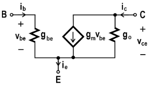{height="3cm"}
:::

and the other using a current-controlled current source

::: center
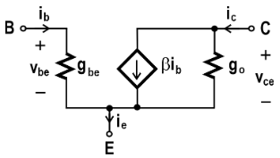{height="3cm"}
:::

-3ex -0.1ex -.4ex 0.5ex .2ex Small-Signal Parameters The base-emitter
resistance $r_{be}$, equivalently $1/g_{be}$, can be expressed as
$$r_{be} = \bigg[\frac{dv_{BE}}{di_B}\bigg]_{DC} = \beta\frac{V_t}{I_C} = \beta\frac{1}{g_m} = \frac{V_t}{I_B}$$
A few things to note, $r_{be}$ consist of both emitter $r_e$ and base
resistance $r_b$ $$r_{be} = r_b + r_e$$ But, since the emitter is
heavily doped, $r_b \gg r_e$, which means the base-emitter is dominated
by the base resistance, $r_{be} \approx r_b$. The emitter resistance
$r_e$ can be expressed as
$$r_e = \bigg[\frac{dv_{BE}}{di_E}\bigg] = \frac{1}{\beta + 1}\bigg[\frac{dv_{BE}}{di_B}\bigg]_{DC} = \frac{r_{be}}{\beta + 1}$$
Each terminal have different characteristics shown below:

::: center
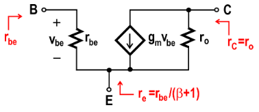{height="3cm"}
:::

We are basically expressing the resistance looking into the circuit. It
maybe clearer to see what the purpose of determining these equations
are, by using the following diagram instead

::: center
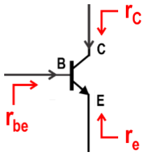{height="3cm"}
:::

As a recap, there are four small-signal parameters associated with BJT:

::: center
{height="3cm"}
:::

-   Transconductance
    $\displaystyle g_m = \bigg[\frac{di_C}{dv_{BE}}\bigg]_{DC} = \frac{I_C}{V_t}$

-   Output conductance
    $\displaystyle g_o = \bigg[\frac{di_C}{dv_{CE}}\bigg]_{DC} = \frac{I_C}{V_A}$

-   Base-emitter resistance
    $\displaystyle r_{be} = \bigg[\frac{dv_{BE}}{di_B}\bigg]_{DC} = \frac{V_t}{I_B}$

-   Transistor parameter $\displaystyle \beta = \frac{I_C}{I_B}$

::: list

The transistor parameter $\beta$ is typically given, which usually has a
value of $100$. The other three parameters are what varies in ways due
to the DC operating point.
:::

# BJT Voltage Amplifiers

-4ex -1ex -.4ex 1ex .2ex Load Line and Maximum Signal Swing Recall that
a transistor is optimal as an amplifier when operating in the active
region. The load line is a line drawn on the characteristics curve.

::: center
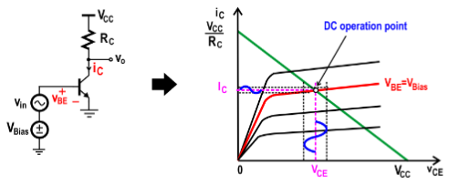{height="4cm"}
:::

The load line can be expressed as $$i_C = \frac{V_{CC} - v_{CE}}{R_c}$$
The intersection of the load line and $i_C-v_{CE}$ curve with
$v_{BE} = V_{bias}$ gives us the DC operating point (or the bias point).
Once the operating point is established you essentially know how to bias
the transistor optimallyeither by varying $V_{bias}$ or $R_c$.

::: list

Note that it is normally done by varying $V_{bias}$ in the circuit, as
varying $R_c$ affects gain, which will get to in a bit.
:::

Two important considerations in deciding the location of the DC
operating point are the gain and allowable signal. In deciding the value
for $V_{bias}$, it is useful to refer to the $i_C-v_{CE}$ curve:

::: center
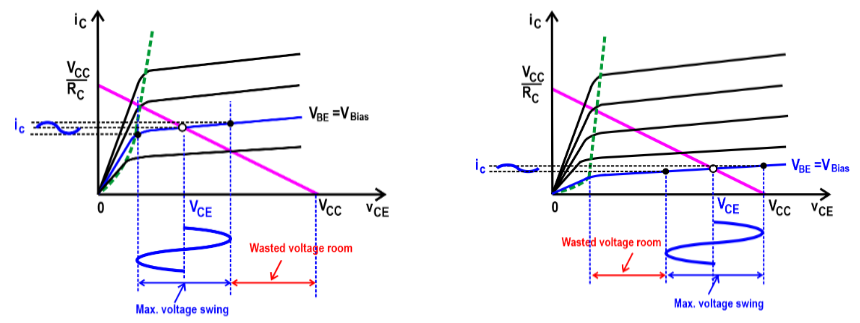{height="5cm"}
:::

1.  If DC operating point is too close to the boundary of active and
    saturation regions, the max signal swing will be smaller (shown on
    the left).

2.  If DC operating point is too close to $V_{CC}$, the max signal swing
    will be smaller (shown on the right).

From the DC operating point, we can determine the lower and upper bounds
of $v_o$ signal swing coming from $v_{in}$ in the circuit:

-   The lower bound can be expressed as $v_{o,\,total,\,min} = V_{sat}$

-   The upper bound can be expressed as $v_{o,\,total,\,max} = V_{CC}$

::: center
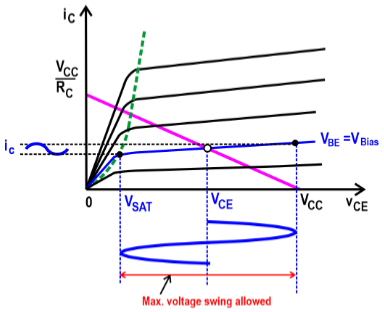{width="7cm"}
:::

From the two equations, we can determine the max voltage swing, which is
$$\label{eq:maxvoltswing}
    v_{o,\,AC,\,max} = \frac{V_{CC} - V_{sat}}{2}$$ There are three
basic configurations for connecting BJT as an amplifier:

-   Common-Emitter (CE) Amplifier

-   Common-Base (CB) Amplifier

-   Common-Collector (CC) Amplifier

Each has distinctly different attributes and hence areas of application,
which will cover in each section.

-4ex -1ex -.4ex 1ex .2ex Common-Emitter (CE) Amplifier The
common-emitter amplifier is the most widely use of the three. The
common-emitter amplifier circuit is shown below:

::: center
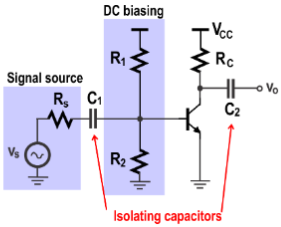{height="4cm"}
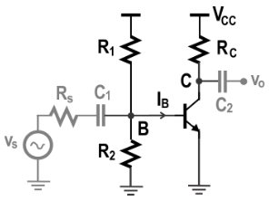{height="3.75cm"}
:::

The purpose of each component are explained below:

-   The signal source represents the Thevenin equivalent of the signal
    generator with an internal resistance $R_s$.

-   The two isolating capacitors $C_1$ and $C_2$ are used to separate
    the AC signals from the DC biasing voltageby passing AC signals and
    blocking any DC component.

-   It uses two resistors $R_1$ and $R_2$ to generate DC biasing voltage
    $V_B$ at the basereferred to as voltage divider biasing.

Suppose $R_c$ is known, we can express the optimal $V_B$ that yields the
max output voltage swing shown in which is
$$V_B = V_t\ln{\bigg[\frac{V_{CC}-V_{sat}}{2I_SR_c}\bigg]}$$ Since $V_B$
is generated by a DC biasing voltage, we'll rewrite $V_B$ in terms of
$R_1$ and $R_2$. In order to derive this equation, we need to consider
two possible cases:

Case 1:

:   If $R_1$ and $R_2$ small, $I_B$ can ignored since
    $I_{R1},I_{R2} \gg I_B$. Therefore, we can apply voltage division to
    determine $V_B$, such that $$V_B = \frac{R_2}{R_1 + R_2}V_{CC}$$ One
    downside to this is that it will consume more (DC) power.

Case 2:

:   If $R_1$ and $R_2$ are large, $I_B$ can no longer be ignored since
    $I_{R1},I_{R2}$ is now comparable to $I_B$, where the current splits
    from $I_B$ and $I_{R2}$. Performing KCL at node B yields
    $$V_B = \frac{G_1V_{CC} - (I_C/\beta)}{G_1 + G_2}$$ Note that
    $G_1 = 1/R_1$ and $G_2 = 1/R_2$ and $I_C = \beta I_B$.

Since we always prefer to reduce power consumption, we make $R_1$ and
$R_2$ large.

-3ex -0.1ex -.4ex 0.5ex .2ex Characteristic Parameter of the CE
Amplifier By replacing the BJT with an equivalent circuit shown below,
we can use this circuit to determine the characteristics parameters of
the amplifier $R_{in}$, $R_{out}$, and $A_{v}$ as follows.

In small-signal analysis, the capacitors $C_1$, $C_2$ are replaced by
effective shorts and the DC source $V_{CC}$ is replaced by a ground.

::: center
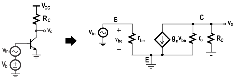{width="70%"}
:::

::: list

The circuit above is shown without a voltage-divider bias, $R_1$ and
$R_2$, instead uses $V_b$.
:::

The input resistance $R_{in}$ is the resistance \"seen\" by the AC
source connected to the input.

::: multicols
2

::: flushleft
{height="3cm"}
:::

The input resistance is expressed by the following formula:
$$R_{in} = r_{be}$$ and with DC biasing, the equation can be expressed
as: $$R_{in} = R_1 \parallel R_2 \parallel r_{be}$$
:::

The output resistance $R_{out}$ is the resistance looking in at the
collector.

::: multicols
2

::: flushleft
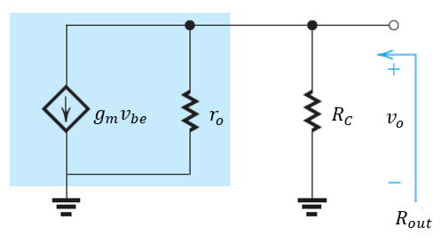{height="3cm"}
:::

The output resistance is expressed by the following formula:
$$R_{out} = R_c \parallel r_o$$ where $r_o$ is intended to quantify the
impact of base-width modulation.
:::

The voltage gain $A_v$ is the ratio of the output voltage $v_o$ at the
collector to the input voltage $v_{in}$. $$A_v = \frac{v_o}{v_{in}}$$
Since $v_{in} = v_{be}$ and by performing KCL at output node (refer to
the diagram used for $R_{out}$)
$$\frac{v_o}{R_c} + \frac{v_o}{r_o} + g_mv_{be} = \bigg(\frac{1}{R_c}+\frac{1}{r_o}\bigg)v_o + g_mv_{in} = 0 \quad \Longleftrightarrow \quad \frac{v_o}{v_{in}} = -g_m\bigg(\frac{R_cr_o}{R_c + r_o}\bigg)$$
The voltage gain is expressed by the following formula:
$$\label{eq:ce_voltgain}
    A_v = -g_mR_{out} = -g_m(R_c \parallel r_o)$$

::: list

Notice how $A_v$ is negative, which indicates a phase inversion from
input to output. In other words, CE amplifier is an inverting amplifier.
:::

One issue with the design is when we try to fabricate this on-chip,
resistors take up a ton of space and becomes quite expensive, which
brings up the next point. So an alternative is by replacing the resistor
$R_c$ with an active load as shown below.

::: center
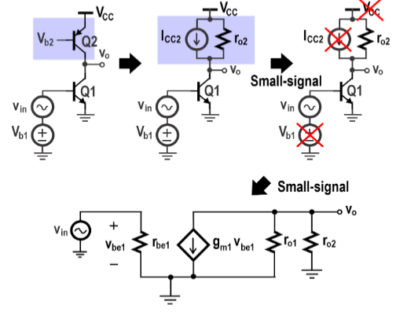{width="8cm"}
:::

The purpose of $Q_2$ is to behave like a resistor with no amplification:

-   It can be achieved by passing through a constant voltage $V_{b2}$ at
    the base.

-   Since $V_{b2}$ is constant, the current of $Q_2$ is constant and
    therefore, it can be represented by a constant source $I_{CC2}$ with
    an output resistance $r_{o2}$.

-   If we can use $r_{o2}$ to fabricate $R_c$, then a large $A_v$ is
    obtained without using a large resistor.

::: list

Keep in mind, $Q_1$ is an NPN transistor, so $Q_2$ is a PNP transistor
for $R_{out}$ to be large.
:::

The characteristics parameters are the same as before, with the only
difference changing $R_c$ to $r_{o2}$ in the output resistance:

-   Input resistance: $R_{in} = r_{be}$

-   Output resistance: $R_{out} = r_{o1} \parallel r_{o2}$

-   Voltage gain: $A_v = -g_mR_{out} = -g_m(r_{o1}\parallel r_{o2})$

-2ex -0.1ex -.2ex .2ex .2ex Summary

1.  The CE amplifier gives high input resistance (draws little current),
    moderately high output resistance (easier to match for maximum power
    transfer), and high voltage gain, $A_{v}$ (a desirable feature of an
    amplifier).

2.  It is an inverting amplifier, by increasing $g_m$ or $R_{out}$,
    increases the voltage gain $A_v$, but it comes at a cost:

    -   Increasing $g_m$ results in more power consumption.

    -   It is costly to fabricate a large resistor on chip.

3.  By replacing the resistor with an active load, one can increase the
    voltage gain without using a large resistor, with an extra cost of
    providing an additional biasing voltage.

-3ex -0.1ex -.4ex 0.5ex .2ex Emitter Degeneration When we include a
resistance $R_E$ in the emitter as shown below, it can lead to
significant changes in the amplifier characteristics.

::: center
{height="4cm"}
:::

The emitter degeneration forms a negative feedback mechanism that
stabilizes $I_C$. In other words, it stabilizes the DC operating point,
accounting for the fluctuations which can change the value of $V_B$.

1.  Without $R_E$, let's say $V_{b1}$ increases, then $V_{BE1}$
    increases as well, since $$V_{b1} = V_{BE1}$$

2.  As a result, $I_C$ increases, changing the DC operating point and
    affecting $v_o$. $$I_C = I_Se^{V_{BE1}/V_t}$$

3.  When $R_E$ is present, $V_{BE1}$ will be smaller subsequently, since
    $$V_{b1} = V_{BE1} + R_EI_E \qquad \Longleftrightarrow \qquad V_{BE1} = V_{b1} - R_EI_E$$

4.  Then $I_C$ decreases, making it less susceptible to fluctuations.

    ::: center
    {width="80%"}
    :::

With the addition of $R_E$, the characteristics parameters changed.

::: center
{width="75%"}
:::

The input resistance is: $$R_{in} \approx (1 + g_{m1}R_E)r_{be1}$$ and
with DC biasing: $$\label{eq:ce_rindc}
        R_{in} \approx R_1 \parallel R_2 \parallel (1 + g_{m1}R_E)r_{be1}$$
The output resistance is:
$$R_{out} = (r_{o1} \parallel r_{o2})(1 + g_{m1}R_E)$$ The voltage gain
is: $$\label{eq:ce_evoltgain}
    A_v = \frac{-g_{m1}(r_{o1} \parallel r_{o2})}{1 + g_{m1}R_E}$$ The
emitter degeneration reduces the power consumption, but comes at a cost,
which lowers the voltage gain by $1 + g_{m1}R_E$ in the denominator. A
way to preserve the voltage gain is by adding a shunt capacitor $C_E$ in
parallel to $R_E$.

::: center
{width="50%"}
:::

If you recall from 202, the impedance of a capacitor is
$$z_{C_E} = \frac{1}{j\omega C_E}$$ where $\omega$ is the input
frequency:

-   In DC, emitter degeneration is active because $C_E$ behaves as an
    open-circuit ($z_{C_E} = \infty$), since $\omega = 0$.

-   In AC, emitter degeneration is inactive at $\omega$ because $C_E$
    behaves as a short-circuit ($z_{C_E} = 0$), since $C_E$ designed as
    such to be sufficiently large.

As a result, the voltage gain is no longer affected by emitter
degeneration, such that $$A_v \approx g_m(R_c \parallel r_o)$$

-2ex -0.1ex -.2ex .2ex .2ex Summary

1.  With emitter degeneration, it posses four unique characteristics:

    -   Increased input resistance by a factor of $1 + g_{m1}R_E$

    -   Reduced voltage gain by a factor of $1 + g_{m1}R_E$

    -   Increased output resistance

    -   Reduces power consumption

2.  To preserve voltage gain at the frequency of the input, shunt
    capacitor $C_E$ that behaves as a short circuit at input frequency
    is added.

::: center
{width="50%"}
:::

-4ex -1ex -.4ex 1ex .2ex Common-Base (CB) Amplifier The common-base
amplifier circuit is shown below:

::: center
{height="4cm"}
:::

The input is now located at the emitter, while the output is still at
the collector. The components still perform the same purpose as
described in CE amplifier.

-3ex -0.1ex -.4ex 0.5ex .2ex Characteristic Parameter of the CB
Amplifier In small-signal analysis, the following circuit is obtained.

::: center
{width="60%"}
:::

The input resistance is:
$$R_{in} \approx \frac{r_{be}}{\beta + 1} = r_e$$ and with DC biasing:
$$R_{in} \approx R_1 \parallel R_2 \parallel r_e$$ The output resistance
is the same as that of CE amplifier: $$R_{out} = R_c \parallel r_o$$ The
voltage gain is: $$A_v \approx g_{m1}(R_c \parallel r_{o})$$

::: list

Since $A_v$ is positive, CB amplifier is a non-inverting amplifier,
unlike CE amplifier which is an inverting amplifier.
:::

One thing to add, we can also replace $R_c$ with an active load, like we
did with CE amplifier.

::: center
{width="5cm"}
:::

-2ex -0.1ex -.2ex .2ex .2ex Summary

1.  The CB amplifier has a low input resistance. This is undesirable as
    it will draw a large current when driven by a voltage input. Refer
    to the next section.

2.  It is a non-inverting amplifier, with the same voltage gain as that
    of CE amplifier.

-3ex -0.1ex -.4ex 0.5ex .2ex Characterizing Amplifiers In general, CB
amplifiers should not be used as a voltage amplifiers due to its low
input resistance, $R_{in} = r_e$. To understand why, refer to the
characterization of an amplifier below.

::: center
{height="2.5cm"}
:::

For amplifiers, a large input resistance is desirable as it reduces the
loading effect of the amplifier on the signal source.

::: center
{height="2cm"}
:::

The larger the input resistance $R_{in}$, the more the input signal
$v_s$ will appear at the input of the amplifier. $$\label{eq:input_volt}
    v_{in} = \frac{R_{in}}{R_s + R_{in}}v_s \approx \bigg(1 - \frac{R_s}{R_{in}}\bigg)v_s$$
If you recall, CE amplifiers have a large input resistance, thus making
it a desirable voltage amplifier.
$$\frac{R_s}{R_{in}} \approx 0 \qquad \Longrightarrow \qquad v_{in} \approx v_s$$
However, CB amplifiers have a small input resistance, since
$r_e = r_{be}/(\beta + 1)$, where $\beta$ is around $100$, resulting to
a huge voltage loss from $v_s$ to $v_{in}$.

Suppose we use a Norton equivalent source, instead of a Thevenin
equivalent source.

::: center
{height="2cm"}
:::

Now in this scenario, the signal of the source is current. $R_N$ is
designed to be very large, so all the current will be delivered to the
load, oppose to $R_s$ in Thevenin equivalent.
$$i_{in} = \frac{R_N}{R_{in} + R_N}i_N \approx \bigg(1 - \frac{R_{in}}{R_N}\bigg)i_N$$
So if $R_N$ is large enough or $R_{in}$ is very small, then all the
current will be delivered to the load.
$$\frac{R_{in}}{R_N} \approx 0 \qquad \Longrightarrow \qquad i_{in} \approx i_N$$
-2ex -0.1ex -.2ex .2ex .2ex Additional Remarks When designing the
circuit, we might not have a current generator, so how can we apply
them?

::: center
{width="60%"}
:::

By placing a common-emitter, the transistor $Q_1$ maps $v_{in}$ to
$I_{C1}$ and we know it has an output resistance $r_{o1}$ due to base
width modulationthe equivalent circuit is shown on the right.

::: list

This isn't really covered in the scope of the course, just intended to
demonstrate how it would look like. It is referred to as a cascode
amplifier.
:::

-4ex -1ex -.4ex 1ex .2ex Common-Collector (CC) Amplifier The
common-collector amplifier is usually referred to as an emitter
follower. The common-collector amplifier circuit is shown below:

::: center
{height="3cm"}
:::

Since the output voltage is at the emitter, it is in phase with the base
voltage, so there is no inversion from input to output.

-3ex -0.1ex -.4ex 0.5ex .2ex Characteristic Parameter of the CC
Amplifier In small-signal analysis, the following circuit is obtained.

::: center
{width="60%"}
:::

The input resistance is the same as that of CE amplifier:
$$R_{in} = r_{be}$$ The output resistance is:
$$R_{out} \approx \frac{1}{g_{m1}} = r_e$$ The voltage gain is:
$$A_v \approx 1$$

::: list

Because there is no inversion and $A_v \approx 1$, the output voltage
closely follows the input voltage in both phase and amplitudethus the
term emitter-follower.
:::

Suppose we replace $R_E$ with an active load, as we have done with the
previous two amplifiers.

::: center
{height="3cm"}
:::

-   An NPN-based source follower functions as a voltage-down shifter as
    $v_o = v_{in} - v_{BE1}$. It shifts the level down by $v_{BE1}$.

-   An PNP-based source follower functions as a voltage-up shifter as
    $v_o = v_{in} + v_{EB1}$. It shifts the level up by $v_{EB1}$.

::: center
{height="3cm"}
:::

-3ex -0.1ex -.4ex 0.5ex .2ex Characterizing Amplifiers Due to its high
input resistance and a low output resistance, it can be used a voltage
buffer. To understand the use of this, let's look back at the diagram we
used for CB amplifiers.

::: center
{height="2.5cm"}
:::

Previously, we covered how a high input resistance is more favorable.
Now, we'll focus on the output resistance.

::: center
{height="2cm"}
:::

For amplifiers, a small output resistance is desirable, as it increases
the output voltage $v_{out}$ that will be delivered to the load resistor
$R_L$.
$$v_L = \frac{R_L}{R_L + R_{out}}v_{out} \approx \bigg(1 - \frac{R_{out}}{R_L}\bigg)v_{out}$$
Since CC amplifiers have a small output resistance, such that
$R_{out} \ll R_L$, then
$$\frac{R_{out}}{R_L} \approx 0 \qquad \Longrightarrow \qquad v_L = v_{out}$$
Thus, comes down to the reason we use an emitter follower. As an
example, we have a CE amplifier with a load resistor attached at the
output.

::: center
{height="3cm"}
:::

When a load resistor is present, the voltage gain in is now:
$$A_{v,\ \text{w/ load}} = -g_{m1}(R_{out} \parallel R_L) = -g_{m1}(r_{o1} \parallel r_{o2} \parallel R_L)$$
Depending on $R_L$:

Case 1:

:   If $R_L \gg R_{out}$, then
    $A_{v,\ \text{w/ load}} =  A_{v,\ \text{w/o load}}$, where $R_L$
    will have no impact on the voltage gain.

Case 2:

:   If $R_L \ll R_{out}$, then
    $A_{v,\ \text{w/ load}} \ll  A_{v,\ \text{w/o load}}$, where $R_L$
    will have a severe loading impact on voltage gain.

A solution to Case 2, if we add an emitter follower stage to lower the
output resistance, then $R_L$ will have no impact on the voltage gain.

::: center
{height="3.5cm"}
:::

If you recall an emitter follower has a voltage gain of $A_v \approx 1$,
which is good, since it does not alter or change the voltage gain (More
on this in the next section). By applying an emitter follower, we can
make $R_{out}$ even smaller, such that $R_L \gg R_{out}$.

-4ex -1ex -.4ex 1ex .2ex Multi-stage Amplifiers [Two or more (CE or CB)
amplifiers can be connected in a cascaded arrangement with the output of
one amplifier driving the input of the next.]{#bjt_multistage}

::: center
{height="3cm"}
:::

Isolation capacitors exists at the input, output, and in between stages
to:

-   Isolate the amplifier from both input source and output load

-   DC bias each stage individually

The overall voltage gain of cascaded amplifiers is the product of the
individual voltage gains. $$A_v = A_{v1}A_{v2}A_{v3} \cdots A_{vn}$$
where $n$ is the number of stages.

::: center
{height="3cm"}
:::

Each triangular symbol represents a separate amplifier. As an example,
we have a two-stage BJT amplifier below:

::: center
{height="4cm"}
:::

1.  The input voltage $v_1$ can be obtained using voltage division
    (refer to and ). $$v_1 = \frac{R_{in1}}{R_{in1}+R_s}v_s$$ where
    $R_{in1} = R_1 \parallel R_2 \parallel (1 + g_{m1}R_{E1})r_{be1}$

2.  The voltage gain of stage 1, $A_{v1}$, is equivalently the voltage
    gain of a CE amplifier with emitter degeneration (refer to ). The
    load resistance is $R_{c1} \parallel R_{in2}$.
    $$A_{v1} = \frac{-g_{m1}(R_{c1} \parallel R_{in2})}{1 + g_{m1}R_{E1}}$$
    where
    $R_{in2} = R_3 \parallel R_4 \parallel (1 + g_{m2}R_{E2})r_{be2}$

3.  Likewise, the same goes for voltage gain of stage 2, $A_{v2}$. The
    load resistance is $R_{c2}$.
    $$A_{v2} = \frac{-g_{m2}R_{c2}}{1 + g_{m2}R_{E2}}$$

4.  Combining all three, we can determine the overall voltage gain:
    $$A_v = \bigg[\frac{R_{in1}}{R_{in1}+R_s}v_s\bigg] \times \bigg[\frac{-g_{m1}(R_{c1} \parallel R_{in2})}{1 + g_{m1}R_{E1}}\bigg] \times \bigg[\frac{-g_{m2}R_{c2}}{1 + g_{m2}R_{E2}}\bigg]$$

::: list

For load resistance, we didn't include $r_{o1}$ or $r_{o2}$ because a
large resistor ($r_{o1},r_{o2}$ is $\SI{10}{\kilo\ohm}$ to
$\SI{100}{\kilo\ohm}$) in parallel with a small resistor has the
resistance of the smaller one roughly./
:::

-4ex -1ex -.4ex 1ex .2ex Current Mirrors A current mirror is a circuit
designed to copy a current through one active device by controlling the
current in another active device of a circuit, keeping the output
current constant regardless of loading.

-3ex -0.1ex -.4ex 0.5ex .2ex Diode-Connected BJT It uses a
diode-connected BJT, where the base and collector are tied together.

::: center
{width="\\textwidth"}
:::

The reason we call it a diode-connected BJT is because if you remember
we have a diode $D_1$ between base and emitter then a diode $D_2$
between base and collector.

::: center
{height="3cm"}
:::

When a wire is connected between the base and collector, the diode $D_2$
is short-circuited. As a result, the entire circuit functions like a
diode $D_1$.

::: center
{height="3cm"}
:::

Looking into the circuit, the input resistance is simply the resistance
of the diode $D_1$, which is:
$$R_{in} \approx \frac{1}{g_m} \approx r_{e}$$ And so a diode-connected
BJT synthesizes a resistor of low resistance $r_e$. Equivalently, we
constructed a resistor without physically adding one to the circuit.

-3ex -0.1ex -.4ex 0.5ex .2ex Analysis of Current Mirror without
Base-Width Modulation Let's now look at a BJT current mirror. Refer to
the circuit below.

::: center
{height="4cm"}
:::

For the sake of simplicity, let's first ignore base-width modulation. In
other words, we ignore $r_o$. If you recall from , the collector current
$I_{C1}$ and $I_{C2}$ can be expressed as
$$i_{C1} \approx I_{s1}e^{v_{BE}/V_t}$$
$$i_{C2} \approx I_{s2}e^{v_{BE}/V_t}$$ and by dividing both equations
we have $$\frac{i_{C2}}{i_{C1}} = \frac{I_{s2}}{I_{s1}}$$ When $Q_1$ and
$Q_2$ are identical, we have that $I_{s2} = I_{s1}$, thus
$$i_{C2} = i_{C1}$$ which defines it to be a current mirror. If we
further make further simplifications, which we also ignore $i_B$, since
the base current is very small, such that $i_{B1}, i_{B2} \ll i_{C_1}$,
the current source $$J = i_{C1} + i_{B1} + i_{B2}$$ can be expressed as
$J \approx i_{C1}$ or $$i_{C2} \approx \frac{I_{s2}}{I_{s1}}J$$ Though
for a more accurate analysis where base currents $i_{B1}$ and $i_{B2}$
are accounted for while $r_o$ is not accounted for, we have
$$i_{C2} = \frac{1}{1 + (2/\beta)}J \approx \bigg(1 - \frac{2}{\beta}\bigg)J$$

-3ex -0.1ex -.4ex 0.5ex .2ex Analysis of Current Mirror with Base-Width
Modulation Let's now consider the impact of base-width modulation $r_o$.
When accounted for, the circuit can be depicted as

::: center
{height="4cm"}
:::

From , the collector current $I_{C1}$ and $I_{C2}$ can be expressed as
$$i_{C1} \approx I_{s1}e^{v_{BE}/V_t}\bigg(1 + \frac{v_{CE1}}{V_A}\bigg)$$
$$i_{C2} \approx I_{s2}e^{v_{BE}/V_t}\bigg(1 + \frac{v_{CE2}}{V_A}\bigg)$$
and by dividing both equations we have
$$\frac{i_{C2}}{i_{C1}} = \frac{I_{s2}}{I_{s1}}\frac{1 + (v_{CE2}/V_A)}{1 + (v_{CE1}/V_A)}$$
However, $v_{CE1}$ is not the same as $v_{CE2}$ or in other words,
$v_{CE1} \neq v_{CE2}$ because they are located in two different
branches, so there's no way we can set them to the same voltage.

If we let $v_{CE1} = v_{CE}$ and $v_{CE2} = v_{CE} + \Delta v_{CE}$,
then we can express the difference in voltage between $v_{CE1}$ and
$v_{CE2}$ by $\Delta v_{CE}$, thus
$$\frac{i_{C2}}{i_{C1}} = \frac{I_{s2}}{I_{s1}}\underbrace{\bigg(1 + \frac{\Delta v_{CE}/V_A}{1 + (v_{CE}/V_A)}\bigg)}_{\neq 1}$$
Since $v_{CE1} \neq v_{CE2}$ in general, the impact of $v_{CE}$ mismatch
cannot be neglected for precision current mirrors.

-3ex -0.1ex -.4ex 0.5ex .2ex Current Sinks and Current Sources The
purpose of current mirrors is to construct current sources and current
sinks from a master current source whose value is stableindependent of
temperature and supply voltage fluctuations.

::: center
{height="5cm"}
:::

The current sources and current sinks allows us to very easily generate
DC biasing current across a circuit. The currents are set by the ratio
of transistor size, specifically the area of the emitter.

For example, we have a two-stage amplifier consists consists of two CE
amplifiers formed by $Q_1$ and $Q_2$. The circuit is denoted in blue.

::: center
{height="4cm"}
:::

Ideally we're suppose to use a master current source, as the one we have
does not provide a constant current source.

::: multicols
2

::: flushleft
{height="4.5cm"}
:::

In reality it's not even actual current source, but two resistors using
basic voltage division, such that
$$V_A = \frac{r_{e4}}{r_{e4} + r_{e3}}V_{CC}$$ If $Q_3$ and $Q_4$ have
the same emitter dimensions, then $r_{e4} = r_{e3}$
$$V_A = \frac{V_{CC}}{2}$$
:::

Since $v_{BE4} = V_A$, we can express the collector current $i_{C4}$ as
$$i_{C4} = I_{s4}e^{V_{A}/V_t}$$ Once $V_{A}$ is known, we can determine
collector currents of the current sources and sinks. For example,
$i_{C5}$ is $$i_{C5} = \frac{I_{s5}}{I_{s4}}i_{C4}$$ If $Q_4$ and $Q_5$
have the same emitter dimension, then $I_{s5} = I_{s4}$ and
$i_{C5} = i_{C4}$. We can perform the same analysis for $i_{C6}$ to
$i_{C8}$.

# MOSFETs

Most of the stuff covered should be a recap from PC224, though the
format of some formulas might looks different, but nonetheless are the
same.

-4ex -1ex -.4ex 1ex .2ex Structure of MOSFET Similar to BJTs, there are
two types of Metal-Oxide Field-Effect transistors (MOSFETs) namely:

1.  NMOS transistor

    ::: center
    {width="80%"}
    :::

2.  PMOS transistor

    ::: center
    {width="80%"}
    :::

It's a four-terminal symmetrical device: the source terminal (S), the
drain terminal (D), the gate terminal (G), and the substrate or bulk
terminal (B).

Source:

:   Heavily doped n-typed semiconductor for NMOS and heavily doped
    p-typed silicon for PMOS

Drain:

:   Heavily doped n-typed semiconductor for NMOS and heavily doped
    p-typed silicon for PMOS

Gate:

:   Polysilicon compound (highly conductive and yet more stable than
    metal)

Substrate:

:   Lightly doped p-type for NMOS and lightly doped p-type silicon for
    PMOS

Note how the following references are denoted by their subscripts:

-   $v_{GS}$ is the gate to source voltage, otherwise known as
    $v_{GS} = v_G - v_S$.

-   $v_{SG}$ is the source to gate voltage, otherwise known as
    $v_{SG} = v_S - v_G$.

-   $i_{DS}$ is the current flowing from drain to source.

-   $V_T$ is the threshold voltagedefines the boundary of MOSFET being
    ON or OFF:

Often the source terminal is connected to the ground, so they remove it
from the subscript, such as $i_D$, but should still be the same thing as
$i_{DS}$.

-3ex -0.1ex -.4ex 0.5ex .2ex Dimensions of MOSFET Refer to the diagram
below:

::: center
{height="4cm"}
:::

The dimensions of MOSFET are defined as such:

-   $L_d$ is the drawn length

-   $L$ or $L_{\text{eff}}$ is the effective length

-   $W$ is the width

-   $t_{ox}$ is the gate oxide thickness

-   The dimensions of source and drain are dictated by the number of
    contacts

A capacitor formed by the gate (top plate) and negative ions (bottom
plate) is created $$C_g = C_{ox}(WL)$$ and $C_{ox}$ is the gate
capacitance per area and is given by
$$C_{ox} = \frac{\epsilon_{ox}}{t_{ox}}$$ where
$\epsilon_{ox} = \SI{3.45e-11}{\farad\per\meter}$ is the permittivity of
oxide.

-4ex -1ex -.4ex 1ex .2ex Operation of MOSFET There are three mode of
MOSFET operation: cut-off mode, triode mode, and saturation modeeach
mode have different applications.

To get a better understanding of the different modes, we will be
referencing the $i_{D}-v_{DS}$ characteristics of the MOSFET, which
looks similar to that of the $i_C-v_{CE}$ characteristics of a BJT.

::: center
{height="6cm"}
:::

Note that the graph shown is for NMOS. For PMOS, you would have to
reverse all the formulas, so instead of $v_{DS}$ it would be $v_{SD}$.

-3ex -0.1ex -.4ex 0.5ex .2ex Cut-Off Mode When $v_{GS} < V_T$, the
MOSFET is OFF and no channel is induced.

::: center
{width="5cm"}
:::

The MOSFET will be in cut-off mode, where no current flows, such that
$$i_{DS} = 0$$ In cut-off, the MOSFET functions as an open switch with
no current flow.

-3ex -0.1ex -.4ex 0.5ex .2ex Triode Mode When $v_{GS} > V_T$, the MOSFET
is ON and a channel will be induced where current starts flowing if
$v_{DS} > 0$.

::: center
{width="\\textwidth"}
:::

The triode mode and saturation mode is bounded by the pinch-off
condition, $v_{GS} - V_T$. The MOSFET will operate in the triode mode as
long as $$v_{DS} < v_{GS} - V_T$$ For NMOS, the channel current is given
by
$$i_{DS,\,\text{triode}} = \mu_nC_{ox}\frac{W}{L}\bigg[(v_{GS} - V_T)v_{DS} - \frac{1}{2}v_{DS}^2 \bigg]$$
For PMOS, the channel current is given by
$$i_{SD,\,\text{triode}} = \mu_pC_{ox}\frac{W}{L}\bigg[(v_{SG} - |V_{Tp}|)v_{SD} - \frac{1}{2}v_{SD}^2 \bigg]$$
If we look back at the $i_{D}-v_{DS}$ characteristics of the MOSFET in
the triode mode, you'll notice it behaves like a linear resistor when a
small $v_{DS}$ is applied

::: center
{height="4cm"}
:::

such that we can represent the channel conductance as
$$g_{DS} = \bigg[\frac{di_{DS}}{dv_{DS}}\bigg]_{DC} \approx \mu_nC_{ox}\frac{W}{L}(v_{GS} - V_T)$$
In triode mode, the MOSFET functions as a voltage-controlled resistor
with conductance $g_{DS}$.

-3ex -0.1ex -.4ex 0.5ex .2ex Saturation Mode When $v_{GS} > V_T$ and
$v_{DS} = v_{GS} - V_T$, the MOSFET is ON and a channel will pinch-off
at the drain.

::: center
{width="\\textwidth"}
:::

For NMOS, the channel current at pinch-off is given by
$$i_{DS,\,\text{pinch-off}} = \mu_nC_{ox}\frac{W}{L}(v_{GS} - V_T)$$ For
PMOS, the channel current at pinch-off is given by
$$i_{SD,\,\text{pinch-off}} = \mu_pC_{ox}\frac{W}{L}(v_{SG} - |V_{Tp}|)$$
At pinch-off, the channel current $i_{DS}$ becomes independent of
$v_{DS}$, where $$g_o = \frac{di_{DS}}{dv_{DS}} = 0$$ It behaves as a
voltage-controlled current source with transconductance

::: center
{height="5cm"}
:::

which can be defined as
$$g_m = \bigg[\frac{di_{DS}}{dv_{GS}}\bigg]_{DC} = \frac{2i_{DS}}{v_{GS} - V_T}$$
so to increase pinch-off, one can:

-   increase the width $W$, size of the transistor, or

-   Increase $v_{GS} - V_T$, otherwise referred to as over-drive
    voltage.

When $v_{DS}$ exceeds pinch-off, such that $v_{DS} > v_{GS} - V_T$, the
MOSFET will operate in the saturation mode.

::: center
{width="\\textwidth"}
:::

From the previous $i_{D}-v_{DS}$ characteristics of the MOSFET, we
assumed that as we increase $v_{DS}$, the channel current $i_{DS}$ will
remain constant.

::: center
{height="4cm"}
:::

If you recall for BJTs, we had something called the \"Early effect\",
likewise the same thing can occur in MOSFET.

::: center
{height="4.5cm"}
:::

The output conductance $g_o$ can redefined to be
$$g_o = i_{DS,\,\text{pinch-off}}\lambda$$ For MOSFETs, we use
$\lambda = 1/V_A$, as it is most widely used, where $V_A$ is Early
voltage. For NMOS, the channel current at saturation is given by
$i_{DS,\,\text{pinch-off}} + g_ov_{DS}$ or
$$i_{DS,\,\text{sat}} = \frac{1}{2}\mu_nC_{ox}\frac{W}{L}(v_{GS} - V_T)^2(1 + \lambda v_{DS})$$
For PMOS, the channel current at saturation is given by
$$i_{SD,\,\text{sat}} = \frac{1}{2}\mu_pC_{ox}\frac{W}{L}(v_{SG} - |V_{Tp}|)^2(1 + \lambda v_{SD})$$
In saturation mode, the MOSFET functions as a voltage-controlled current
source with finite output resistance.

-2ex -0.1ex -.2ex .2ex .2ex Summary For NMOS: $$i_{DS} = 0 
    \begin{cases}v_{GS} < V_T\end{cases}$$
$$i_{DS,\,\text{triode}} = \mu_nC_{ox}\frac{W}{L}\bigg[(v_{GS} - V_T)v_{DS} - \frac{1}{2}v_{DS}^2 \bigg]
    \begin{cases}v_{GS} > V_T \\ v_{DS} < v_{GS} - V_T\end{cases}$$
$$\label{eq:nmos_currentsat}
    i_{DS,\,\text{sat}} = \frac{1}{2}\mu_nC_{ox}\frac{W}{L}(v_{GS} - V_T)^2(1 + \lambda v_{DS})
    \begin{cases}v_{GS} > V_T \\ v_{DS} > v_{GS} - V_T\end{cases}$$ For
PMOS: $$i_{SD} = 0 
    \begin{cases}v_{SG} < V_T\end{cases}$$
$$i_{SD,\,\text{triode}} = \mu_nC_{ox}\frac{W}{L}\bigg[(v_{SG} - |V_{Tp}|)v_{SD} - \frac{1}{2}v_{SD}^2 \bigg]
    \begin{cases}v_{SG} > V_T \\ v_{SD} < v_{SG} - |V_{Tp}|\end{cases}$$
$$i_{SD,\,\text{sat}} = \frac{1}{2}\mu_nC_{ox}\frac{W}{L}(v_{SG} - |V_{Tp}|)^2(1 + \lambda v_{DS})
    \begin{cases}v_{SG} > V_T \\ v_{SD} > v_{SG} - |V_{Tp}|\end{cases}$$

-4ex -1ex -.4ex 1ex .2ex Design of Amplifiers The same idea kinda be
applied for MOSFETs when doing small-signal analysis, as we have
previously covered with BJTs.

::: center
{height="3.5cm"}
:::

The total gate to source voltage becomes $$v_{GS} = V_{bias} + v_{in}$$
where $V_{bias}$ ensures that the MOSFET operates in saturation, which
gives rise to a large $g_m$.

::: center
{height="5cm"}
:::

1.  In the first curve, the $i_{DS}-v_{GS}$ relation, a small $v_{in}$
    is mapped to a large $i_{DS}$ via $g_m$.

2.  Notice how our amplified output is current, so we need to map it
    back to voltage, which is the second curve, the $i_{DS}-v_{DS}$
    relation.

3.  The resultant $i_{DS}$ is then mapped to a large $v_{DS}$ via $r_o$
    where $g_o = 1/r_o$.

4.  As a result, voltage amplification is achieved.

-3ex -0.1ex -.4ex 0.5ex .2ex Small-Signal Equivalent Circuit The
small-signal equivalent circuit is shown below.

::: center
{height="4cm"}
:::

The drain current can be expressed as combination of the DC and AC
signal of the circuit $$i_{DS} = I_{DS} + i_{ds}$$ For NMOS, the
small-signal drain current can be expressed as
$$i_{ds} \approx g_mv_{gs} + g_ov_{ds}$$ where
$$\label{eq:nmos_transconductance}
    g_m = \frac{2I_{DS}}{V_{GS} - V_T} \qquad g_o = \lambda I_{DS}$$ For
PMOS, the small-signal drain current can be expressed as
$$i_{sd} \approx g_mv_{sg} + g_ov_{sd}$$ where
$$\label{eq:pmos_transconductance}
    g_m = \frac{2I_{SD}}{V_{SG} - |V_{Tp}|} \qquad g_o = \lambda I_{SD}$$

-3ex -0.1ex -.4ex 0.5ex .2ex Voltage Gain With the output resistor $r_o$
added, the voltage gain becomes
$$A_v = \frac{v_o}{v_{in}} = -g_m(R_D \parallel r_o)$$ and by increasing
$I_{DS}$ or $R_D$, boost the voltage gain.

In the next module, we will go over more in-depth, covering the three
basic configurations for connecting the MOSFET as an amplifier, similar
to what we covered for BJTs.

# MOSFET Voltage Amplifiers

-4ex -1ex -.4ex 1ex .2ex Load Line and Maximum Signal Swing Similarly,
in MOSFET voltage amplifiers, we need to pick the proper DC operating
point given the $V_{bias}$ in order to achieve maximum voltage swing
allowed.

::: center
{height="4cm"}
:::

The load line can be expressed as: $$\label{eq:mosfet_loadline}
    i_{DS} = \frac{V_{DD} - v_{DS}}{R_D}$$ The intersection of the load
line and $i_{DS}-v_{DS}$ curve with $v_{GS} = V_{bias}$ gives us the DC
operating point (or the bias point). Once the operating point is
established you essentially know how to bias the transistor
optimallyeither by varying $V_{bias}$ or $R_D$.

::: list

Note that it is normally done by varying $V_{bias}$ in the circuit, as
varying $R_D$ affects gain, which will get to in a bit.
:::

From the DC operating point, we can determine the lower and upper bounds
of $v_o$ signal swing coming from $v_{in}$ in the circuit.

::: center
{height="3cm"}
:::

For a common-source amplifier with an NMOS:

-   The lower bound can be expressed as $v_{o,\,total,\,min} = V_{sat}$

-   The upper bound can be expressed as $v_{o,\,total,\,max} = V_{DD}$

For a common-source amplifier with a PMOS:

-   The lower bound can be expressed as $v_{o,\,total,\,min} = 0$

-   The upper bound can be expressed as
    $v_{o,\,total,\,max} = V_{DD} - V_{sat}$

From the upper and lower bound equations, we can derive a few equations.

-   The max voltage swing
    $$v_{o,\,AC,\,max} = \frac{V_{DD} - V_{sat}}{2}$$

-   The optimal DC voltage at output
    $$v_{o,\,DC} = \frac{V_{DD} + V_{sat}}{2} = V_{DD} - R_DI_{DS}$$

-   The optimal drain resistance by solving for $R_D$
    $$\frac{V_{DD} + V_{sat}}{2} = V_{DD} +  - R_D\frac{1}{2}\mu_nC_{ox}\frac{W}{L}(V_{bias} - V_T)^2$$

There are three basic configurations for connecting MOSFET as an
amplifier:

-   Common-Source (CS) Amplifier

-   Common-Gate (CG) Amplifier

-   Common-Drain (CD) Amplifier

Each has distinctly different attributes and hence areas of application,
which will cover in each section.

-4ex -1ex -.4ex 1ex .2ex Common-Source (CS) Amplifier Of the three basic
MOS amplifier configurations, the common source is the most widely used.
The common-source amplifier circuit is shown below:

::: center
{height="4cm"}
:::

The purpose of each component are explained below:

-   $R_s$ is the internal resistance of the signal source $v_s$.

-   $R_1$ and $R_2$ generate a DC biasing voltage $V_{DC}$ at the
    gatereferred to as voltage divider biasing.
    $$V_{DC} = \frac{R_2}{R_1 + R_2}V_{DD}$$

-   $C_1$ and $C_2$ are isolating capacitors used to separate the AC
    signals from the DC biasing voltageby passing AC signals and
    blocking any DC component.

-3ex -0.1ex -.4ex 0.5ex .2ex Characteristic Parameter of the CS
Amplifier The small-signal equivalent of the CS amplifier with resistor
load is shown below:

::: center
{height="3.5cm"}
:::

Because there is no gate current flow, the input resistance $R_{in}$ is:
$$R_{in} = \infty$$ The output resistance is:
$$R_{out} = R_D \parallel r_o$$ The voltage gain is:
$$A_v  = - g_mR_{out} = -g_m(R_D \parallel r_o)$$ The negative voltage
gain indicates that the it is an inverting amplifierphase difference
between $v_o$ and $v_{in}$ is $180^\circ$.

::: center
{height="4cm"}
:::

To increase the voltage amplification, we can modify one of two
components: $g_m$ or $R_{out}$.

-   Increasing $g_m$ is not ideal, as a large $g_m$ will increase either
    $W/L$ or $V_{GS} - V_T$, which result in a large drain current
    $I_{DS}$ where
    $$g_m\uparrow = k_n\frac{W}{L}\uparrow(V_{GS} - V_T)\uparrow \quad\Longrightarrow\quad I_{DS} = \frac{1}{2}\mu_nC_{ox}\frac{W}{L}\uparrow(v_{GS} - V_T)^2\uparrow$$
    thus, equivalently increase the power consumption
    $$P\uparrow = V_{DD}I_{DS}\uparrow$$

-   From $R_{out}$, we can increase $R_D$, which is more ideal as it
    doesn't affect power consumption. However, increasing $R_D$ affects
    the load line shown in .

    ::: center
    {height="4cm"}
    :::

    The output can result in distortion if $R_D$ is increases, as for an
    NMOS for example

    ::: center
    {width="75%"}
    :::

    thus, increasing $R_D$ needs to be chosen carefully to maximize
    output voltage swing.

In order to increase $R_D$ in an effective manner, we can use a
current-resistor load instead. The small-signal equivalent of the CS
amplifier with current-source load is shown below:

::: center
{height="3.5cm"}
:::

The purpose of the transistor $M_2$ is to behave like a resistor with no
amplification:

-   It can be achieve by passing through a constant voltage $V_{b2}$ at
    the gate.

-   Since $V_{b2}$ is constant, the current of $M_2$ is constant and
    therefore, it can be represented by a constant source $I_{SD2}$ with
    an output resistance $r_{o2}$.

-   If we can use $r_{o2}$ to fabricate $R_D$, then a large $A_v$ is
    obtained without using a large resistor.

::: list

Keep in mind, $M_1$ is an NMOS, so $M_2$ must be a PMOS, otherwise it
will result no voltage gain of $A_v \approx -1$. Refer below for an
in-depth explanation.
:::

::: {#corollary:mos_res}
::: cBox
::: corollaryT
**Corollary 5.1**. *The purpose of using a PMOS is regarding the
resistance looking into MOSFET. Refer to the diagram below:*

::: center
{height="2cm"}
:::

*If we use an NMOS for $M_2$, the output resistance would be:
$$R_{out} = r_{o1} \parallel \frac{1}{g_{m2}} \approx \frac{1}{g_{m2}}$$
Since $r_{o1} \gg (1/g_{m2})$, the voltage gain would be:
$$A_v = -g_{m1}\frac{1}{g_{m2}} \approx -1$$*
:::
:::
:::

Now, the output resistance can be expressed using $r_{o2}$ instead of
$R_D$, where: $$R_{out} = r_{o1} \parallel r_{o2}$$ Likewise, the
voltage gain is: $$\label{eq:cs_voltgain}
    A_v = -g_{m1}R_{out} = -g_{m1}(r_{o1} \parallel r_{o2})$$

-2ex -0.1ex -.2ex .2ex .2ex Summary

1.  The CS amplifiers has infinite input impedance (draws no current at
    DC), and a moderately high output resistance (easier to match), and
    a high voltage gain (a desirable feature of an amplifier).

2.  It is an inverting amplifier. The voltage gain can increases, by
    increasing $g_m$ or $R_D$:

    -   Increasing $g_m$ will increases the power consumption.

    -   Increasing $R_D$ is ideal, but needs to be chosen carefully to
        maximize output voltage swing.

3.  A current-source load is used in place of the resistor load, where a
    large load resistance $r_{o2}$ of the amplifier is obtained without
    using an expensive resistor $R_D$.

-3ex -0.1ex -.4ex 0.5ex .2ex Source Degeneration A small resistor is
added at the source to form source degeneration.

::: center
{height="3.5cm"}
:::

The purpose for adding source degeneration is similar to an emitter
degeneration of CE amplifiers.

1.  The source degeneration forms a negative feedback. When the input
    voltage $V_{GS1}$ attempts to increase, the voltage drop across
    $R_s$ increases reducing $V_{GS1}$.
    $$V_{b1} = V_{GS1} + R_sI_{DS1}$$

2.  When $V_{DC}$ (or $V_{b1}$) is fixed, adding $R_s$ reduce $I_{DS1}$
    subsequently DC power consumption.

3.  This is at a cost of reduced voltage gain by a factor of
    $1 + g_{m1}R_s$. $$\label{eq:cs_voltgaindegen}
            A_v \approx \frac{-g_{m1}(r_{o1} \parallel r_{o2})}{1 + g_{m1}R_s}$$

Alternatively, we can mitigate the reduce voltage gain by introducing a
shunt capacitor $C_s$ in parallel with $R_s$, shown below.

::: center
{height="4cm"}
:::

-2ex -0.1ex -.2ex .2ex .2ex Summary

1.  The voltage gain is reduced by a factor of $1 + g_mR_s$ as seen in .

2.  To preserve voltage gain at the frequency of the input, a shunt
    capacitor $C_s$ is added in parallel with $R_s$.

-4ex -1ex -.4ex 1ex .2ex Common-Gate (CG) Amplifier The common-gate
amplifier circuit is shown below:

::: center
{height="4.5cm"}
:::

The properties of a CG amplifier:

-   The input signal enters the amplifier from the source.

-   The output of the amplifier is taken at the drain.

-   The gate is routed to a DC voltage $V_{b1}$ and hence acts as an AC
    ground in small-signal equivalent circuit, as shown in the next
    section.

-   The transistor operates in saturation mode,
    $V_{GS} = V_b - v_s > V_T$.

-3ex -0.1ex -.4ex 0.5ex .2ex Characteristic Parameter of the CG
Amplifier The small-signal equivalent of the CG amplifier with resistor
load is shown below:

::: center
{height="3.5cm"}
:::

The input resistance is: $$R_{in} \approx \frac{1}{g_m}$$ The output
resistance is: $$R_{out} = R_D \parallel r_o$$ The voltage gain is:
$$A_v \approx g_m(R_{out}) = g_m(R_D \parallel r_o)$$ Notice that the
gain expression is the same as for the CS amplifier without the negative
sign, which makes it a non-inverting amplifier. However, CS has a larger
overall voltage gain, since CG suffers a signal loss due to its small
input impedance:

-   The larger the input resistance $R_{in}$, the more the input signal
    $v_s$ will appear at the input of the amplifier.
    $$v_{in} = \frac{R_{in}}{R_s + R_{in}}v_s \approx \bigg(1 - \frac{R_s}{R_{in}}\bigg)v_s$$

-   If you recall, CS amplifiers have a large input resistance,
    $R_{in} \gg R_s$, thus making it a desirable voltage amplifier.
    $$\frac{R_s}{R_{in}} \approx 0 \qquad \Longrightarrow \qquad v_{in} \approx v_s$$
    While CG amplifiers have a small input resistance, $1/g_m$,
    resulting to a huge voltage loss from $v_s$ to $v_{in}$.

-   Despite having the same voltage gain, the CS amplifier have a lower
    overall voltage gain.

The small-signal equivalent of the CG amplifier with current-source load
is shown below:

::: center
{height="3.5cm"}
:::

Refer to . The purpose of $M_2$ is identical to
the one described for CS amplifier, such that the output resistance can
be expressed using $r_{o2}$ instead of $R_D$, where:
$$R_{out} = r_{o1} \parallel r_{o2}$$ Then, the voltage gain is:
$$A_v \approx g_m(R_{out}) = g_m(r_{o1} \parallel r_{o2})$$

-2ex -0.1ex -.2ex .2ex .2ex Summary

1.  Unlike CS amplifiers, the CG amplifiers has a low input impedance,
    which is undesirable, as it will draw large current when driven by a
    voltage input.

2.  It is an non-inverting amplifier. The voltage gain is made similar
    in magnitude to that of the CS amplifier, but suffers signal loss,
    thus posses a lower overall voltage gain.

-4ex -1ex -.4ex 1ex .2ex Common-Drain (CD) Amplifier The common-drain
amplifier, more commonly known as the source follower, is similar to the
emitter follower for the BJT. The common-drain amplifier circuit is
shown below:

::: center
{height="4cm"}
:::

The properties of a CD amplifier:

-   The input signal enters the amplifier from the gate.

-   The output of the amplifier is taken at the source.

-3ex -0.1ex -.4ex 0.5ex .2ex Characteristic Parameter of the CD
Amplifier The small-signal equivalent of the CD amplifier with resistor
load is shown below:

::: center
{height="3.5cm"}
:::

Likewise with CS amplifiers, because there is no gate current flow, the
input resistance $R_{in}$ is: $$R_{in} = \infty$$ The output resistance
is: $$R_{out} = \frac{1}{g_m}$$ The voltage gain is: $$A_v  \approx 1$$
As the name suggests, the output follows the input, thus the voltage
gain of $1$.

The small-signal equivalent of the CG amplifier with current-source load
is shown below:

::: center
{height="3cm"}
:::

-   A NMOS-based source follower functions as a voltage down-shifter as
    $v_o = v_{in} - v_{GS1}$. It shifts the voltage level down by
    $v_{GS1}$.

-   A PMOS-based source follower functions as a voltage up-shifter as
    $v_o = v_{in} + v_{SG1}$. It shifts the voltage level down by
    $v_{SG1}$.

-   Since $v_{GS1,\,min} = V_{Tn}$ and $v_{GS1,\,min} = |V_{Tp}|$, the
    minimum voltage shift is the threshold voltage.

-2ex -0.1ex -.2ex .2ex .2ex Summary

-   The CD amplifier has infinite input impedance (draws no current at
    DC), a relatively low output resistance, and a voltage gain that is
    near unity, $A_v \approx 1$.

-   The source follower is used as the output (or last) stage in a
    multistage amplifier, refer to the next section.

-   Its function is to equip the overall amplifier with a low output
    resistanceenabling it to supply relatively large load currents
    without loss of gain.

-4ex -1ex -.4ex 1ex .2ex Multi-Stage Amplifiers Two or more (CS or CG)
amplifiers can be connected in a cascaded arrangement with the output of
one amplifier driving the input of the next.

::: center
{height="3cm"}
:::

Isolation capacitors exists at the input, output, and in between stages
to:

-   Isolate the amplifier from both input source and output load

-   DC bias each stage individually

The overall voltage gain of cascaded amplifiers is the product of the
individual voltage gains. $$A_v = A_{v1}A_{v2}A_{v3} \cdots A_{vn}$$
where $n$ is the number of stages, as previously described in
. The process of solving them is still the same as
shown before, but the equations you use differ as you are now using
MOSFET instead of BJT.

-4ex -1ex -.4ex 1ex .2ex Current Mirrors As a recap, a current mirror is
a circuit designed to copy a current through one active device by
controlling the current in another active device of a circuit.

-3ex -0.1ex -.4ex 0.5ex .2ex Diode-Connected MOSFET In MOSFET, we have
something very similar to the diode-connected BJT, where the drain and
gate are tied together.

::: center
{width="\\textwidth"}
:::

When a wire is connected between the drain and gate, the diode $D_2$ is
short-circuited. As a result, the entire circuit functions like a diode
$D_1$.

::: center
{height="3cm"}
:::

Looking into the circuit, the input resistance is simply the resistance
of the diode $D_1$, which is: $$R_{in} \approx \frac{1}{g_m}$$ Thus, a
diode-connected MOSFET synthesizes a resistor of low resistance.

-3ex -0.1ex -.4ex 0.5ex .2ex Analysis of Current Mirror without
Base-Width Modulation Let's now look at a MOSFET current mirror. Refer
to the circuit below.

::: center
{height="4cm"}
:::

Since the drain and gate are connected, the MOSFET operates in
saturation region, because $$v_D = v_G$$ Therefore, we can say
$$v_{DS} \geq v_{GS} - V_T$$ From , if we neglect $r_o$, then the drain
current is given by:
$$i_{DS1} \approx \frac{1}{2}\mu_nC_{ox}\bigg(\frac{W}{L}\bigg)_1(v_{GS1} - V_T)^2$$
$$i_{DS2} \approx \frac{1}{2}\mu_nC_{ox}\bigg(\frac{W}{L}\bigg)_2(v_{GS2} - V_T)^2$$
and by dividing both equations we have
$$i_{DS2} = \frac{(W/L)_2}{(W/L)_1}i_{DS1}$$ If $M_1$ and $M_2$ are
identical, such that $(W/L)_1 = (W/L)_2$, then it functions as current
mirror as $i_{DS1} = i_{DS2}$. By adjusting the $W/L$ ratio, it becomes
a current amplifier.

-3ex -0.1ex -.4ex 0.5ex .2ex Analysis of Current Mirror with Base-Width
Modulation Let's now consider the impact of base-width modulation $r_o$.
When accounted for, the circuit can be depicted as:

::: center
{height="4cm"}
:::

Now the equation for drain current becomes
$$i_{DS1} \approx \frac{1}{2}\mu_nC_{ox}\bigg(\frac{W}{L}\bigg)_1(v_{GS1} - V_T)^2(1 + \lambda v_{DS1})$$
$$i_{DS2} \approx \frac{1}{2}\mu_nC_{ox}\bigg(\frac{W}{L}\bigg)_2(v_{GS2} - V_T)^2(1 + \lambda v_{DS2})$$
and by dividing both equations we have
$$\frac{i_{DS2}}{i_{DS1}} = \frac{(W/L)_2}{(W/L)_1}\bigg(\frac{1 + \lambda v_{DS1}}{1 + \lambda v_{DS2}}\bigg)$$
Note that we cannot determine the current ratio simply by $W/L$ alone,
as it introduces an uncertainty, since $v_{DS1} \neq v_{DS2}$. If we let
$$v_{DS1} = v_{DS} \hspace{2cm} v_{DS2} = v_{DS} + \Delta v_{DS}$$ where
$\Delta v_{DS}$ is the difference in voltage between $v_{DS1}$ and
$v_{DS2}$. As you can see, the current ratio is directly proportional to
$\Delta v_{DS}$
$$\Delta\bigg(\frac{i_{DS2}}{i_{DS1}}\bigg) = \frac{(W/L)_2}{(W/L)_1}\bigg(\frac{\lambda\Delta v_{DS}}{1 + \lambda v_{DS}}\bigg)$$
So in order to produce a very accurate current mirror, you must reduce
$\Delta v_{DS}$.

-3ex -0.1ex -.4ex 0.5ex .2ex Current Sinks and Current Sources The
purpose of current mirrors is to construct current sources and current
sinks from a master current source whose value is stable---independent
of temperature and supply voltage fluctuations.

::: center
{height="5cm"}
:::

Solving them are fairly straightforward, as the currents are set by the
ratio of transistor size, specifically the area of the emitter $W/L$.

For example, we have a two-stage CS amplifier. The circuit is denoted in
black and the current sources and sinks are in blue.

::: center
{height="4cm"}
:::

Given $J$, then $i_{DS1} = J$. the current sinks are:

-   $\displaystyle i_{DS2} = \frac{(W/L)_2}{(W/L)_1}J$

-   $\displaystyle i_{DS7} = \frac{(W/L)_7}{(W/L)_1}J$

Given $i_{DS2} = i_{SD3}$, the current sources are:

-   $\displaystyle i_{SD4} = \frac{(W/L)_4}{(W/L)_3}I_{SD3} = \frac{(W/L)_4}{(W/L)_3}\frac{(W/L)_2}{(W/L)_1}J$

Finally, the current flowing through the circuit:

-   $\displaystyle i_{DS5} = i_{SD4}$

-   $\displaystyle i_{SD6} = i_{DS7}$

# Differential MOSFET Voltage Amplifiers

-4ex -1ex -.4ex 1ex .2ex Introduction As the name suggests, the
differential amplifier amplifies the difference between two input
signals (or the differential input signal). They are useful for
suppressing noise, as the supply voltage is generally not constant.

::: center
{height="3cm"}
{height="4cm"}
:::

Its fluctuation is known as supply voltage noise, which affects the load
line subsequently the DC operating point. Varying DC operating point
causes $g_m$ to vary, resulting in varying $v_{out}$ not caused by
$v_{in}$.

::: center
{height="3cm"}
:::

In other words, if there is noise in the supply voltage, then it will
also get coupled with the output signal. Therefore, the output of the
amplifier that you design should be insensitive to supply voltage noise,
ground noise, and the fluctuation of the input of the amplifier.

-3ex -0.1ex -.4ex 0.5ex .2ex Single-Ended Signaling The amplifiers we
have encountered so far are single-ended amplifiers, which amplifies a
single input signal.

::: center
{height="2.5cm"}
:::

Signals are represented by nodal voltages with reference to a constant
voltage, typically the ground. And as we demonstrated earlier,
single-ended signaling is much more susceptible to noise.

-4ex -1ex -.4ex 1ex .2ex Differential Amplifiers Thus, we introduce
differential signaling.

::: center
{height="2.5cm"}
:::

Compared to single-ended signaling, signals are represented by the
difference between two single-ended nodal voltages. It's consists of a
DC component $v_{in,\, cm}$ and AC components $v_{in,\, AC}^+$ and
$v_{in,\, AC}^-$, where
$$v_{in}^+ = v_{in,\, AC}^+ + v_{in,\, cm} \hspace{2cm} v_{in}^- = v_{in,\, AC}^- + v_{in,\, cm}$$
You can think of $v_{in,\, cm}$ as our DC biasing voltage of the input
transistors of the differential amplifier.

-3ex -0.1ex -.4ex 0.5ex .2ex NMOS Differential Pair It consists of a
pair of identical common-source amplifiers with the source of the input
transistors $M_2$ and $M_3$ tied together.

::: center
{height="4cm"}
:::

As you can see $V_{b2}$ acts as our DC biasing voltage (or
$v_{in,\,cm}$) and the AC component $v_{in}^+$, $v_{in}^-$.

::: center
{height="2.5cm"}
:::

The transistors $M_4$ and $M_5$ function as constant current-source
load, which if you recall from the previous module are used in place of
a resistor load.

Though, one component you may not be particular familiar with is the
transistor $M_1$, located at the source of the CS amplifier. $M_1$ forms
the tail current source of constant current $I_{SS}$, where
$$\label{eq:nmos_tailcurrent}
    I_{DS2} = I_{DS3} = \frac{I_{SS}}{2}$$ The purpose of the tail
current source is to split that difference between the two sides of the
amplifier. As shown from the equation above, $I_{SS}$ is split evenly
between $M_2$ and $M_3$.

-3ex -0.1ex -.4ex 0.5ex .2ex PMOS Differential Pair Suppose we use PMOS
as the input transistor.

::: center
{height="4cm"}
:::

Similar to NMOS, $V_{b2}$ makes up the DC component and $v_{in}^+$,
$v_{in}^-$ which make up the AC components.

::: center
{height="2.5cm"}
:::

The transistor $M_1$ now forms the head current source of constant
current $I_{SS}$. Similar to tail current source, it is designed to
split that difference between the two sides of the amplifier.

-4ex -1ex -.4ex 1ex .2ex Differential Voltage Gain Now let's go over how
voltage is amplified in a differential amplifier. Using the principle of
superposition, we can express the differential signaling as such

::: center
{height="2.5cm"}
:::

The differential input is $$v_{in} = v_{in}^+ - v_{in}^-$$ where it is
made up of two signals $180^\circ$ out of phase
$$v_{in}^+ = \frac{v_s}{2} + V_{b2} \hspace{2cm} v_{in}^- = -\frac{v_s}{2} + V_{b2}$$
The differential output is $$\label{eq:diff_output}
    v_o = v_o^+ - v_o^-$$ which we can derive from the small-signal
equivalent circuit.

-3ex -0.1ex -.4ex 0.5ex .2ex Small-Signal Equivalent Circuit For
reference, the circuit below is an NMOS differential pair.

::: center
{height="5cm"}
:::

By performing KVL, where $V_{SS}$ is the node voltage of $SS$ then
$$V_{b2} = V_{GS2,3} + V_{SS} \qquad\text{ or }\qquad V_{GS2,3} = V_{b2} - V_{SS}$$
Recall the equation for transconductance (in ), then we can express
$g_{m2,3}$ as
$$g_{m2,3} = \frac{2I_{DS2,3}}{\underbrace{V_{b2} - V_{SS}}_{V_{GS2,3}} - V_T}$$
Now we'll separate our DC and AC components of the differential
amplifier.

::: center
{height="6cm"}
:::

The $I_{SS}/2$ represents our DC current, which we already know from and
. The $\Delta i$ represents our AC current. Then, the current of $M_2$
and $M_3$ is
$$i_{DS2} = \frac{I_{SS}}{2} + \Delta i \hspace{2cm} i_{DS3} = \frac{I_{SS}}{2} - \Delta i$$
If you remember, a transconductor maps a voltage to a current. So in AC,
we're mapping the $v_s/2$ to $\Delta i$, which we can say
$$\Delta i = g_{m2,3}\bigg(\frac{v_s}{2}\bigg)$$ If we perform KCL at
the node $SS$, then the current flowing through $M_1$ is constant.
$$i_{DS1} = i_{DS2} + i_{DS3} = I_{SS}$$ It is independent of the input
source, that is $v_s$, or in other words, it is constantcurrent doesn't
change. This means we can turn the node $SS$ into an AC ground.

::: center
{height="6cm"}
:::

So in small-signal analysis, the differential amplifier can be split
into two identical common-source amplifiers whose AC outputs are given
by $$v_o^+ = g_{m3}(r_{o3} \parallel r_{o5})\bigg(-\frac{v_s}{2}\bigg)$$
$$v_o^- = g_{m2}(r_{o2} \parallel r_{o4})\bigg(\frac{v_s}{2}\bigg)$$
Note that $g_{m2} = g_{m3}$ and $r_{o2,3} = r_{o4,5}$. From , the
differential output is
$$v_o = v_o^+ - v_o^- = g_{m2,3}(r_{o2,3} \parallel r_{o4,5})v_s$$ where
the voltage gain is
$$A_v = \frac{v_o}{v_i}\times\frac{v_s}{v_i} = g_{m2}(r_{o2} \parallel r_{o4}) = g_{m3}(r_{o3} \parallel r_{o5})$$
Notice it has the same voltage gain as that of corresponding
common-source amplifier (in ). It doesn't provide any additional gain,
which might not make sense at first.

But what this provides is a way to deal with supply voltage noise,
without having to worry about the gain being modified for using
differential signaling.

-3ex -0.1ex -.4ex 0.5ex .2ex Power Consumption This, however, comes at
the cost of uses twice the power consumption. Since the voltage gain is
the same, under the condition that the both transistors have the same
transconductance $$g_{m} = \frac{2I_{DS}}{{V_{b2} - V_{SS}} - V_T}$$
Then the current $I_{DS}$ of each branch of the differential pair, $M_2$
and $M_3$, must be the same as that of CS amplifier.

::: center
{height="6cm"}
:::

Therefore, the tail current of the differential pair is twice that of
the DC current of CS amplifier. As result, the power consumption of
differential part is $2\times$ that of CS amplifier.

-3ex -0.1ex -.4ex 0.5ex .2ex Differential-Input Single-Ended-Output
Amplifiers In most scenarios, we only want one output $v_o$, instead of
two outputs $v_o^+$ and $v_o^-$. So how can we modify the differential
amplifier to do such task?

::: center
{height="2.5cm"}
:::

It is pretty simple, which involves using a current mirror to perform
differential-to-single ended conversion.

::: center
{height="6cm"}
:::

The output current is
$$i_o = 2 \times g_m\bigg(\frac{v_s}{2}\bigg) = g_mv_s$$ and the output
voltage is
$$v_o = (r_{o3} \parallel r_{o5})i_o = g_m(r_{o3} \parallel r_{o5})v_s$$
As you can see, we have a non-inverting amplifier with the same voltage
gain as that of the differential-input differential-output amplifier.

-4ex -1ex -.4ex 1ex .2ex Rejection of Supply Noise Let's now go over the
process of rejecting noise from the supply voltage. We can represent the
supply voltage as $V_{DD} +  v_{dd}$, where $v_{dd} \ll V_{DD}$
represents the supply voltage noise.

::: center
{height="4cm"}
:::

Our goal is to know whether the differential output of the differential
pair is affected by $v_{dd}$ or not. We'll first look at a
differential-input differential-output amplifierstwo inputs and two
outputs.

::: center
{height="5cm"}
:::

You might have notice we also short-circuited $v_s/2$, even though it's
not constant. The purpose is that we are only interested in the response
of the amplifier due to $v_{dd}$.

Performing KCL at the output nodes $v_o^+$ and $v_o^-$ results in
$$v_o^+ \approx g_{m5}(r_{o3} \parallel r_{o5})v_{dd}$$
$$v_o^- \approx g_{m4}(r_{o2} \parallel r_{o4})v_{dd}$$ As you can see,
the output voltages are a function of the supply voltage noise $v_{dd}$.
However, when we calculate the differential output
$$v_o = v_o^+ - v_o^- = 0$$ It is $0$, which means the differential
output is insensitive to supply voltage noise. You can refer to the
diagram below.

::: center
{height="2.9cm"}
:::

When there's noise, it's gonna look the same on both output voltages.
And so when we compare the two output voltages, $v_o = v_o^+ - v_o^-$,
the noise will cancels each other out.

::: center
{height="2.65cm"}
:::

Now let's look at a differential-input single-ended-output amplifierstwo
inputs and one outputs.

::: center
{height="4.75cm"}
:::

As we covered in the previous section, we can modify the differential
amplifier, such that there is only one output, but comes at a cost. If
we perform KCL and node $A$ and node $B$, we can derive the single-ended
output voltage
$$v_o = \frac{g_{m5}v_A + g_{o5}v_{dd}}{g_{m5} + g_{o3} + g_{o5}}$$ Then
$v_o$ is a function of the $v_{dd}$, meaning that differential-input
single-ended output amplifiers cannot reject voltage noise.

-3ex -0.1ex -.4ex 0.5ex .2ex Ground Noise As of now we only covered
noise coming from supply voltage, but there's also noise coming from the
ground, that is caused by improper grounding such as a large resistance
of ground rails.

::: center
{height="5cm"}
:::

When a noise-current enters the ground rail, the potential of the ground
rail is no longer at $\SI{0}{\volt}$fluctuating from $0$ to $v_{ss}$,
where $v_{ss}$ is typically tens of $\si{\milli\volt}$.

Using small-signal analysis, we can find the output voltage of the
differential pair caused by $v_{ss}$.

::: center
{height="5cm"}
:::

Performing KCL at the output nodes $v_o^+$ and $v_o^-$ results in
$$v_o^+ \approx g_{m3}(r_{o3} \parallel r_{o5})v_{ss}$$
$$v_o^- \approx g_{m2}(r_{o2} \parallel r_{o4})v_{ss}$$
$$v_o = v_o^+ - v_o^- = 0$$ As with supply voltage noise, the output is
also insensitive to ground noise.

-4ex -1ex -.4ex 1ex .2ex Common-Mode Referring to the diagram below, we
mentioned previously, $v_{in,\,cm}$ and $v_{o,\,cm}$ depicts the DC
operating point, whereas $v_{in,\,AC}^{+,-}$ and $v_{o,\,AC}^{+,-}$
carry the information.

::: center
{height="2.75cm"}
:::

Ideally, we want the common-mode input $v_{in,\,cm}$ to be stable, as it
provides the DC biasing voltage. However, that is something we have no
control over, so instead we should design our differential amplifier to
be insensitive to $v_{in,\,cm}$ fluctuations.

-3ex -0.1ex -.4ex 0.5ex .2ex Common-Mode Voltage Gain The common-mode
voltage gain is defined as
$$A_{v,\,cm} = \frac{v_{o,\,cm}}{v_{in,\,cm}}$$ which can be obtained by
applying both $v_{in,\,cm}$ to both inputs and measuring either ends of
the single-ended outputs of the differential pair, shown below.

::: center
{height="2.25cm"}
:::

Ideally, we prefer a common-mode voltage gain $A_{v,\,cm}$ of $0$, which
means there's zero fluctuations from the input to output. Similar to
what we did with voltage noise, we will perform small-signal analysis.

::: center
{height="5cm"}
:::

A few things to make note of:

-   Consider $r_{o1}$ as the result of two resistors, $2r_{o1}$, to be
    connected in parallel.

-   Then we have that node $SS1$ and node $SS2$ to be identical, such
    that no current flows in between the nodes, since they have same
    voltages, $v_{SS2} - v_{SS1} = 0$.

-   Therefore, we can separate it, forming two sub-circuits, that can be
    identified as a common-source amplifier with source degeneration.

From , we can modify it to obtain the common-mode voltage gain, that is
$$A_{v,\,cm} \approx \frac{-g_{m2,3}(r_{o2} \parallel r_{o4})}{1 + g_{m2,3}(2r_{o1})}$$
In order to have a $A_{v,\,cm} \approx 0$, the denominator must be very
large. In other words, $r_{o1}$ forms source degeneration and
significantly lowers $A_{v,\,cm}$.

::: list

Note that $r_{o1}$ has no impact on the differential voltage gain.
:::

-3ex -0.1ex -.4ex 0.5ex .2ex Voltage Gain Comparison To expand a bit
more on the final bit, one of the reason for using a tail current source
(or head current source for PMOS) is to reduce the common-mode voltage
gain. In technicality, we can choose to not add it, as it is indeed
optional.

::: center
{height="5cm"}
:::

Both amplifiers still have the same differential voltage gain. However,
the circuit on the left will have a larger common-mode voltage gain. If
$v_{in,\,cm}$ fluctuates, in turn, the circuit's input and output will
fluctuate significantly as well.

-3ex -0.1ex -.4ex 0.5ex .2ex CMRR This is one of the parameters we use
quantify amplifiers. We won't go much in-depth regarding this topic, but
a good amplifier should have:

1.  a large differential-mode voltage gain $A_{v,\,\text{diff}}$, and
    ...

2.  a small common-mode voltage gain $A_{v,\,cm}$.

CMRR stands for common-mode rejection ratio which is
$$\text{CMRR} = 20\log{\bigg(\frac{A_{v,\,\text{diff}}}{A_{v,\,cm}}\bigg)}$$
A typically value is around $\SI{80}{\decibel}$.

-4ex -1ex -.4ex 1ex .2ex Mismatch In the design stage, we always assume
that the two branches of a differential amplifier to be completely
identical

::: center
{height="4cm"}
:::

such that:

-   Load match: $R_{D1} = R_{D2} = R_D$

-   Dimensions match: $(W/L)_1 = (W/L)_2 = (W/L)$

-   Threshold voltage match: $V_{T1} = V_{T2} = V_T$

However, by the time the circuit is fabricated, you will see that they
are different. This is due to the fabrication process uncertainties
which give rise to mismatch between the branches.

::: center
{height="4cm"}
:::

While it is not possible to get rid of the mismatch, our goal is to
minimize the impact it has on our circuit. We always assume the
worst-case:

-   Worst-case load mismatch: $\pm\Delta R_D$

-   Worst-case dimension mismatch: $\pm\Delta (W/L)$

-   Worst-case threshold mismatch: $\pm\Delta V_T$

-2ex -0.1ex -.2ex .2ex .2ex Load Mismatch To calculate the load
mismatch, we assume the worst-case, so let $R_{D1} = R_D + \Delta R_D$
and $R_{D2} = R_D - \Delta R_D$ with no other mismatch. Then apply a
common-mode voltage $v_{in,\,cm}$ to both inputs.

::: center
{height="4cm"}
:::

Performing KVL, the output nodes $v_o^+$ and $v_o^-$ are
$$v_o^+ = V_{DD} - (R_D - \Delta R_D)i_{DS}$$
$$v_o^- = V_{DD} - (R_D + \Delta R_D)i_{DS}$$ then the differential
output is
$$v_{o,\,\text{diff},\,R_D} = v_o^+ - v_o^- = 2i_{DS}\Delta R_D$$ The
output offset voltage caused by load mismatch is proportional to
$\Delta R_D$.

-2ex -0.1ex -.2ex .2ex .2ex Dimension Mismatch Similarly, to calculate
the dimension mismatch, let $(W/L)_2 = (W/L) + \Delta (W/L)$ and
$(W/L)_3 = (W/L) - \Delta (W/L)$ with no other mismatch. Apply
$v_{in,\,cm}$ to both inputs.

::: center
{height="4cm"}
:::

The differential output is
$$v_{o,\,\text{diff},W/L} = v_o^+ - v_o^- = -2R_DI_{DS}\bigg[\frac{\Delta (W/L)}{(W/L)}\bigg]$$
The output offset voltage caused by dimension mismatch is inversely
proportional. This means that if we want to reduce the dimension
mismatch, we need to increase $(W/L)$.

-2ex -0.1ex -.2ex .2ex .2ex Threshold Voltage Mismatch Lastly, we have
the threshold voltage mismatch. As usual, let
$V_{T2} = V_T + \Delta V_T$ and $V_{T3} = V_T - \Delta V_T$ with no
other mismatch and apply $v_{in,\,cm}$ to both inputs.

::: center
{height="4cm"}
:::

The differential output is
$$v_{o,\,\text{diff},\,V_T} = v_o^+ - v_o^- = -4k_n \frac{W}{L}(V_{in,\,cm} - V_{SS} - V_T)\Delta V_T$$
The output offset voltage caused by threshold voltage mismatch is
proportional to $\Delta V_T$.

-3ex -0.1ex -.4ex 0.5ex .2ex Offset Voltage The load mismatch, dimension
mismatch, and threshold voltage mismatch are uncorrelated. Therefore,
the total mismatch-induced output offset voltage is obtained from
$$v_{os,\,\text{output}} = \sqrt{v_{o,\,\text{diff},\,R_D}^2 + v_{o,\,\text{diff},W/L}^2 + v_{o,\,\text{diff},\,V_T}^2}$$
The mismatch results in a non-zero output voltage,
$v_{os,\,\text{output}} \neq 0$. In circuit analysis, we always want to
bring this all the way back to the input, such that we can make
comparisons at the input.

::: center
{height="2.75cm"}
:::

The way we do this, is by attaching an artificial input offset voltage
source $v_{os,\,input}$ which we can be calculate via dividing by
differential voltage gain
$$v_{os,\,input} = \frac{v_{os,\,output}}{A_{v,\,\text{diff}}}$$
Typically, it is placed at the non-inverting input of the amplifier
$v_{in}^+$. We will use a technique called auto-zeroing to remove the
impact of $v_{os,\,input}$.

-2ex -0.1ex -.2ex .2ex .2ex Virtual Short Characteristics Before going
over the technique, we must understand what exactly is a virtual short.

::: center
{height="3cm"}
:::

It refers to a condition of a differential input amplifier, in which its
non-inverting and inverting inputs have almost the same voltage
$$v_{in}^+ = v_{in}^-$$ There's two conditions to be met:

1.  They form a negative feedback, $v_o^+$ and $v_o^-$ are connected to
    $v_{in}^-$ and $v_{in}^+$ respectivelypositive to negative and
    vice-versa.

2.  The differential voltage gain $A_{v,\,\text{diff}}$ is sufficiently
    large.

-2ex -0.1ex -.2ex .2ex .2ex Auto-Zeroing Technique To demonstrate the
auto-zeroing, we have switches that are controlled by the input signal.

-   When $\phi = 1$, we have a virtual short, where $v^+ = v^-$, and the
    capacitor is charged to $v_{os}$ with polarity shown.

-   When $\phi = 0$, it does some magic and the voltage of the capacitor
    cancels out $v_{os}$. Then poof, the offset voltage goes bye bye.

::: center
{height="4cm"}
:::

Some remarks:

-   $v_{os}$ needs to remain unchanged during both $\phi = 0$ and
    $\phi 1$.

-   $v_o$ is not available during $\phi = 1$.

-   Switches are implemented using MOSFET.
