??? Introduction
    This will cover various topics for the course MTH314: Discrete Mathematics for Engineering, using the textbook, *Discrete  Mathematics*, by A. Bonato, the textbook, *Discrete Mathematics with Applications*, by S. Epp, and lectures notes provided by the professor, Dr. Changping Wang.

    Other resources used:
     
    - [Discrete Math (Full Course: Sets, Logic, etc) - Dr. Trefor Bazett](https://www.youtube.com/playlist?list=PLHXZ9OQGMqxersk8fUxiUMSIx0DBqsKZS)

  
  

Last Updated: 2022-04-16

# Intro to Sets and Logic

## The Language of Sets 
One of the most important fundamentals revolves around sets.

> **Definition 1.1** (Set). *A set refers to a collection of objects, written in set-roster notation; using curly brackets $\{ \}$ or set-builder notation, which will be discussed later.*

We use the following notation $\in$ to represent an element of a set and $\notin$ when it is not an element of a set.

> **Example 1.1**. *Given $A = \{1,2,3,4,5\}$, we can write it as:
> 
> - $1 \in A$
> - $3  \in A$ 
> - $6 \notin A$
> - $\pi \notin A$

There are certain sets of numbers referred to frequently, so they are given common set notations:

|   **Symbol**  | **Set of** ...                            | **Example**                                           |
|-------------- |------------------------------------------ | ----------------------------------------------------- |
|  $\mathbb{N}$ | Non-negative integers or natural numbers  | $\{0,1,2,3, \cdots\}$                                 |
|  $\mathbb{Z}$ | Integers                                  | $\{\cdots, -2, -1, 0, 1, 2, \cdots\}$                 |
|  $\mathbb{Q}$ | Rational numbers                          | $\{\frac{p}{q} \mid p,q \in \mathbb{Z}, q \neq 0\}$   |
|  $\mathbb{R}$ | Real numbers                              | All of the above number sets                          |

Addition to a superscript $+$ or $-$ indicates that only positive or negative elements of the sets:

- $\mathbb{Z}^+ = \{1,2,\cdots\}$ 
- $\mathbb{Z}^- = \{-1,-2,\cdots\}$
- $\mathbb{R}^+$ is a set of positive real numbers
- $\mathbb{R}^-$ is a set of negative real numbers

Another way to describe a set is using a set-builder notation, which characterize all the elements in the set by stating the property or properties they must have to be members. 

> **Definition 1.2** (Set-Builder Notation). *Let $S$ denote a set and let $P(x)$ be a property that elements of $S$ may or may not satisfy. 
> 
> $$\{x \in S \mid P(x)\}$$ 
> 
> We may define the  following to be the set of all elements $x$ in $S$ such that $P(x)$ is true.
<!-- -->
> **Example 1.2**. Let $A = \{x \in \mathbb{Z} \mid -2 < x < 5\}$, the following set can be described as the set of all elements $x$ are integers such that $-2 < x < 5$, where: 
> 
> $$A = \{-1,0,1,2,3,4\}$$*
<!-- -->
> **Definition 1.3** (Cardinality). *The cardinality of set denotes the number of elements of the set, usually denoted with a vertical bar on each side.
<!-- -->
> **Example 1.3**. Let $B = \{2,5,7,9,12\}$, then the cardinality of set $B$ is: 
> 
> $$|B| = 5$$

As defined earlier, a set is a collection of objects and so how do we define a set with no objects?

> **Definition 1.4** (Empty Set). *A special set that contains no elements is called an empty set, which uses the notation $\varnothing$.

For an empty set, the cardinality would be $|\varnothing| = 0$, since it contains no elements; $\varnothing = \{\}$.

### Subsets 
A basic relation between sets is that of subset, which introduces a new notation $\subseteq$ for subset and $\subsetneq$ for proper subset.

<figure markdown>
  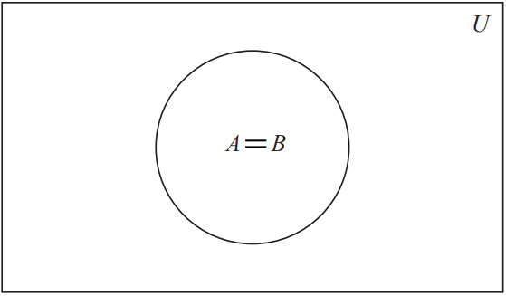{width="300"}
  <figcaption>$$A \subseteq B$$</figcaption>

  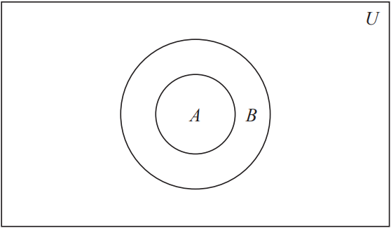{width="300"}
  <figcaption>$$A \subsetneq B$$</figcaption>
</figure>

> **Definition 1.5** (Subset). If $A$ and $B$ are sets, then $A$ is a subset of $B$, written as $A \subseteq B$, if and only if every element of $A$ is also an element of $B$.
<!-- -->
> **Definition 1.6** (Proper subset). *If $A$ is a subset of $B$, but not equal to $B$; where there is at least one element of $B$ not in $A$, then $A$ is a proper subset of $B$, written as $A \subsetneq B$.

: Some online sources or textbooks may use the following notation $\subset$ instead of $\subsetneq$, to represent a proper subset. They are the same thing, but to avoid confusion, I'll be using this notation $\subsetneq$.

Note that every proper subset is a subset, but not every subset is a proper subset. So the diagram shown in (b) can also be used to demonstrate what a subset looks like.

> **Example 1.4**. *Let $A = \{1,2,3,4,5\}$, $B = \{1,3,5\}$, $C = \{2,3,5\}$, and $D = \{2,3,5\}$ then:
> 
> - $B \subseteq A$ and $B \subsetneq A$
> - $C \subseteq A$ and $C \subsetneq A$
> - $C\subseteq D$ and $D \subseteq C$

: Two sets are equal when they share the exact element or in other words, subsets of each other: $C \subseteq D$ and $D \subseteq C \Longleftrightarrow C = D$.

### Power Sets 
Previously, we went over what a subset is and so will use that to define the following set.

> **Definition 1.7** (Power Set). Let $S$ denote a set, the power set of $S$, denoted $\mathcal{P}(S)$, is the set of all subsets of $S$. 
> In general, for any finite set $S$, where $|S| = n$, we have that $|\mathcal{P}(S)| = 2^n$.

If you recall every proper subset is considered a subset and so we may use that in the following example. Any set is gonna have various subsets.

> **Example 1.5**. Given a set $A = \{1,3,5\}$, we can define the following to be subsets of $A$:
>  
> - $\{1\} \subseteq A$
> - $\{1,3\} \subseteq A$
> - $\{1,5\} \subseteq A$
> - $\{1,3,5\} \subseteq A$
> - *and so on*

The power set is basically all the possible subsets of $A$ that can be formed given a set. The empty set $\varnothing$ and the set $A$ is always included in the $\mathcal{P}(A)$.

> **Example 1.6**. Using the set $A = \{1,3,5\}$, then:
> 
> $$\mathcal{P}(A) = \{\varnothing, \{1\}, \{2\}, \{3\}, \{1,3\}, \{1,5\}, \{3,5\}, \{1,3,5\}\}$$

It becomes quite tricky when we use an empty set. The power set of an empty set, $\mathcal{P}(\varnothing) = \{\varnothing\}$ with cardinality of $1$. We can double check this by $|\varnothing| = 0$ and so $|\mathcal{P}(\varnothing)| = 2^0 = 1$ or cardinality of $1$.

### Singleton and Doubleton 

When a set only has one or two elements, it can be classified into one of two ways: 

> **Definition 1.8** (Singleton). A singleton is a set with a single element, $\{x\}$.
<!-- -->
> **Definition 1.9** (Doubleton). A doubleton (or unordered pair) is a set with two elements, $\{x,y\}$.

An ordered pair uses round brackets instead of curly brackets to indicate that order matters, $(x,y)$, which will be discussed more in later sections.

## Operations on Sets 
There are four main set operations to be discussed. Let $A$ and $B$ be subsets of a universal set $U$.

: Universal set, denoted $U$, is the collection of all objects that can occur as elements of the sets under consideration. All other sets are subsets of the universal set.

> **Definition 1.10** (Union). The union of $A$ and $B$, denoted $A \cup B$, is the set of all elements that are at least in one of $A$ or $B$. 
> 
> $$A\ \cup\ B = \{x \in U \mid x \in A \text{ or } x \in B\}$$
<!-- -->
> **Definition 1.11** (Intersection). The intersection of $A$ and $B$, denoted $A \cap B$, is the set of all elements that are common to both $A$ and $B$.
> 
> $$A\ \cap\ B = \{x \in U \mid x \in A \text{ and } x \in B\}$$
<!-- -->
> **Definition 1.12** (Difference). The difference of $A$ minus $B$, denoted $A \smallsetminus B$, is the set of all elements that are in $A$ and not in $B$.
> 
> $$A\ \smallsetminus\ B = \{x \in U \mid x \in A \text{ and } x \notin B\}$$*
<!-- -->
> **Definition 1.13** (Complement). The complement of $A$, denoted $A^c$, is the set of all elements in $U$ that are not in $A$.
> 
> $$A^c = \{x \in U | x \notin A\}$$

There's one other operation not included, which is the symmetric difference, denoted $A \triangle B$, is the set of elements which are in either of the sets A and B, but are not common  to both $A$ and $B$.

{height="300"}

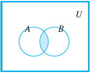{height="3.5cm"}

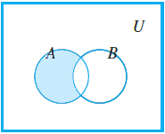{height="3.5cm"}

{height="3.5cm"}

### Set Properties 

The following theorem consists of set identities, some of which you might be familiar with:

> **Theorem 1.1**. *Let $A$, $B$, and $C$ be subsets of a universal set $U$:
> 
> 1.  *Commutative law:*
> 2.  *Associative law:*
> 3.  *Distributive law:*
> 4.  *Complement law:*
> 5.  *Double complement law:*
> 6.  *De Morgan's law:*
> 7.  *Identity law:*
> 8.  *Idempotent law:*
> 9.  *Set difference law:*

### Indexed Collection of Sets 
The definitions of unions and intersections for more than two sets are very similar to the definitions for two sets, which we may generalize in the following way.

> **Definition 1.14** (Union and Intersection). *Let $A_i$ be a subset of a universal set $U$ where $i \geq 1$ and given a non-negative integer $n$.
> 
> $$\bigcup\limits_{i=1}^n\ A_i = A_1 \cup A_2 \cup \cdots \cup A_n = \{x \in U \mid x \in A_i \text{ for some } i, \text{ where } 1 \leq i \leq n\}$$
> 
> $$\bigcap\limits_{i=1}^n\ A_i = A_1 \cap A_2 \cap \cdots \cap A_n = \{x \in U \mid x \in A_i \text{ for all } i, \text{ where } 1 \leq i \leq n\}$$
> 
> \... and generalize to infinite unions and intersections.
> 
> $$\bigcup\limits_{i=1}^\infty\ A_i = \{x \in U \mid x \in A_i \text{ for some } i, \text{ where } i \geq 1 \}$$
> 
> $$\bigcap\limits_{i=1}^\infty\ A_i = \{x \in U \mid x \in A_i \text{ for all } i, \text{ where } i \geq 1\}$$

Recap of the interval notation, $(\ )$ means the endpoints are excluded and $[\ ]$ means they are included. There are three specific types you'll encounter when solving for infinite  intersections of a set:

1. $\displaystyle\bigcap\limits_{i=1}^\infty \bigg(-\frac{1}{i}, \frac{1}{i}\bigg)$
2. $\displaystyle\bigcap\limits_{i=1}^\infty \bigg(0, \frac{1}{i}\bigg)$ and $\displaystyle\bigcap\limits_{i=1}^\infty \bigg[0, \frac{1}{i}\bigg)$
3. $\displaystyle\bigcap\limits_{i=1}^\infty\ (n, \infty)$ and $\displaystyle\bigcap\limits_{i=1}^\infty\ [n, \infty)$

There might be slight variations of the questions, but it should give you a general idea on how to solve for them.

> **Example 1.7**. *Solve the following set, $\bigcap\limits_{i=1}^\infty \Big(-\frac{1}{i}, \frac{1}{i}\Big)$:
> 
> 1. Let's think logically, by drawing out the number lines for the first three sets.
> 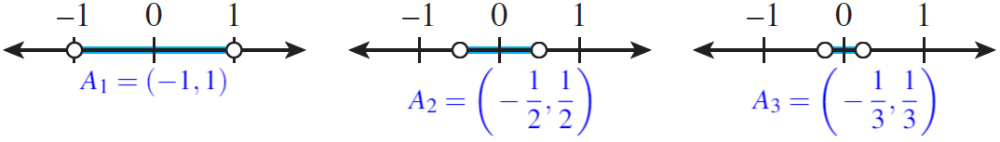{height:100px}
> 
> 2. If you notice the number line slowly decreases in size. As it reaches infinity, it will eventually reach $0$, which will be the only thing they all share in common.
> 
> $$\bigcap\limits_{i=1}^\infty \bigg(-\frac{1}{i}, \frac{1}{i}\bigg) = \{0\}$$
<!-- -->
> **Example 1.8**. *Solve the following set, $\bigcup\limits_{i=1}^\infty \Big(-\frac{1}{i}, \frac{1}{i}\Big)$:
> 1. We are now interested in all of the possible elements of the set. Using the number line from before, if you notice, $(-1,1)$ already contains all the elements in $A_2$ and $A_3$. 
> 
> 2. So we can say that $(-1,1)$ contains all the elements shared in the infinite set.
> 
> $$\bigcup\limits_{i=1}^\infty \bigg(-\frac{1}{i}, \frac{1}{i}\bigg) = (-1,1)$$

: The notation for the open interval $(a,b)$ is identical to the notation for ordered pair $(a,b)$, context makes it unlikely that the two will be confused.

> **Example 1.9**. *Solve the following set, $\bigcap\limits_{i=1}^\infty \Big(0, \frac{1}{i}\Big)$:
> 
> 1. Let's draw out the number lines again for the first three sets.
> 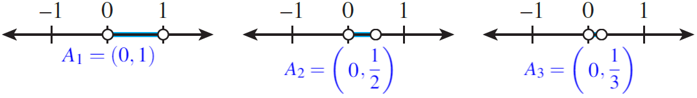{height="1.35cm"}
> 
> 2. Likewise, as it reaches infinity, it will eventually reach $0$, however, note that $0$ is not included, from the round brackets, so we say it's an empty set. 
> 
> $$\bigcap\limits_{i=1}^\infty \bigg(0, \frac{1}{i}\bigg) = \varnothing$$

If instead it was
$\displaystyle\bigcap\limits_{i=1}^\infty \Big[0, \frac{1}{i}\Big)$,
then our answer would be $\{0\}$, as it is included in the set.
:::

::: exampleT
**Example 1.10**. *Solve the following set,
$\bigcap\limits_{i=1}^\infty\ [i, \infty)$:*

1.  *Let's draw out the first number line when $i = 1$ and when
    $i = 5$.*

    ::: center
    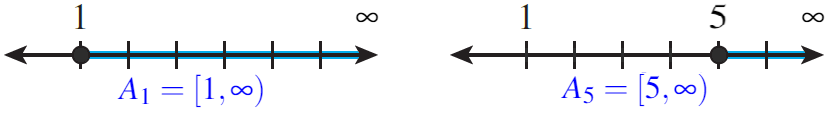{height="1cm"}
    :::

2.  *As $i$ goes from $1$ to $5$, you notice that $\{1,2,3,4\}$ is no
    longer common for all sets. As $i \to \infty$, logically there
    exists no real number which are common for all sets.*

3.  *We can conclude that the intersection of the infinite set is an
    empty set.
    $$\bigcap\limits_{i=1}^\infty\ [i, \infty) = \varnothing$$*
:::

::: list

Note that the answer doesn't change even if we have
$\displaystyle\bigcap\limits_{i=1}^\infty\ (i,\infty)$, our answer is
still $\varnothing$.
:::

If you are interested in the mathematical proof, click on the following
link: [[Archimedean
property]{.underline}](https://youtu.be/Ytg2VSqjtXY?t=1246).

-3ex -0.1ex -.4ex 0.5ex .2ex Cartesian Products on Sets In this section,
we'll first focus on the notion of ordered pairs and how they work.

::: dBox
::: definitionT
**Definition 1.15** (Ordered pair). *The symbol $(a,b)$ denotes the
ordered pair with the specification that $a$ is the first element and
$b$ is the second element of the pair.
$$(a,b) = (c,d) \longrightarrow a = c \text{ and } b = d$$*
:::
:::

::: dBox
::: definitionT
**Definition 1.16** (Cartesian product). *For sets $A$ and $B$, the
Cartesian product of $A$ and $B$, denoted $A \times B$, is the set of
all ordered pairs $(a,b)$.
$$A \times B = \{(a,b) \mid a \in A \text{ and } b \in B\}$$*
:::
:::

::: exampleT
**Example 1.11**. *Let $A = \{x,y\}$ and $B = \{1,2,3\}$, find
$A \times B$ and $B \times A$:*

-   *$A \times B = \{(x,1), (y,1), (x,2), (y,2), (x,3), (y,3)\}$*

-   *$B \times A = \{(1,x), (1,y), (2,x), (2,y), (3,x), (3,y)\}$*
:::

::: list

Note how the order matters, such that $A \times B \neq B \times A$ in
the following example above.
:::

-4ex -1ex -.4ex 1ex .2ex Logic It's important to first establish one
thing, which we define as:

::: dBox
::: definitionT
**Definition 1.17** (Statement). *A statement (or proposition) is a
sentence that is true or false, but not both.*
:::
:::

There are different ways to express a statement as shown below.

::: exampleT
**Example 1.12**. *Determine whether the following are statements and if
so, are they true or false?*

1.  *\"$2$ is greater than $5$\" is a statement and is logically false.*

2.  *\"$x > 5$\" is not a statement because of the variable $x$, it is
    undetermined.*

3.  *\"$\sqrt{9}$ is an integer\" is a statement and is logically true.*

4.  *\"There are $7$ days in a week\" is a statement and is logically
    true.*
:::

We will now introduce five logical connectives, used to build more
complicated logical expressions out of simpler ones. Let $P$ and $Q$ be
statement variables.

::: dBox
::: definitionT
**Definition 1.18** (Negation). *The statement \"not $P$\", denoted by
$\lnot\ P$, is true when $P$ is false.*
:::
:::

::: dBox
::: definitionT
**Definition 1.19** (Conjunction). *The statement \"$P$ and $Q$\",
denoted by $P\ \land\ Q$, is true when, and only when, both $P$ and $Q$
are true.*
:::
:::

::: dBox
::: definitionT
**Definition 1.20** (Disjunction). *The statement \"$P$ or $Q$\",
denoted by $P\ \lor\ Q$, is true when at least one of $P$ or $Q$ are
true.*
:::
:::

::: dBox
::: definitionT
**Definition 1.21** (Conditional). *The statement \"If $P$ then $Q$\",
denoted by $P\ \rightarrow\ Q$, is false when $P$ is true and $Q$ is
false; otherwise it is true.*
:::
:::

::: dBox
::: definitionT
**Definition 1.22** (Biconditional). *The statement \"$P$ if and only if
$Q$\", denoted by $P\ \leftrightarrow\ Q$, is true exactly when either
$P$ and $Q$ are both true, or when $P$ and $Q$ are both false.*
:::
:::

::: list

The order of operations goes from $\lnot$, $\land$, $\lor$,
$\rightarrow$ then $\leftrightarrow$, if no parenthesis are present.
:::

The five logical connectives has the following truth table:

   $P$   $\lnot\ P$
  ----- ------------
    T        F
    F        T

   $P$   $Q$   $P\ \land\ Q$   $P\ \lor\ Q$   $P\ \rightarrow\ Q$   $P\ \leftrightarrow\ Q$
  ----- ----- --------------- -------------- --------------------- -------------------------
    T     T          T              T                  T                       T
    T     F          F              T                  F                       F
    F     T          F              T                  T                       F
    F     F          F              F                  T                       T

However, when statement is always true or false we can define to be the
following:

::: dBox
::: definitionT
**Definition 1.23** (Tautology). *A tautology is a statement form that
is always true regardless of the truth values of the individual
statement substituted for its statement variables*
:::
:::

::: dBox
::: definitionT
**Definition 1.24** (Contradiction). *A contradiction is a statement
form that is always false regardless of the truth values of the
individual statements substituted for its statement variables.*
:::
:::

::: exampleT
**Example 1.13**. *Show that $P\ \lor\ \lnot\ P$ is a tautology and that
$P\ \land\ \lnot\ P$ is a contradiction.*

   *$P$*   *$\lnot\ P$*   *$P\ \lor\ \lnot\ P$*
  ------- -------------- -----------------------
    *T*        *F*                 *T*
    *F*        *T*                 *T*

   *$P$*   *$\lnot\ P$*   *$P\ \land\ \lnot\ P$*
  ------- -------------- ------------------------
    *T*        *F*                 *F*
    *F*        *T*                 *F*
:::

-3ex -0.1ex -.4ex 0.5ex .2ex Conditional Statements When asked to
rewrite the following sentences using $\rightarrow$, they would use the
phrases \"necessary condition\" and \"sufficient condition\", which
implies:

-   The statement $P$ is a necessary condition for $Q$ means that
    $Q\ \rightarrow\ P$.

-   The statement $P$ is a sufficient condition for $Q$ means that
    $P\ \rightarrow\ Q$.

For a conditional statement, $P\ \rightarrow\ Q$, we can form two
related statements:

::: dBox
::: definitionT
**Definition 1.25** (Inverse). *The inverse of $P\ \rightarrow\ Q$ is
$\lnot\ P\ \rightarrow\ \lnot\ Q$.*
:::
:::

::: dBox
::: definitionT
**Definition 1.26** (Converse). *The converse of $P\ \rightarrow\ Q$ is
$Q\ \rightarrow\ P$.*
:::
:::

::: dBox
::: definitionT
**Definition 1.27** (Contrapositive). *The contrapositive of
$P\ \rightarrow\ Q$ is $\lnot\ Q\ \rightarrow\ \lnot\ P$.*
:::
:::

::: exampleT
**Example 1.14**. *Rewrite the following statement: \"If $n$ is prime,
then $n$ is odd or $n$ is $2$\" using the:*

1.  *Inverse: If $n$ is not prime, then $n$ is not odd and $n$ is not
    $2$.*

2.  *Converse: If $n$ is odd or $n$ is $2$, then $n$ is a prime.*

3.  *Contrapositive: If $n$ is not odd and $n$ is not $2$, then $n$ is
    not a prime.*
:::

::: list

When writing the negation, watch out for other logical connectives
present in the sentences, like $\land$ and $\lor$ and make sure to apply
De Morgan's laws properly.
:::

-3ex -0.1ex -.4ex 0.5ex .2ex Logical Equivalences Two statements are
logically equivalent, denoted by $\equiv$, if they share the same truth
table.

::: tBox
::: theoremeT
**Theorem 1.1**. *Let $P$ and $Q$ be statement variables:*

1.  *Commutative law:*

2.  *Associative law:*

3.  *Distributive law:*

4.  *Double negation law:*

5.  *De Morgan's law:*

6.  *Idempotent law:*

7.  *Implication law:*
:::
:::

You might notice some similarities to the previous theorem for unions
and intersections of a set.

::: tabu
\*2X\[c\] **Logical Equivalences** & **Set Properties**\

::: flushleft
For all statements variables $P$, $Q$, and $R$:
:::

&

::: flushleft
For all sets $A$, $B$, and $C$:
:::

\

(a) $P\ \lor\ Q \equiv Q\ \lor\ P$

(b) $P\ \land\ Q \equiv Q\ \land\ P$

&

(a) $A\ \cup\ B = B\ \cup\ A$

(b) $A\ \cap\ B = B\ \cap\ A$

\

(a) $P\ \land\ (Q \land R) \equiv (P\ \land Q)\ \land\ R$

(b) $P\ \lor\ (Q \lor R) \equiv (P\ \lor Q)\ \lor\ R$

&

(a) $A\ \cap\ (B\ \cap\ C) = (A\ \cap\ B)\ \cap\ C$

(b) $A\ \cup\ (B\ \cup\ C) = (A\ \cup\ B)\ \cup\ C$

\

(a) $P\ \land\ (Q\ \lor R) \equiv (P\ \land Q)\ \lor\ (P\ \land\ R)$

(b) $P\ \lor\ (Q\ \land R) \equiv (P\ \lor Q)\ \land\ (P\ \lor\ R)$

&

(a) $A\ \cap\ (B\ \cup\ C) = (A\ \cap\ B)\ \cup\ (A\ \cap\ C)$

(b) $A\ \cup\ (B\ \cap\ C) = (A\ \cup\ B)\ \cap\ (A\ \cup\ C)$

\

(a) $\lnot(\lnot\ P) \equiv P$

&

(a) $(A^c)^c = A$

\

(a) $P\ \lor\ P \equiv P$

(b) $P\ \land\ P \equiv P$

&

(a) $A\ \cup\ A = A$

(b) $A\ \cap\ A = A$

\

(a) $\lnot(P\ \lor\ Q) \equiv \lnot\ P\ \land\ \lnot\ Q$

(b) $\lnot(P\ \land\ Q) \equiv \lnot\ P\ \lor\ \lnot\ Q$

&

(a) $(A\ \cup\ B)^c = A^c\ \cap\ B^c$

(b) $(A\ \cap\ B)^c = A^c\ \cup\ B^c$

\
:::

::: tabu
\*2X\[c\]

(a) $P\ \lor\ (P\ \land\ Q) \equiv P$

(b) $P\ \land\ (P\ \lor\ Q) \equiv P$

&

(a) $A\ \cup\ (A\ \cap\ B) = A$

(b) $A\ \cap\ (A\ \cup\ B) = A$

\
:::

-3ex -0.1ex -.4ex 0.5ex .2ex Predicates and Quantified Statements We
initially discussed that a logical statement is either true or false. So
something like \"$x > 5$\" is not a statement, but what we define to be
a predicate.

::: dBox
::: definitionT
**Definition 1.28** (Predicate). *A predicate $P(x)$ is a sentence that
contains a finite number of variables and becomes a statement when
specific values are substituted for variables.*
:::
:::

::: dBox
::: definitionT
**Definition 1.29** (Domain). *The domain $D$ of a predicate variable is
the set of all values that may be substituted in place of variable.*
:::
:::

A way to obtain statements from predicates is to add quantifiers. Let
$P(x)$ be a predicate and $D$ the domain of $x$.

::: dBox
::: definitionT
**Definition 1.30** (Universal quantifier). *The symbol $\forall$ is
read as \"for every\" or \"for all.\" A universal statement is a
statement of the form, $\forall x \in D,\ P(x)$.*

*It is defined to be true if, and only if, $P(x)$ is true for every $x$
in $D$. It is defined to be false if, and only if, $P(x)$ is false for
at least one $x$ in $D$.*
:::
:::

::: dBox
::: definitionT
**Definition 1.31** (Existential quantifier). *The symbol $\exists$ is
read as \"there exists\" or \"there is.\" An existential statement is a
statement of the form, $\exists x \in D,\ P(x)$.*

*It is defined to be true if, and only if, $P(x)$ is true for at least
one $x$ in $D$. It is false if, and only if, $P(x)$ is false for all $x$
in $D$.*
:::
:::

::: exampleT
**Example 1.15**. *Rewrite the following sentences using quantifiers.*

1.  *\"Every real number has a non-negative square\" rewritten as
    $\forall x \in \mathbb{R},\ x^2 \geq 0$*

2.  *\"There is a positive integer whose square is equal to itself\"
    rewritten as $\exists y \in \mathbb{Z}^+,\ y^2 = y$*
:::

One final topic to discuss is the negation of universal and existential
quantifiers.

::: tBox
::: theoremeT
**Theorem 1.1** (Negation of a Universal statement). *The negation of a
universal statement is logically equivalent to an existential statement.
Symbolically,
$$\lnot(\forall x \in D,\ P(x)) \equiv \exists x \in D,\ \lnot\ P(x)$$*
:::
:::

::: tBox
::: theoremeT
**Theorem 1.1** (Negation of a Existential statement). *The negation of
a existential statement is logically equivalent to an universal
statement. Symbolically,
$$\lnot(\exists x \in D,\ P(x)) \equiv \forall x \in D,\ \lnot\ P(x)$$*
:::
:::

::: exampleT
**Example 1.16**. *Negate the following statements from the previous
exercise.*

1.  *\"There exists a real number that has a negative square\" or
    $\exists x \in \mathbb{R},\ x^2 < 0$*

2.  *\"Every positive integer whose square is not equal to itself\" or
    $\forall x \in \mathbb{Z}^+,\ y^2 \neq y$*
:::

::: list

In example 1.11, the first statement is true, while, in example 1.12,
the first statement is false, since squaring a number will always be
positive.
:::

There are some cases where certain statements contain multiple
quantifiers.

::: exampleT
**Example 1.17**. *Negate the following statement:
$\forall x \in \mathbb{Z},\ \exists y \in \mathbb{Z},\ y > x$.*

1.  *We can simply think of \"$\exists y \in \mathbb{Z},\ y > x$\" as
    the predicate $P(x)$.
    $$\lnot(\forall x \in \mathbb{Z},\ P(x)) \equiv \exists x \in \mathbb{Z},\ \lnot\ P(x)$$*

2.  *Then we take the negation of $P(x)$.
    $$\lnot\ P(x) \equiv \lnot(\exists y \in \mathbb{Z},\ y > x) \equiv \forall y \in \mathbb{Z},\ y \leq x$$*

3.  *And we put it all together.
    $$\exists x \in \mathbb{Z},\ \forall y \in \mathbb{Z},\ y \leq x$$*
:::

-3ex -0.1ex -.4ex 0.5ex .2ex Order of Quantifiers In a statement
containing both $\forall$ and $\exists$, changing the order of the
quantifiers can significantly change the meaning of the statementyou
read from left to right.

For example, the following statements are equivalent:
$$\forall x,\ \forall y,\ P(x) \equiv \forall y,\ \forall x,\ P(x) \hspace{2cm} \exists x,\ \exists y,\ P(x) \equiv \exists y,\ \exists x,\ P(x)$$
However, now consider mixed quantifier and they are no longer
equivalent:
$$\forall x,\ \exists y,\ P(x) \not\equiv \exists y,\ \forall x,\ P(x) \hspace{2cm} \exists x,\ \forall y,\ P(x) \not\equiv \forall y,\ \exists x,\ P(x)$$
For a more dramatic context. let's use the following analogy:
$\forall x,\ \exists y,\ x \text{ loves } y$ and
$\exists y,\ \forall x,\ x \text{ loves } y$

-   Note that both statements looks identical, except the order of
    quantifiers.

-   However, the first statement means everybody loves somebodywhom that
    somebody could be a different person for each $x$, ...

-   whereas the second statement means there is one individual who is
    loved by all people.

We can also visualize this using a directed graph, as a shown below:

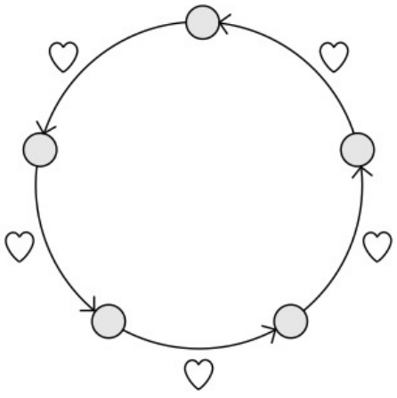{height="3.5cm"}

{height="3.5cm"}

# Relations and Functions

-4ex -1ex -.4ex 1ex .2ex Binary Relations A relations is something that
involves two different sets. A special kind of binary relation is a
function. Suppose there are some elements inside $X$ and $Y$, we can
visualize an arrow diagram for our relation.

The graph corresponds to the following ordered pairs:
$\{(x_1,y_1), (x_2, y_2), (x_3, y_3)\}$

::: dBox
::: definitionT
**Definition 2.1** (Binary Relation). *For sets $X$ and $Y$, a binary
relation $R$ from $X$ to $Y$ is a subset of $X \times Y$. Hence, $R$ is
a set of ordered pairs $(x,y)$ with $x \in X$ and $y \in Y$. We write
$x \mathrel{R}y$ if $(x,y) \in R$.*

*We say that $R$ is a binary relation on $X$ if $X = Y$; that is,
$R\subseteq X \times X$.*
:::
:::

A relation can also be drawn as a directed graph which will prove to be
more useful when explaining the properties of relation. Using the same
set of ordered pairs from before, it can drawn as such:

::: center
:::

-3ex -0.1ex -.4ex 0.5ex .2ex Properties of Relation There exists various
properties that some, but not all, relations satisfy. Let $R$ be a
binary relation on a set $A$:

::: dBox
::: definitionT
**Definition 2.2** (Reflexive). *The relation $R$ is reflexive, if for
all $x \in  A$, $x \mathrel{R}x$.*

*$R$ is reflexive $\Leftrightarrow$ for every $x$ in $A$, $(x,x) \in R$*

::: center
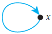{height="1cm"}
:::
:::
:::

::: dBox
::: definitionT
**Definition 2.3** (Symmetric). *The relation $R$ is symmetric, if for
all $x,y \in A$, if $x \mathrel{R}y$, then $y \mathrel{R}x$.*

*$R$ is symmetric $\Leftrightarrow$ for every $x$ and $y$ in $A$, if
$(x,y) \in R$ then $(y,x) \in R$*

::: center
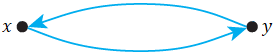{height="0.75cm"}
:::
:::
:::

::: dBox
::: definitionT
**Definition 2.4** (Transitive). *The relation $R$ is transitive, if for
all $x,y,z \in A$, if $x \mathrel{R}z$ and $y \mathrel{R}z$, then
$x \mathrel{R}z$.*

*$R$ is transitive $\Leftrightarrow$ for every $x$, $y$, and $z$ in $A$,
if $(x,y) \in R$ and $(y,z) \in R$ then $(x,z) \in R$*

::: center
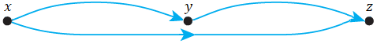{height="0.7cm"}
:::
:::
:::

::: exampleT
**Example 2.1**. *Suppose we have a set $A = \{0,1,2,3,4\}$ and the
relation as follows:
$$R = \{(0,0), (0,1), (0,3), (1,0), (1,1), (2,2), (3,0), (3,3)\}$$*

1.  *Let's draw out the directed graph.*

    ::: center
    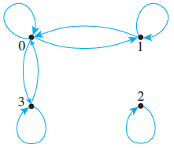{height="3.5cm"}
    :::

2.  *$R$ is reflexive because there is a loop for each element, as shown
    for $(0,0), (1,1), (2,2), (3,3)$.*

3.  *$R$ is symmetric because there is an arrow going from one point
    then back to the other, as shown for $(0,1), (1,0)$ and
    $(0,3), (3,0)$*

4.  *$R$ is not transitive because there's no arrow from $(1,3)$ or
    $(3,1)$ which would otherwise make it transitive.*
:::

Sometimes the set of relation is not given, instead the definition is
provided. For example, suppose we have set a $A = \{1,2,3,4\}$ and the
relation $R$ defined as follows:

Properties of Div:

:   $(x,y) \in R \text{ if } x \mid y$

    The line \"$\mid$\" means $x$ divisible by $y$. Equivalently, you
    can think of it as $y = xk$ where $k \in \mathbb{Z}$. The set of
    relation would be:
    $$R = \{(1,1),(1,2),(1,3),(1,4),(2,2),(2,4),(3,3),(4,4)\}$$

Properties of Congruence Modulo n:

:   $(x,y) \in R \text{ if } n \mid (x-y)$

    Sometimes, it referred to as $x \equiv y \ (\mathrm{mod}\ n)$. Let
    use $n = 2$, as an example. We can use the expression before,
    $x-y = 2k$ where $k \in \mathbb{Z}$. The set of relation would be:
    $$R = \{(1,1),(1,3),(2,2),(2,4),(3,1),(3,3),(4,2),(4,4)\}$$

Properties of \"Greater Than\":

:   $(x,y) \in R \text{ if } x > y$

    In this case, we are only interested where $x$ is greater than $y$.
    The set of relation would be:
    $$R = \{(2,1),(3,1),(3,2),(4,1),(4,2),(4,3)\}$$

-3ex -0.1ex -.4ex 0.5ex .2ex Equivalence Relation There's are cases when
the relation has all three properties discussed.

::: dBox
::: definitionT
**Definition 2.5** (Equivalence relation). *Let $R$ be a binary relation
on a set $A$. The relation $R$ is an equivalence relation if it is
reflexive, symmetric and transitive, $(A, R)$.*
:::
:::

A notable example would be the equality sign, which might not make
senses at first, but let's break it down. For all real numbers $x$ and
$y$, consider the relation $R$ defined as follows
$$(x,y) \in R \text{ if } x = y$$

Is $R$ reflexive?

:   Yes, because it is implying the statement $x = x$, which is true;
    every real number is equal to itself.

Is $R$ symmetric?

:   Yes, because if $x = y$, then $y = x$ is also true; if one number is
    equal to another, then the second is equal to the first.

Is $R$ transitive?

:   Yes, because if $x = y$ and $y = z$, then $x = z$ is true; if one
    real number equals a second and the second equals a third, then the
    first must also equal the third.

Let's introduce this new idea called the equivalence class, as an
extension to equivalence relation. Suppose $A$ is a set and $R$ is an
equivalence relation on $A$.

::: dBox
::: definitionT
**Definition 2.6** (Equivalence class). *For each element $a$ in $A$,
the equivalence class of $a$, denoted $[a]$ is the set of all elements
$x$ in $A$ such that $x$ is related to $a$ by $R$.
$$= \{x \in A \mid x \mathrel{R}a \}$$*
:::
:::

::: list

Some textbooks may define it as $[a] = \{x \in A \mid a \mathrel{R}x \}$
instead. Either one works, as you may recall, it's transitive.
:::

::: exampleT
**Example 2.2**. *Let $A = \{0,1,2,3,4\}$ and the relation as follows:
$$R = \{(0,0),(0,4),(1,1),(1,3),(2,2),(3,1),(3,3),(4,0),(4,4)\}$$*

1.  *Determine all the elements related to $0$ or $x \mathrel{R}0$,
    where $x \in A$. $$0 \mathrel{R}0,\ 4 \mathrel{R}0$$ The elements
    $0$ and $4$ are essentially what makes up the equivalence class of
    $0$, which more formally can be written as
    $$[0] = \{x \in A \mid x \mathrel{R}0\} = \{0,4\}$$*

2.  *Thus, find the equivalence class for the rest of the elements of
    $A$. $$[1] = \{x \in A \mid x \mathrel{R}1\} = \{1,3\}$$
    $$[2] = \{x \in A \mid x \mathrel{R}2\} = \{2\}$$
    $$[3] = \{x \in A \mid x \mathrel{R}3\} = \{1,3\}$$
    $$[4] = \{x \in A \mid x \mathrel{R}4\} = \{0,4\}$$ Note that
    $[4] = [0]$ and $[1] = [3]$, so the distinct equivalent classes are
    $$\{0,4\}, \{1,3\}, \text{ and } \{2\}$$*
:::

If you notice, the distinct equivalence classes of an equivalence
relation $R$ on a set $A$ form a partition of $A$. Likewise, the
converse is also true, which will discuss in the next section.

::: tBox
::: theoremeT
**Theorem 2.1**. *Let $R$ be an equivalence relation on a set $A$, where
we assume $A \neq \varnothing$.*

1.  *For all $x \in A$, $[x] \neq \varnothing$.*

2.  *If $x \mathrel{R}y$, then $[x] = [y]$.*

3.  *If $(x,y) \notin R$, then $[x]\ \cap\ [y] = \varnothing$.*
:::
:::

-3ex -0.1ex -.4ex 0.5ex .2ex Relation Induced by Partition As a recap, a
partition of a set $A$ is a finite or infinite collection of nonempty,
mutually disjoint subsets whose union is $A$ or illustratively,

::: center
{height="2.5cm"}
:::

where $A_i\ \cap\ A_j = \varnothing$ whenever $i \neq j$ and
$A_1\ \cup\ \cdots\ \cup\ A_6 = A$.

::: dBox
::: definitionT
**Definition 2.7**. *Let $P$ be a partition of a set $A$ and define the
binary relation $R_P$, so that $x \mathrel{R}y$ if $x$ and $y$ are in
the same part of the partition.*
:::
:::

Again, this definition might sound confusing, but let's use the set $A$
from the previous example to get a better understanding.

::: exampleT
**Example 2.3**. *Let $A = \{0,1,2,3,4\}$ and consider the following be
a partition $P$ of $A$: $$P = \{\{0,1\},\{2,3\},\{4\}\}
    % A_1 = \{0,1\} \hspace{1cm} A_2 = \{2,3\} \hspace{1cm} A_3 = \{4\}$$*

1.  *Let's consider the first subset of the partition, $A_1 = \{0,1\}$.
    Since both $0$ and $1$ are in the subset, we can form the following
    relation. $$0 \mathrel{R}1,\ 1\mathrel{R}0$$ We can also do the
    following, since they are still in the same part of the partition.
    $$0 \mathrel{R}0,\ 1 \mathrel{R}1$$*

2.  *Thus, for the second subset, $A_2 = \{2,3\}$, we can form a similar
    set of relations.
    $$2 \mathrel{R}3,\ 3 \mathrel{R}2,\ 2 \mathrel{R}2,\ 3 \mathrel{R}3$$*

3.  *Finally for the third subset of the partition, $A_3 = \{4\}$, which
    only has one. $$4 \mathrel{R}4$$*

4.  *Hence, combining all of them makes up the binary relation $R_P$:
    $$R_P = \{\underbrace{(0,1),(1,0),(0,0),(1,1)}_{\{0,1\}},\underbrace{(2,3),(3,2),(2,2),(3,3)}_{\{2,3\}},\underbrace{(4,4)}_{\{4\}}\}$$*
:::

The fact is that a relation induced by a partition of a set satisfies
all three properties, or in other words, $R_P$ is an equivalence
relation.

-3ex -0.1ex -.4ex 0.5ex .2ex Partial Orders Partial orders provide one
way of ranking objects. To define them, we define another property of
relation.

::: dBox
::: definitionT
**Definition 2.8** (Antisymmetric). *Let $R$ be a binary relation on a
set $A$. We say $R$ is antisymmetric, if and only if, for every $a$ and
$b$ in $A$, if $a \mathrel{R}b$ and $b \mathrel{R}a$, where $a = b$.*
:::
:::

Equivalently, we are saying that the relation should not have the
following:

::: center
{height="0.75cm"}
:::

For example, the relation on the left is not antisymmetric, whereas the
relation on the right is antisymmetric.

::: center
{height="3cm"}
:::

::: dBox
::: definitionT
**Definition 2.9** (Partial order relation). *Let $R$ be a binary
relation on a set $A$. The relation $R$ is a partial order relation if
it is reflexive, antisymmetric, and transitive.*
:::
:::

We call $(A,R)$ a partial ordered set or poset. We use $\preceq$ to
represent the relation $R$.

-   Two elements $x$ and $y$ are **comparable** if either
    $x \mathrel{R}y$ or $y \mathrel{R}x$. Otherwise, the elements are
    incomparable. A set of pairwise **incomparable** is called an
    **antichain**.

-   If every pair of element is comparable, then $R$ is a **total
    order**, **linear order**, or **chain**.

Back to previous example, the relation on the left has two elements, $0$
and $1$, that are incomparable. The relation on the right is a linear
order with three elements.

::: dBox
::: definitionT
**Definition 2.10** (Hasse diagram). *A diagram used to represent
partial order relations with sufficient information and an implied
upward orientation.*
:::
:::

To obtain a Hasse diagram, proceed as follows:

1.  Construct a digraph (or directed graph) of the poset $(A,R)$, so
    that all arrows point upward, except the loops.

2.  Eliminate all loops.

3.  Eliminate all directed edges that are redundant because of
    transitivity.

4.  Eliminate the arrows on the directed edge.

Suppose we have a set $A = \{1,2,3,9,18\}$ with the div relation,
$x \mid y$. The digraph of this poset has the following appearance on
the left and the Hasse diagram on the right:

::: center
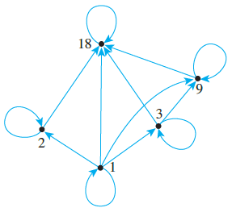{height="4cm"}
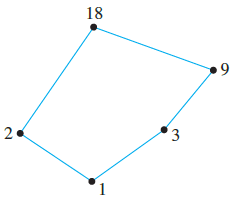{height="3.5cm"}
:::

We can reference some extremal elements of posets using the following
definitions.

::: dBox
::: definitionT
**Definition 2.11**. *Let $R$ be a partial order of on a set $A$:*

1.  *An element $u$ is a **least element** if $\forall x \in A$,
    $u \mathrel{R}x$.*

2.  *An element $v$ is a **greatest element** if $\forall x \in A$,
    $x \mathrel{R}v$.*

3.  *An element $u$ is a **minimal element** if there does not exist an
    element $x \in A \smallsetminus \{u\}$, such that $x \mathrel{R}u$.
    Alternatively, there exists no element \"below\" it.*

4.  *An element $u$ is a **maximal element** if there does not exist an
    element $x \in A \smallsetminus \{v\}$, such that $v \mathrel{R}x$.
    Alternatively, there exists no element \"above\" it.*
:::
:::

Note the difference between least and minimal element, likewise, with
greatest and maximal element.

-   A least element is a minimal, but a minimal element need not to be a
    least element.

-   Similarly, a greatest element is a maximal, but a maximal element
    need not to be a greatest element.

-   A poset can have at most one least and greatest element, but it may
    have more than one minimal or maximal element.

Look at the following digraph of each poset:

::: center
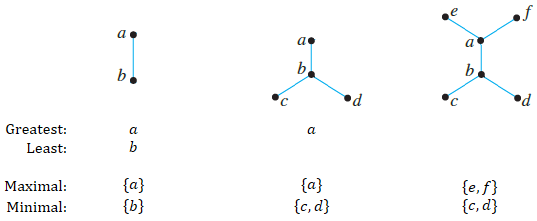{height="5.25cm"}
:::

-4ex -1ex -.4ex 1ex .2ex Introduction to Graph Theory Graph theory one
of the most important topics in discrete mathematics. You may have heard
of the famous bridge puzzle, known as \"The Seven Bridges of
Königsberg\", which consists of the following problem.

::: problem
**Problem 2.1**. *Is it possible to find a route through the graph that
starts and ends at some vertex, one of $A$, $B$, $C$, or $D$, and
traverses each edge exactly once?*

::: center
{height="2.5cm"}
:::
:::

We can further simply this to the following graph. If you compare the
two diagrams, they are equivalently the same.

::: center
{height="2.5cm"}
:::

If you aren't already aware of it, this problem is impossible to solve
and it all relates back to graph theory. Let's start off by defining
what a graph is.

::: dBox
::: definitionT
**Definition 2.12** (Graph). *A graph $G$ is a pair consisting of a
vertex set $V(G)$ and an edge set $E(G)$ containing pairs of distinct
vertices, such that $G = (V,E)$*
:::
:::

::: list

The bridge graph is an undirected graphthe order of the two connected
vertices is not important, oppose to a directed graph.
:::

The order of a graph $G$ is $|V(G)|$ and its size is $|E(G)|$. We can
use the bridge example, to define our vertex and edge set,
$$V(G) = \{A,B,C,D\} \hspace{1cm} E(G) = \{\{A,B\},\{A,B\},\{B,D\},\{B,D\},\{A,C\},\{B,C\},\{C,D\}\}$$
where $|V(G)| = 4$ and $|E(G)| = 7$.

-3ex -0.1ex -.4ex 0.5ex .2ex Degrees There's no solution to the bridge
problem because suppose we start and end at vertex $A$, then the degree
of the other three vertices $B$, $C$, and $D$ must be even.

::: dBox
::: definitionT
**Definition 2.13** (Degree). *Given a graph with vertex $v$, the degree
of $v$, denoted by $\deg_G(v)$ is the number of edges incident to $v$.*
:::
:::

From the graph earlier, we can define the degree of each vertex:
$\deg(A) = 3$, $\deg(B) = 5$, $\deg(C) = 3$, and $\deg(D) = 3$.

::: dBox
::: definitionT
**Definition 2.14** (Neighbor set). *The neighbor set of $v$, denoted
$N_G(v)$, is $\{w \in V(G) \mid v,w \in E(G)\}$; any $w \in V(G)$ is
called a neighbor of $v$, equivalently $\deg_G(v) = |N_G(v)|$.*

*The closed neighbor set of $v$, denoted $N_G(v)$, is
$N_G(v)\ \cup\ \{v\}$.*
:::
:::

::: list

As you'll see later on, the subscript $G$ is often removed, if the graph
is clear from context.
:::

The definition may sound more confusing that what it is suppose to mean,
but it is essentially the set of all vertices which are adjacent to $v$.
Refer to the example below.

Another set of terms will discuss in this section the minimum and
maximum degree of a graph $G$.

::: dBox
::: definitionT
**Definition 2.15** (Minimum and Maximum Degree). *The integer
$\delta(G)$ is the minimum degree of $G$ and the integer $\Delta(G)$ is
the maximum degree of $G$.*
:::
:::

::: exampleT
**Example 2.4**. *Suppose we have the following graph $G$ is defined
as:*

::: center
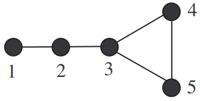{height="2cm"}
:::

1.  *For each vertex: $\deg(1) = 1$, $\deg(2) = 2$, $\deg(3) = 3$,
    $\deg(4) = 2$, and $\deg(5) = 2$.*

2.  *The vertex $3$ has three vertices adjacent to it, which are $2$,
    $4$, and $5$, thus $N(3) = \{2,4,5\}$ and $|N(3)| = \deg(3) = 3$ .*

3.  *The closed neighbor set includes $3$, since
    $N[3] = \{2,4,5\}\ \cup\ \{3\} = \{2,3,4,5\}$.*

4.  *From 1. we can see the minimum degree is $1$ and the maximum degree
    is $3$, thus $\delta(G) = 1$ and $\Delta(G) = 3$.*
:::

The following theorem is pretty simple, but helpful in drawing
conclusions when analyzing graphs.

::: tBox
::: theoremeT
**Theorem 2.1** (Handshake Theorem). *Let $G$ be a graph, then
$$\sum_{u \in V(G)} = \deg_G(u) = 2|E(G)|$$*
:::
:::

The equivalent definition of this in text means, the sum of degree of
all the vertices is twice the number of edges contained in it. Using the
example from before, there's five vertices and a total degree of $10$.

In general, any undirected graph has an even number of vertices of odd
degree.

-3ex -0.1ex -.4ex 0.5ex .2ex Walks, Paths, and Cycles Travel in a graph
is accomplished by moving from one vertex to another along a sequence of
adjacent edges. There various definitions used to describe the movement
in a graph.

::: dBox
::: definitionT
**Definition 2.16**. *Let $G$ be a graph and let $u$ and $v$ be vertices
in $G$.*

Walk:

:   *A walk from $u$ to $v$ is a finite sequence of adjacent vertices of
    $G$. Thus a walk has the form, $W = (v_0,v_1,v_2, \cdots, v_n)$ if
    $\{v_i,v_{i+1}\} \in E(G)$ for $0 \leq i < n$, where $v_0 = u$ and
    $v_n = v$. The length of a walk is the number of edges in $W$.*

Closed Walk:

:   *A closed walk is a walk that starts and ends at the same vertex,
    where $v_0 = v_n$.*

Path:

:   *A path is a walk without repeated vertices. The path of order
    $n \geq 1$ is denoted by $P_n$.*

Cycle:

:   *A cycle is a closed walk of at least $3$ or more vertices. The
    cycle of order $n \geq 3$ is denoted by $C_n$.*
:::
:::

A path, $P_n$, where $n \geq 1$, consist of $n$ vertices and $n-1$
edges.

::: center
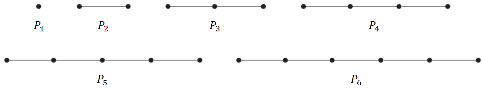{width="\\textwidth"}
:::

A cycle, $C_n$, where $n \geq 3$, consists of $n$ vertices and $n$
edges.

::: center
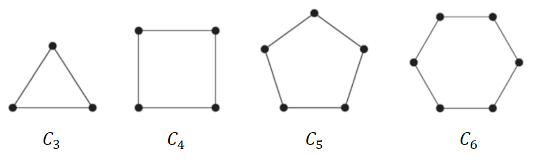{height="3cm"}
:::

::: exampleT
**Example 2.5**. *Suppose we have the graph below, define the following
walks:*

::: center
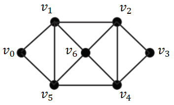{height="2cm"}
:::

::: multicols
*2*

1.  *$(v_0,v_1,v_2)$ is a path, $P_3$, as neither vertices nor edges are
    repeated.*

    ::: center
    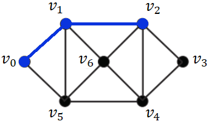{height="2cm"}
    :::

2.  *$(v_2,v_6,v_4,v_5,v_1,v_2)$ is a cycle, $C_5$, as we do not repeat
    a vertex nor edge, but started and ended at the same vertex.*

    ::: center
    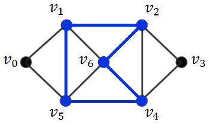{height="2cm"}
    :::
:::
:::

We can now define what we mean by the diameter of a graph $G$. Note this
will get a bit confusing. First, let's start with the distance between
two vertices $u$ and $v$.

::: dBox
::: definitionT
**Definition 2.17** (Graph distance). *The distance between $u$ and $v$
is the minimum length of the paths in $G$ connecting them, denoted by
$d_G(u,v)$ or $d(u,v)$, if $G$ is clear from context.*
:::
:::

::: list

The distance between $u$ and $v$ is the same regardless of the start
position, such that $d(u,v) = d(v,u)$. You can think of the distance as
the number of edges traversed.
:::

So in theory, what does this exactly mean? Let's use a simple graph for
now.

::: center
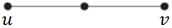{height="0.5cm"}
:::

The distance between $u$ and $v$ is $d(u,v) = 2$, as that's the only
path to traverse. Another example, let's try and use the graph from
before to see if you fully understand the definition.

::: center
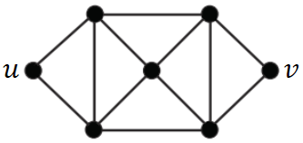{height="1.5cm"}
:::

As you can see, there are many possible paths from $u$ to $v$, shown in
red. Some examples are:

::: center
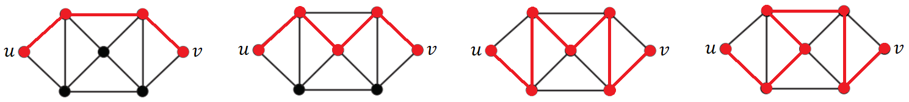{height="1.5cm"}
:::

However, remember that we are only interested in the shortest path,
which in this case is $d(u,v) = 3$. It's really important that you
understand how to define the shortest path in $G$ given two vertices $u$
and $v$, as it will help in understand the next definition.

::: dBox
::: definitionT
**Definition 2.18** (Graph diameter). *The diameter of a graph $G$ is
defined as
$$\mathop{\mathrm{diam}}(G) = \max\{d_G(v,w) \mid v,w \in V(G)\}$$
Equivalently, the largest number of vertices which must be traversed in
order to travel from one vertex to another.*
:::
:::

::: exampleT
**Example 2.6**. *Consider the following graph $G$, determine the
diameter of the graph:*

::: center
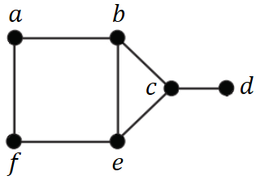{height="2cm"}
:::

1.  *We can start off by focusing on vertex $a$:*

::: center
{width="\\textwidth"}
:::

2.  *Then on vertex $b$:*

::: center
{width="80%"}
:::

3.  *Repeat for the rest of the vertices, for all $v,w \in V(G)$.*

4.  *If you did it properly, you will see that $d(a,d)$ and $d(f,e)$
    have the maximum distance. $$\mathop{\mathrm{diam}}(G) = 3$$*
:::

You can also refer to this
[[video]{.underline}](https://youtu.be/CwMCWQtNhtY) if you want a visual
explanation of this example.

-3ex -0.1ex -.4ex 0.5ex .2ex Subgraphs and Induced Subgraphs As the name
suggests, the prefix \"sub\" refers to it being subsets of another
graph.

::: dBox
::: definitionT
**Definition 2.19** (Subgraph). *A graph $H$ is said to be a subgraph of
a graph $G$, written $H \subseteq G$, if, and only if,
$V(H) \subseteq V(G)$ and $E(H) \subseteq E(G)$.*

*The graph $H$ is a spanning subgraph of $G$ if $V(H) = V(G)$.*
:::
:::

It may be easier to understand visually. Suppose we have the following
graph $G$:

::: center
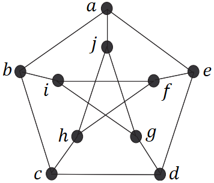{height="2.5cm"}
:::

As an example, each of the graphs are variations of graph $H$, which are
subgraphs of graph $G$:

::: center
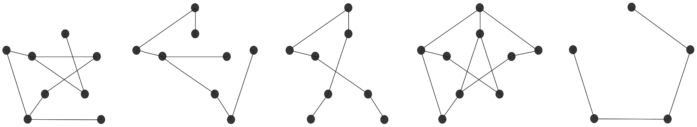{width="90%"}
:::

We only consider it to be spanning subgraph if and only if
$V(H) = V(G)$, which in this case, if $V(H) = \{a,b,c,d,e,f,g,h,i,j\}$,
which none of them are. On the other hand, these graphs are spanning
subgraphs of $G$:

::: center
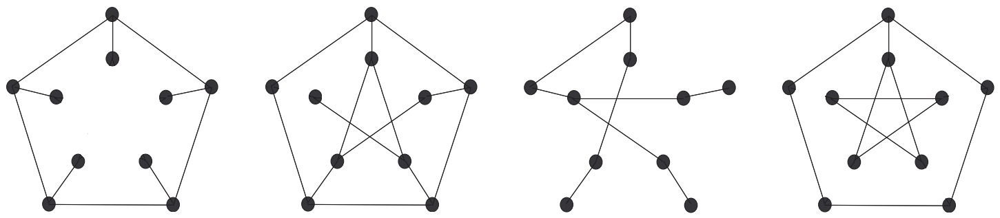{width="80%"}
:::

A final concept is induced subgraphs, which consists of the following
property.

::: dBox
::: definitionT
**Definition 2.20** (Induced subgraph). *If $S \subseteq V(G)$, then the
subgraph of $G$ induced by $S$, denoted by $G[S]$, has vertices $S$ and
edges are those of $G$ with endpoints in $S$.*
:::
:::

Note that none of the subgraphs shown so far are considered induced
subgraphs of $G$. Though, we can modify it slightly to make it an
induced subgraph, indicated by the red line.

::: center
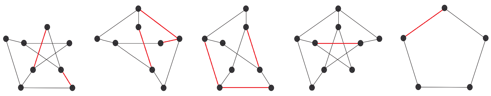{width="90%"}
:::

Just focus on the induced subgraph in the far left. Notice how every
possible edge that exists in graph $G$ between the vertices,
$\{b,d,e,f,g,h,i,j\}$, exists in this subgraph, thus making it an
induced subgraph. Likewise, how the edge $a,b$ is not here because $a$
is not in the subset of vertices.

-3ex -0.1ex -.4ex 0.5ex .2ex Special Graphs We consider some important
examples of graphs. One important class of graphs consists of those that
do not have any loops or parallel edges.

::: dBox
::: definitionT
**Definition 2.21** (Simple graph). *A simple graph is a graph that does
not have any loops or parallel edges. In a simple graph, an edge with
endpoints $v$ and $w$ is denoted $\{v,w\}$.*
:::
:::

The following graphs can be depicted as simple graphs:

::: center
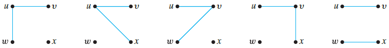{width="\\textwidth"}
:::

Another important class of graphs consists of those that are "complete"
in the sense.

::: dBox
::: definitionT
**Definition 2.22** (Complete graph). *A complete graph on $n$ vertices,
denoted $K_n$, is a simple graph with $n$ vertices and exactly one edge
connecting each pair of distinct vertices.*
:::
:::

This may sound confusing at first, but look at the following graphs
below to get a general idea of how it works.

::: center
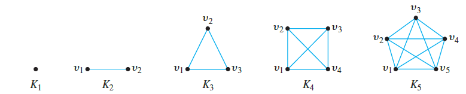{width="\\textwidth"}
:::

Then another class of graphs we can consider are complete bipartite
graphs, which are as follows.

::: dBox
::: definitionT
**Definition 2.23** (Complete bipartite graph). *A complete bipartite
graph, denoted $K_{m.n}$, is a simple graph that has its vertex set
partitioned into two subsets of $m$ and $n$ vertices.*
:::
:::

Note the difference between $K_5$ and $K_{3,2}$, where there are no
edges connected between $v_1$, $v_2$ and $v_3$ or similarly with $w_1$
and $w_2$, which would otherwise just make it a complete graph.

::: center
{height="4cm"}
:::

The dashed-lines highlights the partition of two subsets. If there are
some edges not present between the parts, then the graph is just a
bipartite graph.

-4ex -1ex -.4ex 1ex .2ex Functions If you think about it, functions are
a special kind of binary relation. By definition:

::: dBox
::: definitionT
**Definition 2.24** (Function). *A function $f$ is a binary relation
from sets $X$ and $Y$. For each $x \in X$, there is a unique $y \in Y$,
so that $x \mathrel{f}y$.*

*We write $f(x) = y$ for $x \mathrel{f}y$ and say \"$f$ of $x$ equals
$y$.\" Denoted as $f: X \to Y$, it is a relation from $X$, the
**domain** of $f$, to $Y$, the **co-domain** of $f$.*
:::
:::

Using an arrow diagrams, we can define a function by the following:

1.  Every element of $X$ has an arrow that points to an element in $Y$.

2.  No element of $X$ has two arrows that points to two different
    elements in $Y$.

We can also define the range of a function $f$, which is a subset of the
co-domain.

::: dBox
::: definitionT
**Definition 2.25** (Range). *Let $f: X \to Y$ be a function. The range
of $f$ is: $$\{y \in Y \mid \text{for some } x \in X, f(x) = y\}$$*
:::
:::

::: exampleT
**Example 2.7**. *Suppose a function $f$ is defined from $X$ to $Y$ by
the following arrow diagram:*

::: center
{height="2.5cm"}
:::

1.  *The domain of $f = \{a,b,c\}$ and co-domain of $f = \{1,2,3,4\}$.*

2.  *The range of $f$ equals $\{2,4\}$.*
:::

-3ex -0.1ex -.4ex 0.5ex .2ex Functions Acting on Sets You can consider
the set of images in $Y$ of all the elements in a subset of $X$ and the
set of inverse images in $X$ of all the elements in a subset of $Y$.

::: dBox
::: definitionT
**Definition 2.26** (Image and Inverse Image). *Let $f: X \to Y$ be a
function and $A \subseteq X$ and $C \subseteq Y$. The image of $A$,
denoted by $f(A)$, is
$$f(A) = \{y \in Y \mid \text{for some } x \in A, f(x) = y\}$$ The
inverse image of $C$, denoted by $f^{-1}(C)$, is
$$f^{-1}(C) = \{x \in X \mid f(x) \in C\}$$*
:::
:::

Using the example from before, it might be easier to understand what
these definition represent:

-   $f(a) = 2$, $f(b) = 4$, and $f(c) = 2$

-   $f^{-1}(1) = \varnothing$, $f^{-1}(2) = \{a,c\}$,
    $f^{-1}(3) = \varnothing$, and $f^{-1}(4) = \{b\}$

Note that $C$ is a subset of $Y$, so you maybe asked to find the inverse
image of more than one element. For example, let $C = \{2,4\}$, then
$f^{-1}(C) = \{a,b,c\}$.

-3ex -0.1ex -.4ex 0.5ex .2ex One-to-One, Onto and Inverse Functions
We'll now discuss two important properties that functions may satisfy:
the property of being one-to-one and the property of being onto.

::: dBox
::: definitionT
**Definition 2.27** (One-to-one). *A function $f: X \to Y$ is one-to-one
(or **injective**) if for all $x_1,x_2 \in X$, such that $x_1 \neq x_2$,
we have $f(x_1) \neq f(x_2)$.*

*If any two distinct elements of $X$ are sent to two distinct elements
of $Y$, then it is one-to-one.*

::: center
{height="2.5cm"}
:::
:::
:::

::: dBox
::: definitionT
**Definition 2.28** (Onto). *A function $f: X \to Y$ is one-to-one (or
**surjective**) if for all $y \in Y$, there exists $x \in X$, such that
$f(x) = y$.*

*If each elements of $Y$ equals $f(x)$ for at least one $x$ in $X$, then
it is onto.*

::: center
{height="2.75cm"}
:::
:::
:::

For finite sets, it is pretty easy to determine whether a function is
one-to-one or onto, just from the arrow diagram above. The tricky part
comes when analyzing a function for an infinite set.

::: exampleT
**Example 2.8**. *Let $f: \mathbb{R} \to \mathbb{R}$ be defined by
$f(x) = 4x - 1$. Is $f$ is onto?*

1.  *In order to prove something is onto, we need show that there exists
    a real number $x$, such that $y = 4x-1$.*

2.  *We can do so, by solving for $x$ in this case, where
    $x = (y - 1)/4$. If you notice, $y$ is not restricted to anything,
    meaning that $y$ can be any $\mathbb{R}$.*

3.  *Equivalently, we are saying \"There exists an $x$ (which we
    determined from 3.), which is being mapped
    $\forall y \in \mathbb{R}$.\"*
:::

::: exampleT
**Example 2.9**. *Let $f: \mathbb{R} \to \mathbb{R}$ be defined by
$f(x) = x^2$. Is $f$ one-to-one?*

1.  *Consider $f(x_1) = f(x_2)$, We need to show that $x_1 = x_2$. If we
    fail to prove this, then it is not one-to-one. Alternatively,
    $(2)^2 = (-2)^2 = 4$, but $2 \neq -2$, so the function is not
    one-to-one.*
:::

There also exist functions which satisfy both properties discussed.

::: dBox
::: definitionT
**Definition 2.29** (One-to-one correspondence). *A function
$f: X \to Y$ is bijective (or bijective) if it is both one-to-one and
onto.*

::: center
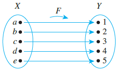{height="3cm"}
:::
:::
:::

This will aid us in defining a type of function known as the inverse
function, which undoes the action of $f$. It sends each element of $Y$
back to the element of $X$ where it came from.

::: dBox
::: definitionT
**Definition 2.30** (Inverse function). *Let $f: X \to Y$ be a
one-to-one correspondence. The inverse function of $f$ is denoted by
$f^{-1}$, where $f^{-1}: Y \to X$.*

::: center
{height="3cm"}
:::
:::
:::

Obtaining the inverse function should be something you are all familiar
with, it just been described in a different setting, which is by solving
for $x$.

::: exampleT
**Example 2.10**. *Is $y = 4x-1$ a bijection (or a one-to-one
correspondence) from $\mathbb{R}$ to $\mathbb{R}$? If so, find the
inverse $f^{-1}(x)$.*

1.  *To check if it is one-to-one, show that
    $f(x_1) = f(x_2) \Longrightarrow x_1 = x_2$. The function is
    one-to-one, since $4x_1 - 1 = 4x_2 - 1 \Longrightarrow x_1 = x_2$.*

2.  *To check if it is onto, we must show that for every
    $y \in \mathbb{R}$, there is an $x \in \mathbb{R}$, such that
    $y = f(x)$. We can prove this, by solving for $x$.
    $$x = \frac{y+1}{4}$$ There exists some $x \in \mathbb{R}$, such
    that $f(x) = y$, which makes the function is onto.*

3.  *To get the inverse function, we can use the equation we obtained in
    the previous one and interchange $x$ and $y$:
    $$y = f^{-1}(x) = \frac{x+1}{4}$$*
:::

# Number Theory and Combinatorics

-4ex -1ex -.4ex 1ex .2ex Elementary Number Theory The underlying content
of this section consists of properties of integers, rational numbers,
and real numbers.

-3ex -0.1ex -.4ex 0.5ex .2ex Rational Number Sums, differences, and
products of integers are integers, but most quotients of integers are
not integers, rather known as:

::: dBox
::: definitionT
**Definition 3.1** (Rational Number). *A real number $r$ is rational, if
and only if, it can be expressed as a quotient of two integers with a
nonzero denominator.
$$r \text{ is rational } \Leftrightarrow \exists \text{ integers } a \text{ and } b \text{ such that } r = \frac{a}{b} \text{ and } b \neq 0$$*
:::
:::

Some examples of rational numbers are $0$, $1$, and $1/3$. While a real
number that is not rational is called an irrational numbers, like $\pi$,
$e$, and $\sqrt{2}$.

-3ex -0.1ex -.4ex 0.5ex .2ex Parity Number The parity of an integer
focuses on the property of a number being even or odd.

::: dBox
::: definitionT
**Definition 3.2** (Parity). *An integer $x$ is even if $x = 2a$, for
some integer $a$. An integer $x$ is odd if $x = 2b + 1$, for some
integer $b$.*
:::
:::

::: tBox
::: theoremeT
**Theorem 3.1** (Properties of parity). *Let $x$ and $y$ be integers:*

1.  *If $x$ and $y$ are both, then so are $x + y$ and $xy$.*

2.  *If $x$ is even and $y$ is odd, then $x + y$ is odd.*

3.  *If $x$ is odd and $y$ is odd, then $x + y$ is even.*

4.  *We have that $x$ is even if and only if $x^2$ is even.*
:::
:::

Alternatively, the arithmetic on the even and odd numbers can depicted
as:

-   Even $+$ Even $\to$ Even

-   Even $+$ Odd $\to$ Odd

-   Odd $+$ Odd $\to$ Even

-   Even $\times$ Even $\to$ Even

-   Even $\times$ Odd $\to$ Even

-   Odd $\times$ Odd $\to$ Odd

-4ex -1ex -.4ex 1ex .2ex Divisors Divisors play a central role in number
theory, as they help us define prime numbers and the Euclidean
algorithm, which will discuss after.

::: dBox
::: definitionT
**Definition 3.3** (Divisibility). *The notation $a \mid b$ is read
\"$a$ divides $b$\", if $b = ak$, for some integer $k$. We can say that*

::: description
*$b$ is a multiple of $a$, or*

*$b$ is divisible by $a$, or*

*$a$ is a factor of $b$, or*

*$a$ is a divisor of $b$*
:::
:::
:::

One useful trick for checking divisibility when it comes to large
numbers is by checking if the sum of its individual digit is divisible
by instead. Refer to the example below.

::: exampleT
**Example 3.1**. *Is $94\;417\;898\;732$ divisible by $9$?*

1.  *Let's start calculating the sum of its digits
    $$9+4+4+1+7+8+9+8+7+3+2 = 62$$*

2.  *Since there exist no integers $k$ which satisfy the following
    equation, $62 = 9k$, it is not divisible by $9$.*
:::

Following this, we can now define what the greatest common divisor of
two integers is.

::: dBox
::: definitionT
**Definition 3.4** (Greatest common divisor). *The greatest common
divisor of nonzero integers $a$ and $b$, denoted $\gcd(a,b)$, is the
largest integer that divides both $a$ and $b$.*
:::
:::

Note that every integer divides $0$, since $0 = a \times 0$ where
$k = 0$.

::: exampleT
**Example 3.2**. *Find the $\gcd(72,63)$:*

1.  *The divisor of $72$ are $\{1,2,3,6,8,9,12,18,24,36,72\}$.*

2.  *The divisor of $63$ are $\{1,3,7,9,21,63\}$.*

3.  *The largest integer that divides both integers is $9$, such that
    $9 \mid 72$ and $9 \mid 63$.*

4.  *Hence, $\gcd(72,63) = 9$*
:::

-3ex -0.1ex -.4ex 0.5ex .2ex Prime Numbers We can also use divisors as a
way to define a prime number.

::: dBox
::: definitionT
**Definition 3.5** (Prime number). *A number $p > 1$ is prime if, and
only if, its only positive integer divisors are $1$ and itself.
Otherwise, it's composite.*
:::
:::

The most comprehensive statement about divisibility of integers is
contained in the factorization of integers theorem.

::: tBox
::: theoremeT
**Theorem 3.1** (Fundamental Theorem of Arithmetic). *Every integer
$n>1$ equals a product of primes, which is unique up to the ordering of
factors.*
:::
:::

For example, $72$ can be written as, $2^33^2$, where $2$ and $3$ are
prime numbers. In a way you can think of each number as made up of
building blocks of prime number.

-3ex -0.1ex -.4ex 0.5ex .2ex Euclidean Algorithm The Euclidean algorithm
provides us a simpler method for deriving the greatest common divisor of
two positive integers. It is based on these two key facts:

1.  If $r$ is a positive integer, then $\gcd(r,0) = r$. 

2.  If $a$ and $b$ are any integers, such that $a,b \neq 0$, and if $q$
    and $r$ are integers such that $a = bq + r$, then
    $\gcd(a,b) = gcd(b,r)$

The first fact should be fairly straightforward to understand. The
second fact might be harder to understand, so let's use an example.

::: exampleT
**Example 3.3**. *Find the $\gcd(72,63)$:*

1.  *Let $a = 72$ and $b = 63$, then we rewrite it in the form of
    $72 = 63q + r$. You can think of $q$ as the quotient and $r$ as the
    remainder. $$72 = 63(1) + 9$$*

2.  *Then $\gcd(72,63) = \gcd(63,9)$. Let $a = 63$ and $b = 9$, where
    $63 = 9q + r$. $$63 = 9(7) + 0$$*

3.  *Then $\gcd(63,9) = \gcd(9,0)$. Using the first key fact, we know
    $\gcd(9,0) = 9$.*
:::

Alternatively, we can set $q = 1$, where $r = a - b$.

::: tBox
::: theoremeT
**Theorem 3.1** (Reducing gcd). *If $a$ and $b$ are any integers, such
that $a,b \neq 0$, then: $$\gcd(a,b) = \gcd(b, a-b)$$*
:::
:::

::: list

Keep in mind, $\gcd(a,b) = \gcd(b,a)$, so alternatively can be written
as $\gcd(a, b-a)$. Also note that $\gcd(a,b) = \gcd(|a|,|b|)$.
:::

Using this theorem, we can continue to reduce greatest common divisor,
until we either have an integer simple enough to work with or it results
in the form of $\gcd(r,0)$.

-4ex -1ex -.4ex 1ex .2ex Linear Diophantine Equation We focus on
equations with integer coefficients and integer solutions.

::: dBox
::: definitionT
**Definition 3.6** (Linear Diophantine equation (LDE)). *An equation of
the form $ax + by = c$, or can also be written as
$ax = c\ (\mathrm{mod}\ b)$, where $a$, $b$, $c$, $x$,
$y \in \mathbb{Z}$.*
:::
:::

In this section, we try to answer the following problem.

::: problem
**Problem 3.1**. *Given an integer $a$, $b$, and $c$, does a solution
$(x,y)$ exist and how can you find a solution to an LDE?*
:::

So how exactly can we prove whether a solution exists? It all relates
back to the greatest common divisor, more specifically $\gcd(a,b)$.

A useful theorem which we'll use in proving this is Bézout's identity.

::: tBox
::: theoremeT
**Theorem 3.1** (Bézout's identity). *Let $a$ and $b$ be nonzero
integers, and let $d = \gcd(a,b)$. Then there exist integers $m$ and $n$
that satisfy: $$ma + nb = d$$*
:::
:::

So for an LDE to have a solution, $c$ must be a multiple of $d$, denoted
as $d \mid c$, which can be written more formally as:

::: tBox
::: theoremeT
**Theorem 3.1** (Check if solution exists for LDE). *Let
$d = \gcd(a,b)$. The LDE $ax + by = c$ has a solution if and only if
$d \mid c$.*
:::
:::

::: exampleT
**Example 3.4**. *Does a solution exists to the LDE $60x + 33y = 9$?*

1.  *Compute the greatest common divisor of $60$ and $33$.
    $$\gcd(60,33) = \gcd(33,27) = \gcd(27,6) \gcd(6,3) = \gcd(3,0) = 3$$*

2.  *Determine whether a solution exists, if $\gcd(12,8) = 4 \mid 68$ or
    there exists an integer $k$, where
    $$3 \mid 9 \Longleftrightarrow 9 = 3k$$ which is true for $k = 3$,
    thus a solution exist.*
:::

Once it's determined a solution exists for the LDE, we want to way to
derive the general solution $(x,y)$, which brings up the next theorem.

::: tBox
::: theoremeT
**Theorem 3.1** (Solutions to LDE). *Let $d = \gcd(a,b)$ where
$a \neq 0$ and $b \neq 0$. If $(x,y) = (x_0,y_0)$ is a solution to the
LDE $ax + by = c$, then all solutions are given by
$$x = x_0 + \frac{b}{d}t \qquad y = y_0 - \frac{a}{d}t$$ for all
$t \in \mathbb{Z}$. We may write the solution set as
$$\Big\{\Big(x_0 + \frac{b}{d}t\Big), \Big(y_0 - \frac{a}{d}t\Big) : t \in \mathbb{Z}\Big\}$$*
:::
:::

::: exampleT
**Example 3.5**. *Solve the following LDE $60x + 33y = 9$ or
$60x = 9\ (\mathrm{mod}\ 33)$.*

1.  *As we proved before, a solution exists where
    $d = \gcd(60,33) = 3$.*

2.  *First step is a finding a solution to Bézout's identity, where
    there exists integers $m$ and $n$ that satisfy $am + bn = d$.
    $$60m + 33n = 3$$ such that $m = 5$ and $n = -9$ satisfies this
    equation. Refer to the section after.*

3.  *Then to get $x_0$ and $y_0$, we multiply $m$ and $n$ by $3$ to get
    the original LDE equation.
    $$3\big[60n + 33n = 3\big] = 60(3n) + 33(3n) = 9$$ such that
    $x_0 = 15$ and $y_0 = -27$ satisfies the equation
    $60x_0 + 33y_0 = 9$.*

4.  *Finally, we just apply the theorem to get the general solution for
    all $t \in \mathbb{Z}$
    $$x = 15 + \frac{33}{3}t = 15 + 11t \qquad y = -27 - \frac{60}{3}t = -27 - 20t$$*
:::

-3ex -0.1ex -.4ex 0.5ex .2ex Solving for Initial Solution The trickiest
part is solving for integers $m$ and $n$ which satisfies Bézout identity
to get the initial solutions $x_0$ and $y_0$. Let's use the previous
example, $60m + 33n = 9$.

The process involves by working backwards through your steps in the
Euclidean Algorithm:

-   $60 = 33(1) + 27$

-   $33 = 27(1) + 6$

-   $27 = 6(4) + 3$

Reformat the Euclidean Algorithm, such that $r = a - bq$:

-   $27 = 60 - 33(1) \hfill (3.5)$

-   $6 = 33 - 27(1) \hfill (3.6)$

-   $3 = 27 - 6(4) \hfill (3.7)$

Now use substitution. Refer to the text in red:
$$3 = 27 - {\color{red}6}(4)$$
$$3 = 27 - \big[{\color{red}33 - 27(1)}\big](4) \tag*{Substitute $6$ using Eq. $3.6$}$$
$$3 = 27 - 33(4) + 27(4) \tag*{Expand}$$
$$3 = {\color{red}27}(5) - 33(4) \tag*{Combine like terms}$$
$$3 = \big[{\color{red}60 - 33(1)}\big](5) - 33(4) \tag*{Substitute $27$ using Eq. 3.5}$$
$$3 = 60(5) - 33(5) - 33(4) \tag*{Expand}$$
$$3 = 60(5) - 33(9) \tag*{Combine like terms}$$ $$3 = 60(5) + 33(-9)$$

-4ex -1ex -.4ex 1ex .2ex Congruence In number theory, congruence is
nothing more than a statement about divisibility.

::: dBox
::: definitionT
**Definition 3.7** (Congruence). *Let $a$, $b$, $n \in \mathbb{Z}$ with
$n > 0$, if $a$ is congruent to $b$ modulo $n$, then we write
$$a \equiv b\ (\mathrm{mod}\ n)$$ which provides that $n \mid (a - b)$.*
:::
:::

So what information can we take away from
$a \equiv b \ (\mathrm{mod}\ n)$?

-   $a$ and $b$ have the same remainder when divided by $n$

-   $a = kn + b$ for some integer $k$

-   $n \mid (a-b)$

There are also some useful algebraic properties of congruences.

::: tBox
::: theoremeT
**Theorem 3.1**. *If $a \equiv b \ (\mathrm{mod}\ n)$ and
$c \equiv d \ (\mathrm{mod}\ n)$, then:*

-   *$a + c \equiv b + d \ (\mathrm{mod}\ n)$*

-   *$a - c \equiv b - d \ (\mathrm{mod}\ n)$*

-   *$ac \equiv bd \ (\mathrm{mod}\ n)$*
:::
:::

The algebra of congruence is sometime referred to as clock arithmetic.
For example, we can represent modulo $12$ as a clock (where $0$
represents $12$).

::: center
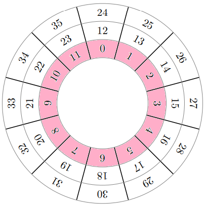{height="6cm"}
:::

The clock demonstrate that every integer is congruent to at least one of
$0 \dots 11$ modulo $12$ (row highlighted in pink). Just like a clock,
when we go over $12$, we start over at $1$, and so the same thing
applies with modulo, where $1 \equiv 13 \ (\mathrm{mod}\ 12)$.

-3ex -0.1ex -.4ex 0.5ex .2ex Congruence Class Refer back to [[section
2.1.2]{.underline}](#subsection.2.1.2) for a recap. Congruence is
another type of equivalence relationsa relation that satisfies all
three:

Reflexive:

:   $a \equiv a \ (\mathrm{mod}\ n)$

Symmetric:

:   If $a \equiv b \ (\mathrm{mod}\ n)$, then
    $b \equiv a \ (\mathrm{mod}\ n)$

Transitive:

:   If $a \equiv b \ (\mathrm{mod}\ n)$ and
    $b \equiv c \ (\mathrm{mod}\ n)$, then
    $a \equiv c \ (\mathrm{mod}\ n)$

As a result, we can form equivalence classes, or otherwise known as

::: dBox
::: definitionT
**Definition 3.8** (Congruence class). *Let $a$, $b$, $n \in \mathbb{Z}$
with $n > 0$. The congruence class of modulo $n$ is
$$_n = \{b \in \mathbb{Z} \mid b \equiv a \ (\mathrm{mod}\ n)\}$$ Note
that
$$_n = \{b \in \mathbb{Z} \mid b = a + kn \text{ for } k \in \mathbb{Z}\}$$*
:::
:::

For example, in congruence modulo $2$, we have

-   $[0]_2 = \{0, \pm 2, \pm 4, \pm 6, \cdots\}$

-   $[1]_2 = \{\pm 1, \pm 3, \pm 5, \pm 7, \cdots\}$

The congruence classes of $0$ and $1$ are, respectively, the sets of
even and odd integers.

::: tBox
::: theoremeT
**Theorem 3.1** (Equality of congruence classes). *Let $a$, $b$,
$n \in \mathbb{Z}$ with $n > 0$. We then have that
$a \equiv b \ (\mathrm{mod}\ n)$ if and only if $$_n = [b]_n$$*
:::
:::

Referring back to the clock diagram, in congruence modulo $12$, we have:
$$[0]_{12} = [12]_{12} = [24]_{12} = \{0, 0 \pm 12, 0 \pm 24, \cdots\} = \{\cdots -24, -12, 0, 12, 24, \cdots\}$$
You may have notice that the distinct congruence classes are
$[0], [1], \cdots, [11]$:

-   $[0]_{12} = \{0, 0 \pm 12, 0 \pm 24, \cdots\}$

-   $[1]_{12} = \{1, 1 \pm 12, 1 \pm 24, \cdots\}$

    $\vdots$

-   $[11]_{12} = \{11, 11 \pm 12, 11 \pm 24, \cdots\}$

In congruence modulo $n$, we can say for $n > 2$, the distinct
congruence classes are $[0], [1], \cdots, [n-1]$.

-4ex -1ex -.4ex 1ex .2ex Principles of Counting We'll start off with the
fundamentals, that is counting. Of course, most people know how to
count, but combinatorics applies mathematical operations to count
quantities that are much too large to be counted the conventional way.

-3ex -0.1ex -.4ex 0.5ex .2ex Sum Rule Combinatorics is often concerned
with how things are arrangeda way objects could be grouped. One of the
most basic rules regarding arrangements is the rule of sum.

::: tBox
::: theoremeT
**Theorem 3.1** (Sum rule). *Suppose that we are given disjoint sets $X$
and $Y$. If $|X| = m$ and $|Y| = n$, then $$|X\ \cup\ Y | = m + n$$*
:::
:::

Then we can generalized this theorem for more than two disjoints sets.

::: tBox
::: theoremeT
**Theorem 3.1** (Generalized sum rule). *If we are given pairwise
disjoint sets $X_i$, where $1 \leq i \leq m$, so that $|X_i| = m$, then
$$\bigg|\bigcup\limits_{i=1}^m X_i \bigg| = \sum_{i=1}^m |X_i|$$*
:::
:::

So what about sets that are not disjoint? For example, we have two sets
$X = \{1,2,3\}$ and $Y = \{2,3,4\}$. If we use the sum rule, where
$|X| = 3$ and $|Y| = 3$, we should get: $$|X| + |Y| = 3 + 3 = 6$$
However, $X\ \cup\ Y = \{1,2,3,4\}$, where $|X \cup Y| = 4 \neq 6$, such
that $$|X\ \cup\ Y| < |X| + |Y|$$ which brings up the next theorem.

::: tBox
::: theoremeT
**Theorem 3.1** (Boole's inequality). *For any sets $A_i$, we have that
$$\bigg|\bigcup\limits_{i=1}^m A_i \bigg| \leq \sum_{i=1}^m |A_i|$$*
:::
:::

Equivalently, we can rewrite the sum rule as
$|A\ \cup\ B| = |A| + |B| - |A\ \cap\ B|$, where we subtract the
cardinality of elements that are common. For disjoint sets that is
$\varnothing$, compared to joint sets, resulting in $\leq$.

And so this brings the final theorem which will cover in this section.

::: tBox
::: theoremeT
**Theorem 3.1** (Principle of Inclusion-Exclusion). *Let
$X_1, X_2, \dots, X_n$ be finite sets. We then have that
$$\bigg|\bigcup\limits_{1\leq1\leq n} X_i \bigg| = |X_1| + |X_2| + \dots + |X_n|$$
$$\qquad\qquad \:-\;|X_1\ \cap\ X_2| - |X_1\ \cap\ X_3| - \dots - |X_{n-1}\ \cap\ X_n|$$
$$\qquad\qquad \:+\;|X_1\ \cap\ X_2\ \cap\ X_3| + |X_1\ \cap\ X_2\ \cap\ X_4| + \dots + |X_{n-2}\ \cap\ X_{n-1}\ \cap\ X_n|$$
$$\qquad\qquad \:+\;(-1)^{n-1}|X_1\ \cap\ X_2\ \cap\ \cdots\ \cap\ X_n|$$*
:::
:::

We can break this principle line-by-line:

1.  Take the sum of the cardinalities of the sets, as you would in a
    disjoint union.

2.  Subtract off the cardinalities of the pairwise intersections of the
    sets

3.  Add the cardinalities of the triple intersections and so on.

The signs $(-1)^{n-1}$ depend on the parity of the number of sets
intersected. For example, if there is three set in the intersection

::: center
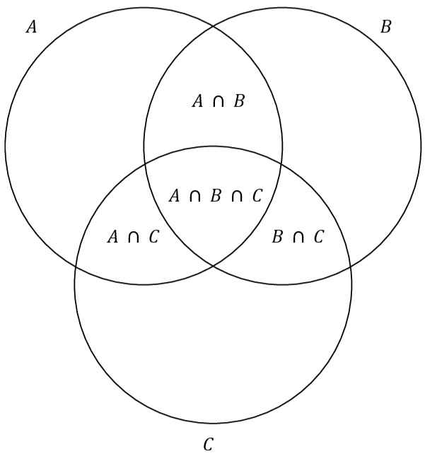{height="4cm"}
:::

$$|A\ \cup\ B\ \cup\ C| = |A| + |B| + |C| - |A\ \cap\ B| - |A\ \cap\ C| - |B\ \cap\ C| + |A\ \cap\ B\ \cap C|$$
You can also refer to the visualization below, if you have trouble
understanding the reason behind it

::: center
{width="95%"}
:::

-3ex -0.1ex -.4ex 0.5ex .2ex Product Rule Another basic rules regarding
arrangements is the rule of product.

::: tBox
::: theoremeT
**Theorem 3.1** (Product rule). *If a task $X$ can be performed in $m$
ways and a task $Y$ can be performed in $n$ ways, then we have that $X$
and $Y$ can be performed together in $mn$ ways.*
:::
:::

One example is with cards. How many cards are in a standard deck of
cards?

::: center
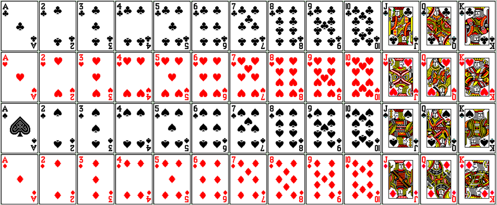{height="4cm"}
:::

Equivalently, you can think of the suit of the card and the rank of the
card as two tasksthere are $4$ suits and $13$. The product rule,
$4 \times 13$, tells us there are $52$ card.

Likewise, we can generalize this theorem for more than two tasks.

::: tBox
::: theoremeT
**Theorem 3.1** (Generalized product rule). *If tasks $X_i$ can be
performed in $m_i$ ways where $i \leq i \leq n$, then we have
$$m_1m_2 \cdots m_n$$ way tasks can be performed together.*
:::
:::

::: exampleT
**Example 3.6**. *How many ways can you make a license plate with
three-digit number (not including zero) and three letters?*

1.  *For starters, let's focus on the three-digit number. For each
    digit, there can be nine different ways, $1 \dots 9$, we can choose
    a number. $$9 \times 9 \times 9 = 9^3$$*

2.  *Then for the three letters, for each choice, there can be
    twenty-six different ways, $a \dots z$, we can choose a letter.
    $$26 \times 26 \times 26 =26^3$$*

3.  *In total, there are $9^326^3$ different ways we can make them.*
:::

-3ex -0.1ex -.4ex 0.5ex .2ex The Pigeonhole Principle The Pigeonhole
Principle is a simple, but powerful tool when counting objects. The
metaphors used to describe the principle typically vary, but they all
follow the same analogy of inserting a finite set into a smaller finite
set.

You can think of it like this, if $n$ pigeons fly into $m$ pigeonholes
and $n > m$, then at least one hole must contain two or more pigeons.

::: center
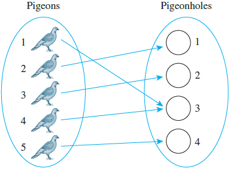{height="4cm"}
:::

::: tBox
::: theoremeT
**Theorem 3.1** (The Pigeonhole Principle). *If $n$ items are put into
$m$ containers, with $n > m$, then at least one container must contain
more than one item.*
:::
:::

In hindsight, it is pretty is obvious, thus, we move immediately to
applicationsranging from the totally obvious to the extremely subtle.

::: exampleT
**Example 3.7**. *If you choose a set of three non-negative integers,
must there be at least two who are both even or both odd.*

1.  *Yes, because we have three items and only two container (odd or
    even), therefore one container must contain more than one item,
    which could be odd or even.*
:::

::: exampleT
**Example 3.8**. *Let $A = \{1,2,3,4,5,6,7,8\}$. If five integers are
selected form $A$, must at least one pair of the integers have a sum of
$9$?*

1.  *You can think of the five selected integers as the number of items,
    where $a_n$ represent a distinct number in the set $A$.
    $$a_1,\ a_2,\ a_3,\ a_4, \text{ and }\ a_5$$*

2.  *Then, all the disjoint subsets that have a sum of $9$ is our
    container. $$\{1,8\},\ \{2,7\},\ \{3,6\}, \text{ and}\ \{4,5\}$$*

3.  *Applying the pigeonhole principle, because there are more items,
    $n = 5$, than there are containers, $m = 4$. Then at least one
    container must contain more than one item.*

4.  *In other words, at least one of the disjoint subsets will contain
    two distinct integers, which will have a sum of $9$.*
:::

A generalization of the pigeonhole principle states:

::: tBox
::: theoremeT
**Theorem 3.1** (Generalized Pigeonhole Principle). *If $n$ items are
put into $m$ containers, with $n > m$, there is at least one container
with $\lceil n/m \rceil$ items.*
:::
:::

-3ex -0.1ex -.4ex 0.5ex .2ex Permutation Before going over combinations,
let's talk about permutation, where order matters. You can think of it
as an ordered combinations. For example, the set of elements $a$, $b$,
and $c$ has six permutations:
$$abc \hspace{1cm} acb \hspace{1cm} bac \hspace{1cm} bca \hspace{1cm} cab \hspace{1cm} cba$$
The number of permutations can be derived using the product rule.
Suppose we have a set of $n$ elements:

1.  For our first choice (or task), we have $n$ ways of picking an
    element.

2.  For our second choice, we now have $n-1$ ways of picking an element

    $\vdots$

3.  For our $n$th choice, there's only one element left, so we only have
    $1$ way of choosing an element.

So by the product rule, there are
$$n \times (n-1) \times (n-2) \times \cdots \times 2 \times 1 = n!$$
ways to perform the entire operation with no repetitions. In other
words, there are $n!$ permutations of a set of $n$ elements. Suppose in
the previous example, we want to know how many permutation there one
only using two elements, instead of all three.

We can define an ordered arrangement of $r$ elements taken from the set
of $n$ elements as an $r$-permutation.

::: dBox
::: definitionT
**Definition 3.9** (Permutation). *The number of $r$-permutations of a
set of $n$ elements is denoted $P(n,r)$. If $0 \leq r \leq n$, then
$$P(n,r) = n \times (n-1) \times \cdots \times (n - r + 1) = \frac{n!}{(n-r)!}$$*
:::
:::

So now can calculate the $2$-permutation of $\{a,b,c\}$, resulting in
$$P(3,2) = \frac{3!}{(3-2)!} = \frac{3!}{1!} = \frac{6}{1} = 6$$ which
are
$$ab \hspace{1cm} ac \hspace{1cm} ba \hspace{1cm} bc \hspace{1cm} ca \hspace{1cm} cb$$

-4ex -1ex -.4ex 1ex .2ex Combination We can now define an unordered
arrangement of $r$ elements of a set as an $r$-combination.

::: dBox
::: definitionT
**Definition 3.10** (Combination). *Let $n$ and $r$ be non-negative
integers, with $r \leq n$. The symbol $\binom{n}{r}$, read \"$n$ chooses
$r$\", denotes the number of subsets of size $r$ that can be formed from
a set of $n$ elements.*
:::
:::

::: list

There's two ways to denote an $r$-combination, which is by
$\binom{n}{r}$ or $C(n,r)$
:::

Using the relation between permutation $P(n.r)$ and combination, gives
us an important formula: $$C(n.r) = \binom{n}{r} = \frac{n!}{(n-r)!r!}$$

::: exampleT
**Example 3.9**. *Given a set of four people: Ann, Bob, Cyd, and Dan.
List all the combinations that can be made with only three people.*

1.  *Note that order doesn't matter, so a subset consisting of $\{$Bob,
    Cyd, Dan$\}$ is the same as the subset consisting of $\{$Dan, Cyd,
    Bob$\}$.*

2.  *Following this fact, then the $3$-combination can be obtained by
    leaving one out of the elements of the set:*

    -   *$\{$Bob, Cyd, Dan$\}$*

    -   *$\{$Ann, Cyd, Dan$\}$*

    -   *$\{$Ann, Bob, Dan$\}$*

    -   *$\{$Ann, Bob, Cyd$\}$*

    *or alternatively
    $$C(4,3) = \binom{4}{3} = \frac{4!}{(4-3)!3!} = \frac{24}{6} = 4$$*
:::

As a follow up, there are special cases of combinations using this
equation.

::: tBox
::: theoremeT
**Theorem 3.1** (Basic properties of combination). *Let $n$ be an
integer:*

1.  *$\displaystyle\binom{n}{0} = \binom{n}{n} = 1$*

2.  *$\displaystyle\binom{n}{1} = \binom{n}{n-1} = n$*

3.  *$\displaystyle\binom{n}{2} = \frac{n(n-1)}{2}$*
:::
:::

-3ex -0.1ex -.4ex 0.5ex .2ex Properties of Combinations There also some
useful of identities that you can form using $C(n,r)$. They seem
mysterious at first, but there's usually a good reason for them.
Combinations have a recursive quality that is captured in the following
theorem.

::: tBox
::: theoremeT
**Theorem 3.1** (Recursive property). *For integers $n \geq 1$ and
$r \geq 1$, with $r \leq n$, we have that
$$\binom{n}{r} = \binom{n - 1}{r - 1} + \binom{n - 1}{r}$$*
:::
:::

You will often see this depicted as Pascal's formula. As an example, we
can calculate $\binom{6}{2}$ using:
$$\binom{6}{2} = \binom{5}{1} + \binom{5}{2} = 5 + 10 = 15$$ Another
important property of combinations is their symmetry.

::: tBox
::: theoremeT
**Theorem 3.1** (Symmetry property). *For integers $n \geq 0$ and
$r \geq 0$, with $r \leq n$, we have that
$$\binom{n}{r} = \binom{n}{n - r}$$*
:::
:::

Using the previous example, we know that:
$$\binom{6}{2} = \binom{6}{4}$$ At first, it might not make sense, but
it will prove to be useful in the next section, when we go over Pascal's
trianglewhich is an arrangement of the combinations that makes them
simple to remember.

Lastly, we have this identity.

::: tBox
::: theoremeT
**Theorem 3.1** (Sum of squares combinations). *For $n \leq 0$, we have
that $$\sum_{r=0}^n\binom{n}{r}^2 = \binom{2n}{n}$$*
:::
:::

As such, we can express the sum of squares as a single combination,
shown below:
$$\sum_{r=0}^{25} \binom{25}{r}^2 = \binom{2 \cdot 25}{25} = \binom{50}{25}$$

-3ex -0.1ex -.4ex 0.5ex .2ex Pascal's Triangle The rows of Pascal's
triangle are indexed by non-negative integers: $0$, $1$, $2$, and etc.
In the $n$th row, we have $\binom{n}{r}$, where $1 \leq r \leq n$ and
the values of $r$ increase from left to right. The following are the
first seven rows of Pascal's triangle. Then, lastly we have this
identity.

::: center
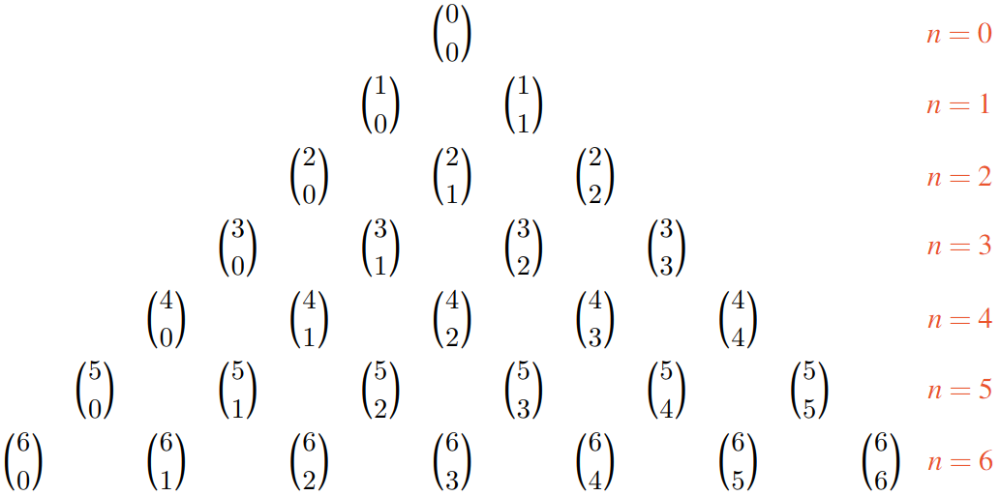{height="7cm"}
:::

Though, they are more commonly represented as their integer counterpart.

::: center
{height="6cm"}
:::

You can see many patterns of how combinations are related in the
triangle, such symmetry in a given row and the recursive property of
combinations, which we discussed prior to this.

One important use of combinations is in expanding polynomial
expressions, such as $(x + y)^n$. The binomial theorem generalizes this
formula.

::: tBox
::: theoremeT
**Theorem 3.1** (Binomial theorem). *Let $n$ be non-negative integers
and let $x$, $y$ be variables.
$$(x + y)^n = \sum_{r = 0}^n\binom{n}{r}x^{n-r}y^r$$
$$\qquad\quad\ \ = \binom{n}{0}x^n + \binom{n}{1}x^{n-1}y + \binom{n}{2}x^{n-2}y^2 + \cdots + \binom{n}{n-1}xy^n + \binom{n}{n}y^n$$*
:::
:::

In other words, the triangular arrangement of numbers gives us the
coefficients in the expansion of any binomial expression.

::: exampleT
**Example 3.10**. *Expand the following expression $(x+y)^n$ for $n=6$:*

1.  *Using the binomial theorem:
    $$(x + y)^6 = \binom{6}{0}x^6 + \binom{6}{1}x^5y + \binom{6}{2}x^4y^2 + \binom{6}{3}x^3y^3 + \binom{6}{4}x^2y^4 + \binom{6}{5}xy^5 + \binom{6}{6}y^6$$*

2.  *If we refer back to Pascal's triangle, then we can easily
    substitute the binomial coefficient with its respective integers, as
    such:
    $$(x + y)^6 = x^6 + 6x^5y + 15x^4y^2 + 20x^3y^3 + 15x^2y^4 + 6xy^5 + y^6$$*
:::
